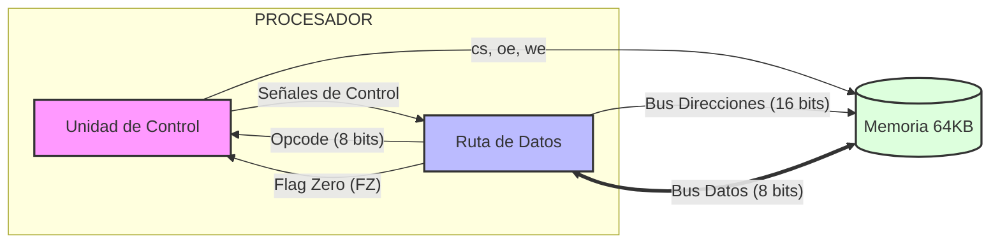
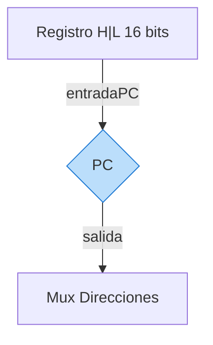
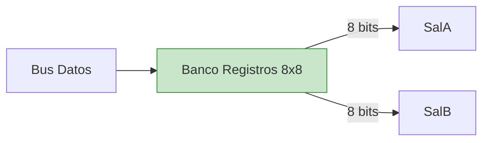
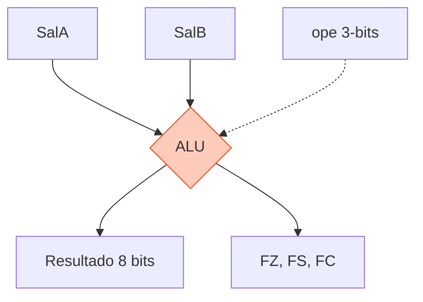
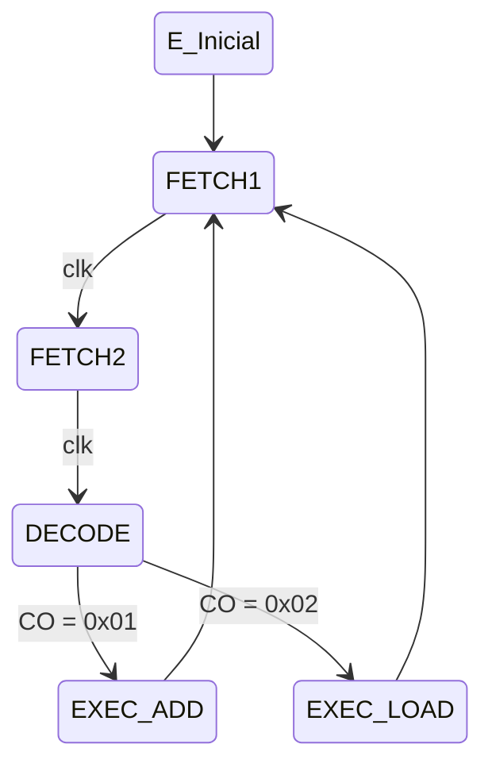

# Arquitectura Detallada del Procesador VHDL

Este documento proporciona una descripción técnica exhaustiva de cada bloque funcional que compone el procesador de 8 bits.

## 1. Diagrama de Bloques General

El procesador sigue una arquitectura de Von Neumann, integrando la Unidad de Control (UC), la Ruta de Datos (RD) y la Memoria a través de buses compartidos.

## 2. Descripción Detallada de Módulos (Ruta de Datos)

### 2.1 PC (Program Counter)
Mantiene la dirección de la próxima instrucción a ejecutar.
*   **Lógica:** Contador síncrono de 16 bits.
*   **Señales:** `clk`, `Lpc` (carga paralela desde HL), `Ipc` (incremento +1), `Clear` (reset).

### 2.2 Multiplexor de Direcciones
Selecciona la fuente para el bus de direcciones de memoria.
*   **Puerto 0:** Dirección proveniente del PC.
*   **Puerto 1:** Dirección proveniente del registro HL (direccionamiento indirecto).
*   **Control:** `SelDir` (1 bit).

### 2.3 Registro H | L
Registro de 16 bits (dividido en High y Low de 8 bits cada uno) para punteros de datos.
*   **Carga:** Independiente mediante señales `LH` (Load High) y `LL` (Load Low) desde el bus de datos de 8 bits.
*   **Salida:** Bus combinado de 16 bits hacia el PC y el Multiplexor.

### 2.4 BR 8x8 (Banco de Registros)
Conjunto de 8 registros de propósito general de 8 bits cada uno.
*   **Escritura:** Un puerto de entrada (`SelRegW`).
*   **Lectura:** Dos puertos de salida simultáneos (`SalA`, `SalB`) gobernados por `SelRegRA` y `SelRegRB`.

### 2.5 ALU (Unidad Aritmético Lógica)
Realiza las operaciones aritméticas y lógicas del sistema.
*   **Entradas:** `SalA`, `SalB` (8 bits).
*   **Operaciones (Bus `ope` de 3 bits):**
    *   `000`: Trans A | `001`: Trans B | `010`: AND | `011`: NOT A
    *   `100`: DEC A | `101`: ADD | `110`: SUB | `111`: INC A
*   **Salida de Datos:** Hacia bus principal mediante un buffer tri-estado (`SalAlu`).

### 2.6 Registro de Banderas (Flags)
Almacena el estado de la última operación de la ALU.
*   **Bit 0 (FZ):** Zero. Activo si el resultado es `x00`.
*   **Bit 1 (FS):** Sign. Refleja el bit más significativo (MSB) del resultado.
*   **Bit 2 (FC):** Carry/Borrow. Captura el acarreo de operaciones aritméticas.

## 3. Unidad de Control (UC)

Actúa como el cerebro del sistema mediante una Máquina de Estados Finitos (FSM).

### Entradas Críticas
*   **`CO` (8 bits):** Código de operación desde el RI.
*   **`FZ` (1 bit):** Flag zero para saltos condicionales.

### Ciclo de Ejecución (FSM)
1.  **FETCH 1:** Pone dirección PC en bus. `cs='1'`, `oe='1'`, `SelDir='0'`.
2.  **FETCH 2:** Carga instrucción en RI e incrementa PC. `Lri='1'`, `Ipc='1'`.
3.  **DECODE:** Evalúa `CO` para determinar el siguiente estado.
4.  **EXECUTE:** Activa las señales específicas (ej. `wr` para guardar en registro, `ope` para la ALU).

## 4. Resumen de Buses

| Nombre | Ancho | Origen Principal | Destino Principal |
| :--- | :---: | :--- | :--- |
| **BusDatos** | 8 bits | Memoria / ALU / BR | BR / HL / RI / Memoria |
| **BusDir** | 16 bits | PC / HL | Memoria |
| **BusControl** | N bits | Unidad de Control | Todos los módulos |

---

## 5. Guía de Escalabilidad y Ajustes (Entorno Real)

Esta sección describe los parámetros técnicos que deben modificarse para evolucionar la arquitectura hacia un sistema más potente o adaptarlo a necesidades específicas de hardware real.

### 5.1 Escalado de Memoria
Para aumentar la capacidad de direccionamiento, solo es necesario modificar el bus de direcciones.
*   **Archivo:** `procesador_vhdl/src/pkg/procesador_pkg.vhd` -> Parámetro `ADDR_WIDTH`.
*   **Impacto:** El **PC**, el registro **HL** y la **Memoria RAM** se redimensionarán automáticamente. Por ejemplo, cambiar a `12` para sistemas embebidos pequeños (4KB) o a `20` para direccionar 1MB.

### 5.2 Evolución del Ancho de Palabra (Datos)
Para transformar el procesador de 8 bits a 16 o 32 bits.
*   **Archivo:** `procesador_vhdl/src/pkg/procesador_pkg.vhd` -> Parámetro `DATA_WIDTH`.
*   **Impacto:** Reconfiguración automática del **Banco de Registros**, **ALU**, **Bus de Datos** y **Registro de Instrucción (RI)**.

### 5.3 Personalización de Banderas (Flags)
Para añadir lógica de control más compleja (ej. saltos por desbordamiento).
*   **ALU (`alu.vhd`):** Implementar la lógica de la nueva bandera (ej. *Overflow* o *Paridad*) y mapearla en el bus `SalidaFlags`.
*   **Ruta de Datos (`ruta_datos.vhd`):** Extraer el bit correspondiente del cable `cable_Flags_out` y llevarlo a la Unidad de Control.
*   **Unidad de Control (`unidad_control.vhd`):** Añadir la señal como entrada y actualizar la lógica de saltos condicionales en el estado `DECODE`.

### 5.4 Frecuencia de Reloj
*   **Ajuste:** Para implementaciones en FPGA real, se debe utilizar el componente `divisor_frecuencia.vhd` para adaptar el reloj de la placa (típicamente 50MHz) a la velocidad de ejecución deseada, asegurando que se cumplan los tiempos de establecimiento (*setup time*) de la lógica combinacional de la ALU.

---
*Este documento consolida la lógica de diseño para la implementación en VHDL y posterior simulación en ModelSim.*
