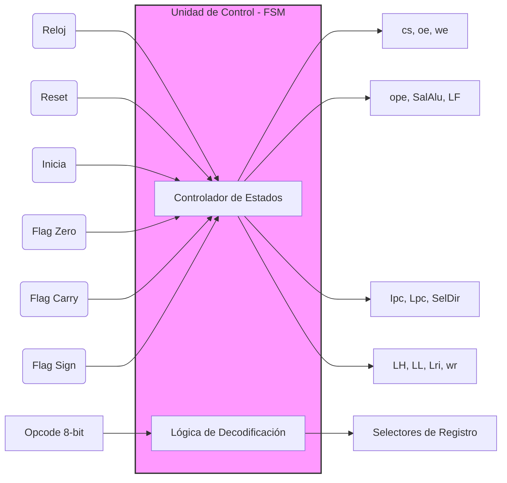
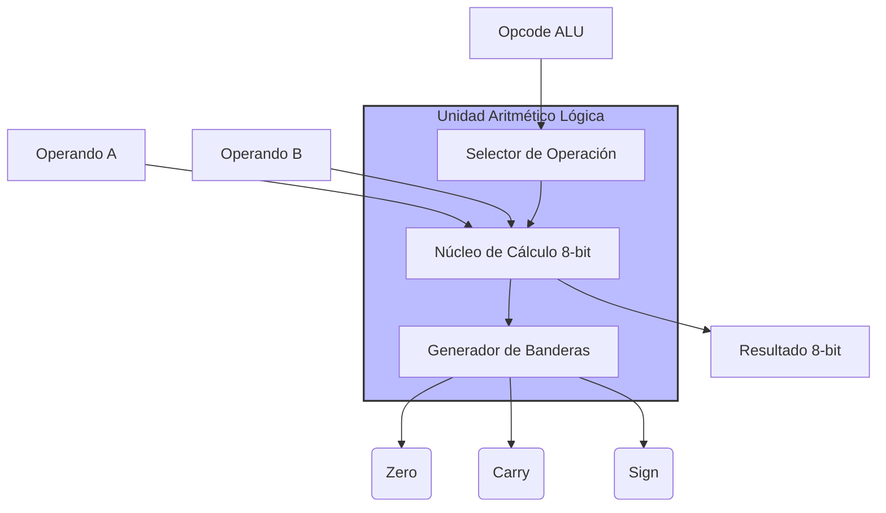
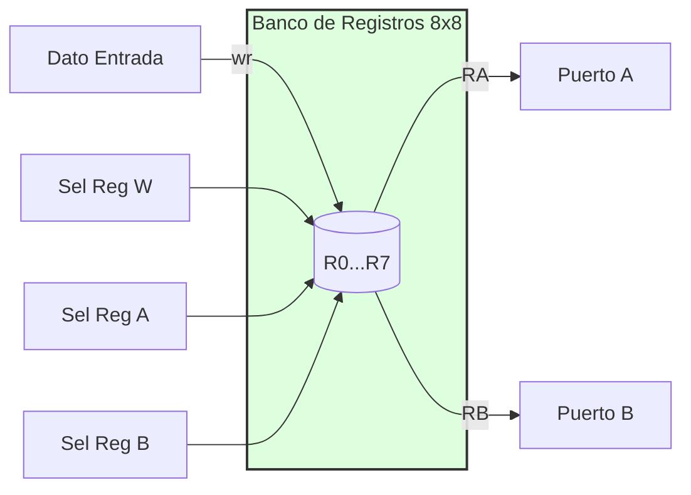
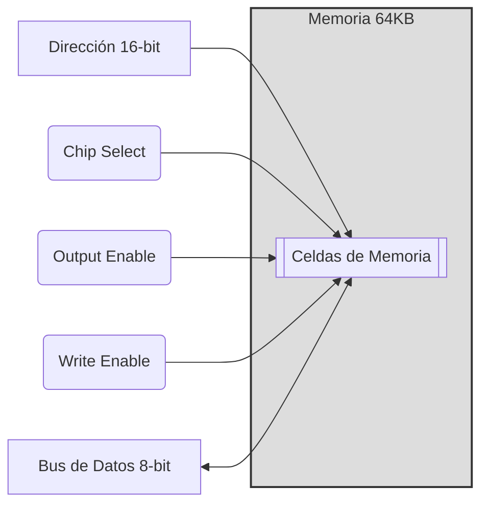
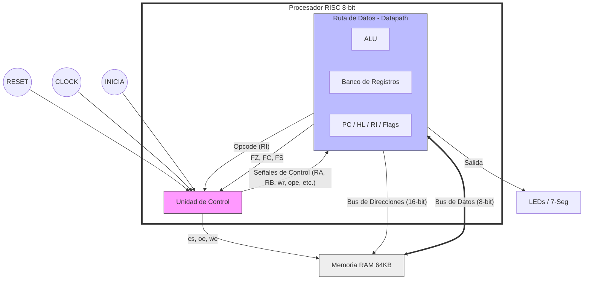

# Lógica del Procesador RISC de 8 bits

Este documento describe la arquitectura interna y la lógica de funcionamiento del procesador diseñado en VHDL. El sistema sigue una arquitectura de Harvard simplificada con un bus de datos compartido para memoria y periféricos.

## 1. Parámetros de Arquitectura

| Parámetro | Valor | Descripción |
| :--- | :--- | :--- |
| **Ancho de Datos** | 8 bits | Tamaño de palabra procesada por la ALU y registros. |
| **Ancho de Direcciones** | 16 bits | Capacidad de direccionamiento de 64 KB (0x0000 a 0xFFFF). |
| **Registros** | 8 | Banco de registros de propósito general (R0 a R7). |
| **Frecuencia Base** | 50 MHz | Reloj de entrada en FPGA (Divisible a 1 Hz). |

## 2. Formato de Instrucción

Las instrucciones son de longitud variable (1 a 3 bytes). El primer byte siempre contiene el **Código de Operación (Opcode)** y, en instrucciones de registro, el índice del registro destino.

**Estructura del Opcode (8 bits):**
`[ Opcode (5 bits) | Registro Destino (3 bits) ]`

---

## 3. Unidades Lógicas

### 3.1 Unidad de Control (UC)
Es el cerebro del sistema. Implementa una Máquina de Estados Finitos (FSM) que orquesta el ciclo de instrucción: **Fetch -> Decode -> Execute**.



### 3.2 Unidad Aritmético Lógica (ALU)
Realiza las operaciones matemáticas y lógicas fundamentales. Genera señales de estado (banderas) basadas en el resultado.



### 3.3 Banco de Registros (BR)
Contiene 8 registros de 8 bits. Permite leer dos operandos simultáneamente (A y B) y escribir un resultado en un tercer registro en el flanco de reloj.



### 3.4 Contador de Programa (PC) y Puntero HL
El **PC** gestiona la ejecución secuencial, mientras que el registro **HL** actúa como un puntero de 16 bits para saltos y acceso a memoria RAM.

```mermaid
graph TD
    subgraph Direccionamiento
        PC[Program Counter 16-bit]
        HL[Registro H|L 16-bit]
        MUX{Mux Dir}
    end

    Ipc(Incremento) --> PC
    Lpc(Carga) --> PC
    BusDat[Bus de Datos 8-bit] --> HL
    HL --> PC
    PC --> MUX
    HL --> MUX
    SelDir[Selector UC] --> MUX
    MUX --> DirMem[Bus Direcciones 16-bit]

    style Direccionamiento fill:#ffd,stroke:#333,stroke-width:2px
```

### 3.5 Memoria RAM (64Kx8)
Almacena tanto el programa (instrucciones) como los datos de usuario. Utiliza un bus bidireccional controlado por buffers tri-estado.



---

## 4. Diagrama de Bloques Completo del Procesador

Este diagrama muestra la interconexión global entre la Unidad de Control, la Ruta de Datos y la Memoria.


