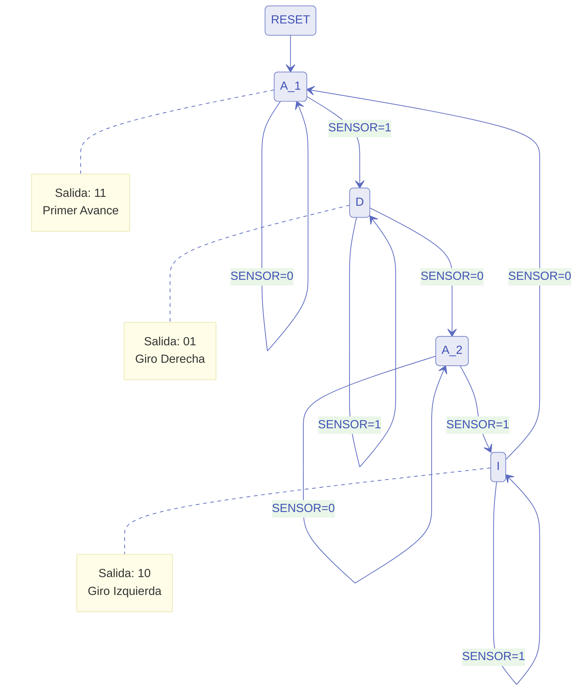

# Documentación: Barredora Automática (barredora.vhd)

## Descripción
Este módulo implementa el control de una barredora "inteligente" mediante una Máquina de Estados Finitos (FSM) de Moore. El sistema alterna el sentido del giro (derecha/izquierda) cada vez que encuentra un obstáculo, siguiendo una secuencia cíclica.

## Interfaz (Puertos)
*   **CLK:** Reloj del sistema.
*   **RST:** Reset asíncrono (activo en alto).
*   **SENSOR:** Entrada del sensor, corresponde a la señal **B** (1 = Obstáculo, 0 = Libre).
*   **MOTOR_IZQ:** Salida motor Rueda Izquierda.
*   **MOTOR_DER:** Salida motor Rueda Derecha.

## Lógica de Movimiento
*   **Avanzar:** `MOTOR_IZQ='1'`, `MOTOR_DER='1'`.
*   **Giro Derecha:** `MOTOR_IZQ='0'`, `MOTOR_DER='1'`.
*   **Giro Izquierda:** `MOTOR_IZQ='1'`, `MOTOR_DER='0'`.

## Tabla de Estados Siguientes

| Descripción | Estado Actual | Entrada (SENSOR/B) | Estado Siguiente | Salidas (MI, MD) |
|:-----------:|:-------------:|:------------------:|:----------------:|:----------------:|
| Avance 1    | **$A_1$**     | 0 (Libre)          | $A_1$            | 1, 1             |
| Avance 1    | **$A_1$**     | 1 (Obstáculo)      | D                | 1, 1             |
| Derecha     | **D**         | 1 (Obstáculo)      | D                | 0, 1             |
| Derecha     | **D**         | 0 (Libre)          | $A_2$            | 0, 1             |
| Avance 2    | **$A_2$**     | 0 (Libre)          | $A_2$            | 1, 1             |
| Avance 2    | **$A_2$**     | 1 (Obstáculo)      | I                | 1, 1             |
| Izquierda   | **I**         | 1 (Obstáculo)      | I                | 1, 0             |
| Izquierda   | **I**         | 0 (Libre)          | $A_1$            | 1, 0             |

### Tabla Codificada en Binario (Transición y Salida)

Asignando combinaciones binarias a los estados ($A_1$ = 00, D = 01, $A_2$ = 10, I = 11):

<table>
  <thead>
    <tr>
      <th colspan="2">Estado Actual</th>
      <th>Entrada</th>
      <th colspan="2">Estado Siguiente</th>
      <th colspan="2">Salida</th>
    </tr>
    <tr>
      <th>q1</th>
      <th>q0</th>
      <th>B</th>
      <th>q1+</th>
      <th>q0+</th>
      <th>RI</th>
      <th>RD</th>
    </tr>
  </thead>
  <tbody>
    <tr><td align="center">0</td><td align="center">0</td><td align="center">0</td><td align="center">0</td><td align="center">0</td><td align="center">1</td><td align="center">1</td></tr>
    <tr><td align="center">0</td><td align="center">0</td><td align="center">1</td><td align="center">0</td><td align="center">1</td><td align="center">1</td><td align="center">1</td></tr>
    <tr><td align="center">0</td><td align="center">1</td><td align="center">0</td><td align="center">1</td><td align="center">0</td><td align="center">0</td><td align="center">1</td></tr>
    <tr><td align="center">0</td><td align="center">1</td><td align="center">1</td><td align="center">0</td><td align="center">1</td><td align="center">0</td><td align="center">1</td></tr>
    <tr><td align="center">1</td><td align="center">0</td><td align="center">0</td><td align="center">1</td><td align="center">0</td><td align="center">1</td><td align="center">1</td></tr>
    <tr><td align="center">1</td><td align="center">0</td><td align="center">1</td><td align="center">1</td><td align="center">1</td><td align="center">1</td><td align="center">1</td></tr>
    <tr><td align="center">1</td><td align="center">1</td><td align="center">0</td><td align="center">0</td><td align="center">0</td><td align="center">1</td><td align="center">0</td></tr>
    <tr><td align="center">1</td><td align="center">1</td><td align="center">1</td><td align="center">1</td><td align="center">1</td><td align="center">1</td><td align="center">0</td></tr>
  </tbody>
</table>

### Tablas de Excitación para Diferentes Flip-Flops

A partir de la tabla codificada en binario, se obtienen las tablas de excitación que definen las entradas necesarias para cada tipo de Flip-Flop (D, JK, T y SR), lo cual representa la memoria que guardará el estado de la barredora para transitar entre estados lógicos.

#### Flip-Flop Tipo D
El Flip-Flop D copia el valor de la entrada en la salida durante el flanco de reloj, es decir D = Q+. Por lo tanto, los valores de D1 y D0 son idénticos a q1+ y q0+.

<table>
  <thead>
    <tr>
      <th colspan="2">Estado Actual</th>
      <th>Entrada</th>
      <th colspan="2">FF Tipo D</th>
    </tr>
    <tr>
      <th>q1</th>
      <th>q0</th>
      <th>B</th>
      <th>D1</th>
      <th>D0</th>
    </tr>
  </thead>
  <tbody>
    <tr><td align="center">0</td><td align="center">0</td><td align="center">0</td><td align="center">0</td><td align="center">0</td></tr>
    <tr><td align="center">0</td><td align="center">0</td><td align="center">1</td><td align="center">0</td><td align="center">1</td></tr>
    <tr><td align="center">0</td><td align="center">1</td><td align="center">0</td><td align="center">1</td><td align="center">0</td></tr>
    <tr><td align="center">0</td><td align="center">1</td><td align="center">1</td><td align="center">0</td><td align="center">1</td></tr>
    <tr><td align="center">1</td><td align="center">0</td><td align="center">0</td><td align="center">1</td><td align="center">0</td></tr>
    <tr><td align="center">1</td><td align="center">0</td><td align="center">1</td><td align="center">1</td><td align="center">1</td></tr>
    <tr><td align="center">1</td><td align="center">1</td><td align="center">0</td><td align="center">0</td><td align="center">0</td></tr>
    <tr><td align="center">1</td><td align="center">1</td><td align="center">1</td><td align="center">1</td><td align="center">1</td></tr>
  </tbody>
</table>

#### Flip-Flop Tipo JK
El Flip-Flop JK requiere de dos entradas por bit. Se utilizan condiciones de "no importa" (X) donde el estado de la entrada no afecta la transición deseada, lo cual simplifica enormemente las ecuaciones lógicas resultantes para la síntesis de circuitos.

<table>
  <thead>
    <tr>
      <th colspan="2">Estado Actual</th>
      <th>Entrada</th>
      <th colspan="2">FF 1 (JK)</th>
      <th colspan="2">FF 0 (JK)</th>
    </tr>
    <tr>
      <th>q1</th>
      <th>q0</th>
      <th>B</th>
      <th>J1</th>
      <th>K1</th>
      <th>J0</th>
      <th>K0</th>
    </tr>
  </thead>
  <tbody>
    <tr><td align="center">0</td><td align="center">0</td><td align="center">0</td><td align="center">0</td><td align="center">X</td><td align="center">0</td><td align="center">X</td></tr>
    <tr><td align="center">0</td><td align="center">0</td><td align="center">1</td><td align="center">0</td><td align="center">X</td><td align="center">1</td><td align="center">X</td></tr>
    <tr><td align="center">0</td><td align="center">1</td><td align="center">0</td><td align="center">1</td><td align="center">X</td><td align="center">X</td><td align="center">1</td></tr>
    <tr><td align="center">0</td><td align="center">1</td><td align="center">1</td><td align="center">0</td><td align="center">X</td><td align="center">X</td><td align="center">0</td></tr>
    <tr><td align="center">1</td><td align="center">0</td><td align="center">0</td><td align="center">X</td><td align="center">0</td><td align="center">0</td><td align="center">X</td></tr>
    <tr><td align="center">1</td><td align="center">0</td><td align="center">1</td><td align="center">X</td><td align="center">0</td><td align="center">1</td><td align="center">X</td></tr>
    <tr><td align="center">1</td><td align="center">1</td><td align="center">0</td><td align="center">X</td><td align="center">1</td><td align="center">X</td><td align="center">1</td></tr>
    <tr><td align="center">1</td><td align="center">1</td><td align="center">1</td><td align="center">X</td><td align="center">0</td><td align="center">X</td><td align="center">0</td></tr>
  </tbody>
</table>

#### Flip-Flop Tipo T
El Flip-Flop T (Toggle) cambia su estado solo si la entrada es 1 y lo mantiene si es 0. Su entrada se obtiene realizando una operación lógica XOR entre el estado actual y el estado siguiente (T = Q $\oplus$ Q+).

<table>
  <thead>
    <tr>
      <th colspan="2">Estado Actual</th>
      <th>Entrada</th>
      <th colspan="2">FF Tipo T</th>
    </tr>
    <tr>
      <th>q1</th>
      <th>q0</th>
      <th>B</th>
      <th>T1</th>
      <th>T0</th>
    </tr>
  </thead>
  <tbody>
    <tr><td align="center">0</td><td align="center">0</td><td align="center">0</td><td align="center">0</td><td align="center">0</td></tr>
    <tr><td align="center">0</td><td align="center">0</td><td align="center">1</td><td align="center">0</td><td align="center">1</td></tr>
    <tr><td align="center">0</td><td align="center">1</td><td align="center">0</td><td align="center">1</td><td align="center">1</td></tr>
    <tr><td align="center">0</td><td align="center">1</td><td align="center">1</td><td align="center">0</td><td align="center">0</td></tr>
    <tr><td align="center">1</td><td align="center">0</td><td align="center">0</td><td align="center">0</td><td align="center">0</td></tr>
    <tr><td align="center">1</td><td align="center">0</td><td align="center">1</td><td align="center">0</td><td align="center">1</td></tr>
    <tr><td align="center">1</td><td align="center">1</td><td align="center">0</td><td align="center">1</td><td align="center">1</td></tr>
    <tr><td align="center">1</td><td align="center">1</td><td align="center">1</td><td align="center">0</td><td align="center">0</td></tr>
  </tbody>
</table>

#### Flip-Flop Tipo SR
El Flip-Flop SR utiliza entradas de Set (S, poner a 1) y Reset (R, poner a 0). A diferencia del JK, en el tipo SR la combinación donde ambas entradas se activan a la vez (S=1, R=1) es un estado prohibido, por lo que nunca aparece en la tabla. También utiliza condiciones de "no importa" (X) donde no se requiere forzar ningún estado.

<table>
  <thead>
    <tr>
      <th colspan="2">Estado Actual</th>
      <th>Entrada</th>
      <th colspan="2">FF 1 (SR)</th>
      <th colspan="2">FF 0 (SR)</th>
    </tr>
    <tr>
      <th>q1</th>
      <th>q0</th>
      <th>B</th>
      <th>S1</th>
      <th>R1</th>
      <th>S0</th>
      <th>R0</th>
    </tr>
  </thead>
  <tbody>
    <tr><td align="center">0</td><td align="center">0</td><td align="center">0</td><td align="center">0</td><td align="center">X</td><td align="center">0</td><td align="center">X</td></tr>
    <tr><td align="center">0</td><td align="center">0</td><td align="center">1</td><td align="center">0</td><td align="center">X</td><td align="center">1</td><td align="center">0</td></tr>
    <tr><td align="center">0</td><td align="center">1</td><td align="center">0</td><td align="center">1</td><td align="center">0</td><td align="center">0</td><td align="center">1</td></tr>
    <tr><td align="center">0</td><td align="center">1</td><td align="center">1</td><td align="center">0</td><td align="center">X</td><td align="center">X</td><td align="center">0</td></tr>
    <tr><td align="center">1</td><td align="center">0</td><td align="center">0</td><td align="center">X</td><td align="center">0</td><td align="center">0</td><td align="center">X</td></tr>
    <tr><td align="center">1</td><td align="center">0</td><td align="center">1</td><td align="center">X</td><td align="center">0</td><td align="center">1</td><td align="center">0</td></tr>
    <tr><td align="center">1</td><td align="center">1</td><td align="center">0</td><td align="center">0</td><td align="center">1</td><td align="center">0</td><td align="center">1</td></tr>
    <tr><td align="center">1</td><td align="center">1</td><td align="center">1</td><td align="center">X</td><td align="center">0</td><td align="center">X</td><td align="center">0</td></tr>
  </tbody>
</table>

### Ecuaciones Lógicas Mínimas (Síntesis Combinacional)

Aplicando mapas de Karnaugh a las tablas de excitación obtenidas y a las salidas correspondientes del diseño Moore, se obtienen las siguientes expresiones booleanas mínimas:

**Salidas de los Motores:**

| Señal | Ecuación Mínima |
|:-----:|:----------------|
| **RI** | $q_1 + \overline{q_0}$ |
| **RD** | $\overline{q_1} + \overline{q_0}$ |

**Flip-Flop Tipo D:**

| Señal | Ecuación Mínima |
|:-----:|:----------------|
| **D1** | $\overline{q_1} \cdot q_0 \cdot \overline{B} + q_1 \cdot \overline{q_0} + q_1 \cdot B$ |
| **D0** | $B$ |

**Flip-Flop Tipo JK:**

| Señal | Ecuación Mínima |
|:-----:|:----------------|
| **J1** | $q_0 \cdot \overline{B}$ |
| **K1** | $q_0 \cdot \overline{B}$ |
| **J0** | $B$ |
| **K0** | $\overline{B}$ |

**Flip-Flop Tipo T:**

| Señal | Ecuación Mínima |
|:-----:|:----------------|
| **T1** | $q_0 \cdot \overline{B}$ |
| **T0** | $q_0 \oplus B$ |

**Flip-Flop Tipo SR:**

| Señal | Ecuación Mínima |
|:-----:|:----------------|
| **S1** | $\overline{q_1} \cdot q_0 \cdot \overline{B}$ |
| **R1** | $q_1 \cdot q_0 \cdot \overline{B}$ |
| **S0** | $\overline{q_0} \cdot B$ |
| **R0** | $q_0 \cdot \overline{B}$ |

Como se puede observar, utilizar la lógica de un **Flip-Flop Tipo JK** es la estrategia que arroja las ecuaciones más simples de implementar a nivel de compuertas lógicas debido a que aprovecha mejor las condiciones "no importa".

### Tablas de Funcionamiento (Características) de los Flip-Flops

Para complementar la información anterior, a continuación se presentan las tablas de funcionamiento básicas de cada tipo de memoria, mostrando cómo sus entradas y el estado actual ($Q(t)$) definen el bit exacto del estado siguiente ($Q(t+1)$ o $Q^+$).

#### Flip-Flop Tipo D
| D | $Q(t)$ | $Q(t+1)$ |
|:---:|:---:|:---:|
| 0 | 0 | **0** |
| 0 | 1 | **0** |
| 1 | 0 | **1** |
| 1 | 1 | **1** |

#### Flip-Flop Tipo JK
| J | K | $Q(t)$ | $Q(t+1)$ |
|:---:|:---:|:---:|:---:|
| 0 | 0 | 0 | **0** |
| 0 | 0 | 1 | **1** |
| 0 | 1 | 0 | **0** |
| 0 | 1 | 1 | **0** |
| 1 | 0 | 0 | **1** |
| 1 | 0 | 1 | **1** |
| 1 | 1 | 0 | **1** |
| 1 | 1 | 1 | **0** |

#### Flip-Flop Tipo T
| T | $Q(t)$ | $Q(t+1)$ |
|:---:|:---:|:---:|
| 0 | 0 | **0** |
| 0 | 1 | **1** |
| 1 | 0 | **1** |
| 1 | 1 | **0** |

#### Flip-Flop Tipo SR
| S | R | $Q(t)$ | $Q(t+1)$ |
|:---:|:---:|:---:|:---:|
| 0 | 0 | 0 | **0** |
| 0 | 0 | 1 | **1** |
| 0 | 1 | 0 | **0** |
| 0 | 1 | 1 | **0** |
| 1 | 0 | 0 | **1** |
| 1 | 0 | 1 | **1** |
| 1 | 1 | 0 | **X** (Prohibido) |
| 1 | 1 | 1 | **X** (Prohibido) |

### Tablas de Excitación (Transición General) de los Flip-Flops

Estas tablas son la base fundamental utilizada para derivar las entradas de memoria de la barredora. Muestran qué valor deben tomar las entradas del Flip-Flop para lograr la transición deseada desde un estado actual ($Q(t)$) hacia un estado siguiente ($Q(t+1)$).

#### Flip-Flop Tipo D
| $Q(t)$ | $Q(t+1)$ | D |
|:---:|:---:|:---:|
| 0 | 0 | **0** |
| 0 | 1 | **1** |
| 1 | 0 | **0** |
| 1 | 1 | **1** |

#### Flip-Flop Tipo JK
| $Q(t)$ | $Q(t+1)$ | J | K |
|:---:|:---:|:---:|:---:|
| 0 | 0 | **0** | **X** |
| 0 | 1 | **1** | **X** |
| 1 | 0 | **X** | **1** |
| 1 | 1 | **X** | **0** |

#### Flip-Flop Tipo T
| $Q(t)$ | $Q(t+1)$ | T |
|:---:|:---:|:---:|
| 0 | 0 | **0** |
| 0 | 1 | **1** |
| 1 | 0 | **1** |
| 1 | 1 | **0** |

#### Flip-Flop Tipo SR
| $Q(t)$ | $Q(t+1)$ | S | R |
|:---:|:---:|:---:|:---:|
| 0 | 0 | **0** | **X** |
| 0 | 1 | **1** | **0** |
| 1 | 0 | **0** | **1** |
| 1 | 1 | **X** | **0** |

## Diagrama de Estados (Moore)

## Observaciones
1.  **Diseño Moore:** Las salidas dependen exclusivamente del estado actual, lo que garantiza que no haya transiciones espurias (glitches) causadas directamente por la entrada `b`.
2.  **Seguridad:** En caso de error o estado no definido, la máquina vuelve a `E_Inicial` (Paro) por seguridad.
3.  **Nomenclatura:** Se han utilizado nombres cortos (`ri`, `rd`, `b`) para cumplir con el requisito de brevedad sin perder descriptividad.