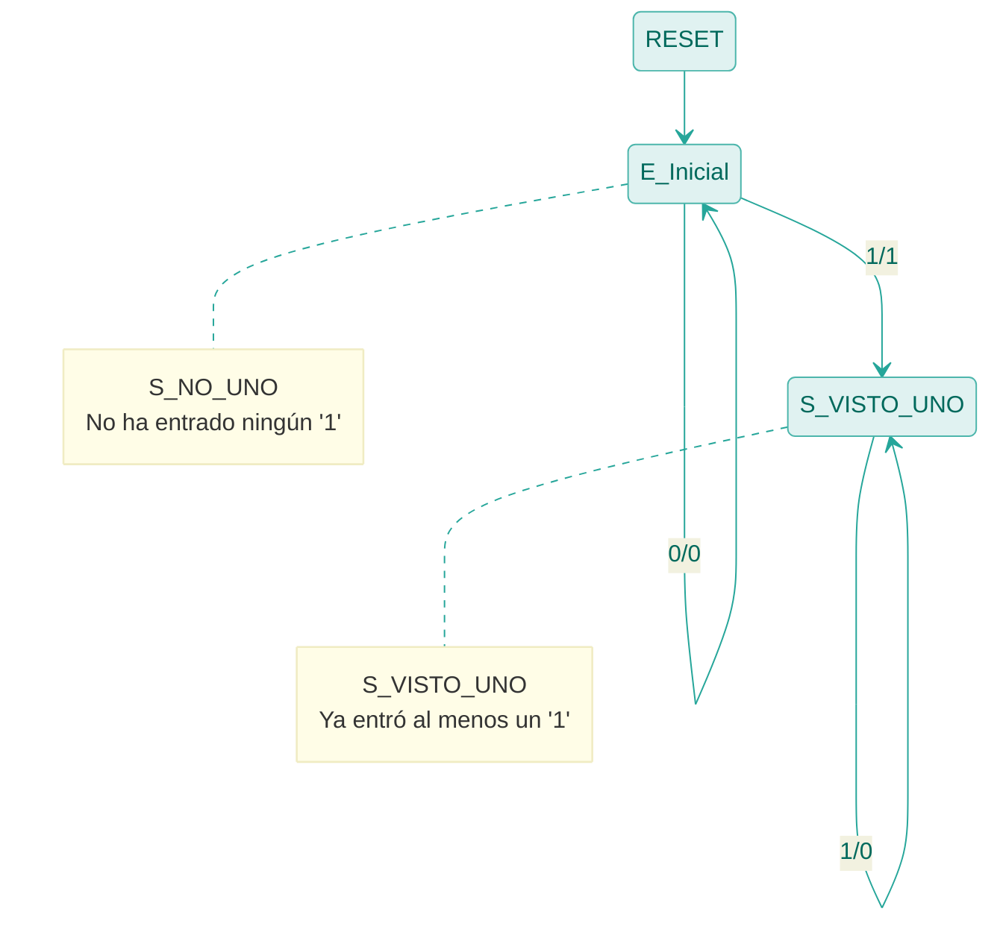
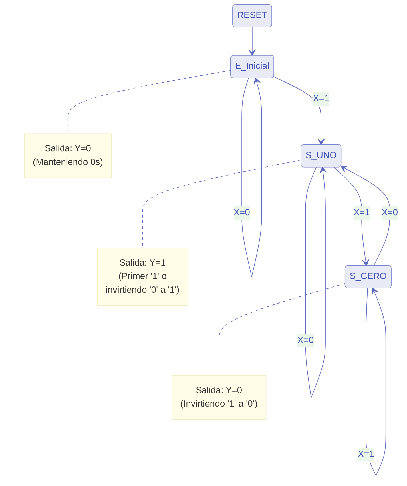

# Calculador de Complemento a 2 Serial (Mealy)

## Descripción
Este circuito implementa una Máquina de Estados Finitos (FSM) de tipo **Mealy** que calcula el complemento a 2 de un número binario procesado de forma serial. Los bits deben ingresar comenzando por el bit menos significativo (LSB).

La regla práctica matemática para esta operación consiste en:
1. Mantener intactos todos los bits de entrada hasta (e incluyendo) el primer `1` que aparezca.
2. A partir de ese momento, invertir todos los bits restantes.

## Interfaz de Puertos
| Puerto | Dirección | Tamaño | Descripción |
| :--- | :---: | :---: | :--- |
| `CLK` | `IN` | 1 bit | Señal de reloj del sistema. |
| `RST` | `IN` | 1 bit | Reset asíncrono activo en alto. Reinicia el circuito para procesar un número nuevo. |
| `X` | `IN` | 1 bit | Bit de entrada de datos (LSB primero). |
| `Y` | `OUT` | 1 bit | Bit de salida, resultado del complemento a 2. |

## Diagrama de Estados (FSM Mealy)

Al ser una máquina de Mealy, las transiciones se evalúan y la salida reacciona en función del estado actual y de la entrada actual. Las transiciones en el diagrama están denotadas con el formato `Entrada / Salida` (X/Y).

## Síntesis con Flip-Flop tipo JK

Para implementar este diseño mediante compuertas lógicas y un Flip-Flop, primero debemos codificar los estados. Al tener solo 2 estados, un único bit ($Q$) es suficiente:
*   `S_NO_UNO` = **0**
*   `S_VISTO_UNO` = **1**

Recordando la **Tabla de Excitación de un Flip-Flop JK**:
| $Q(t)$ | $Q(t+1)$ | $J$ | $K$ |
|:---:|:---:|:---:|:---:|
| 0 | 0 | 0 | X |
| 0 | 1 | 1 | X |
| 1 | 0 | X | 1 |
| 1 | 1 | X | 0 |

### Tabla de Transición, Excitación y Salida

A partir del diagrama de estados y la tabla de excitación, obtenemos la tabla completa de verdad combinacional para calcular la entrada de nuestro Flip-Flop ($J, K$) y la salida del circuito ($Y$):

| Estado Actual $Q(t)$ | Entrada $X$ | Estado Siguiente $Q(t+1)$ | FF Input $J$ | FF Input $K$ | Salida $Y$ |
|:---:|:---:|:---:|:---:|:---:|:---:|
| **0** | **0** | 0 | **0** | **X** | **0** |
| **0** | **1** | 1 | **1** | **X** | **1** |
| **1** | **0** | 1 | **X** | **0** | **1** |
| **1** | **1** | 1 | **X** | **0** | **0** |

### Ecuaciones Mínimas de Síntesis

Utilizando simplificación booleana (como mapas de Karnaugh) sobre la tabla anterior, derivamos las siguientes ecuaciones mínimas para construir el circuito:

**1. Lógica de Estado Siguiente (Entradas del FF JK):**
*   $J = X$ (La entrada $J$ se conecta directamente a $X$)
*   $K = 0$ (La entrada $K$ se conecta a GND/Tierra permanentemente)
*(Nota: El estado se mantendrá en '1' una vez activado hasta que se aplique un pulso en el pin de RESET del Flip-Flop).*

**2. Lógica de Salida de Mealy:**
*   $Y = \overline{Q} \cdot X + Q \cdot \overline{X}$
*   $Y = Q \oplus X$ (Compuerta XOR entre la salida del FF y la entrada $X$)

---

## Implementación Alternativa: FSM de Moore

A diferencia del diseño de Mealy anterior (2 estados, salida inmediata), si decidimos usar una máquina de **Moore**, la salida dependerá únicamente de los Flip-Flops. Esto introduce un ciclo de reloj de retardo y nos obliga a usar **3 estados** para recordar tanto si ya se cruzó el primer '1' como cuál es el bit invertido que debe salir.

### Diagrama de Estados (FSM Moore)

### Síntesis con Flip-Flops tipo JK (Moore)

Al tener 3 estados, necesitamos 2 bits de memoria ($Q_1, Q_0$). Asignamos la siguiente codificación binaria:
*   `E_Inicial` = **00**
*   `S_UNO` = **01**
*   `S_CERO` = **10**
*   (El estado **11** es una condición "no importa" o _Don't Care_).

#### Tabla de Transición y Excitación (Moore)

Basándonos en la tabla de excitación del Flip-Flop JK, obtenemos:

| Estado Actual $Q_1(t) Q_0(t)$ | Entrada $X$ | Estado Siguiente $Q_1(t+1) Q_0(t+1)$ | $J_1$ | $K_1$ | $J_0$ | $K_0$ | Salida $Y$ |
|:---:|:---:|:---:|:---:|:---:|:---:|:---:|:---:|
| **0 0** | **0** | 0 0 | **0** | **X** | **0** | **X** | **0** |
| **0 0** | **1** | 0 1 | **0** | **X** | **1** | **X** | **0** |
| **0 1** | **0** | 0 1 | **0** | **X** | **X** | **0** | **1** |
| **0 1** | **1** | 1 0 | **1** | **X** | **X** | **1** | **1** |
| **1 0** | **0** | 0 1 | **X** | **1** | **1** | **X** | **0** |
| **1 0** | **1** | 1 0 | **X** | **0** | **0** | **X** | **0** |
| **1 1** | **0** | X X | **X** | **X** | **X** | **X** | **X** |
| **1 1** | **1** | X X | **X** | **X** | **X** | **X** | **X** |

*(Nota: La salida $Y$ de Moore depende únicamente de $Q_1 Q_0$, no de $X$, por lo que su valor es el mismo para ambas filas del mismo estado).*

#### Mapas de Karnaugh

A continuación se presentan los mapas de Karnaugh para las 5 variables ($J_1, K_1, J_0, K_0, Y$). Las celdas marcadas con **X** son condiciones "no importa" (_Don't Care_) que corresponden al estado no utilizado (11) o a las combinaciones libres de la tabla de excitación del FF JK. Se utiliza el ordenamiento de código Gray (`00`, `01`, `11`, `10`).

**Mapa para $J_1$:**
| $Q_1$ \ $Q_0 X$ | 00 | 01 | 11 | 10 |
|:---:|:---:|:---:|:---:|:---:|
| **0** | 0 | 0 | **1** | 0 |
| **1** | X | X | X | X |
*Agrupando el `1` de (0,11) con la `X` de (1,11) se obtiene la columna completa $Q_0 X$: **$J_1 = Q_0 \cdot X$***

**Mapa para $K_1$:**
| $Q_1$ \ $Q_0 X$ | 00 | 01 | 11 | 10 |
|:---:|:---:|:---:|:---:|:---:|
| **0** | X | X | X | X |
| **1** | **1** | 0 | X | X |
*Agrupando el `1` de (1,00) con las `X` de las celdas (1,10), (0,00) y (0,10) formando un bloque en los extremos (columnas 00 y 10): **$K_1 = \overline{X}$***

**Mapa para $J_0$:**
| $Q_1$ \ $Q_0 X$ | 00 | 01 | 11 | 10 |
|:---:|:---:|:---:|:---:|:---:|
| **0** | 0 | **1** | X | X |
| **1** | **1** | 0 | X | X |
*Agrupando el `1` de (0,01) con la `X` de (0,11), y por separado el `1` de (1,00) con la `X` de (1,10): **$J_0 = \overline{Q_1} \cdot X + Q_1 \cdot \overline{X} = Q_1 \oplus X$***

**Mapa para $K_0$:**
| $Q_1$ \ $Q_0 X$ | 00 | 01 | 11 | 10 |
|:---:|:---:|:---:|:---:|:---:|
| **0** | X | X | **1** | 0 |
| **1** | X | X | X | X |
*Agrupando el `1` de (0,11) con todas las `X` de las dos columnas centrales (01 y 11), formando un cuadrado de 2x2: **$K_0 = X$***

**Mapa para $Y$ (Moore):**
Como la salida de Moore depende única y exclusivamente del estado actual ($Q_1, Q_0$), utilizamos un mapa de 2 variables independiente de la entrada $X$:
| $Q_1$ \ $Q_0$ | 0 | 1 |
|:---:|:---:|:---:|
| **0** | 0 | **1** |
| **1** | 0 | X |
*Agrupando el `1` de (0,1) con la `X` de (1,1) (columna 1 completa): **$Y = Q_0$***

#### Ecuaciones Lógicas Mínimas

Aplicando mapas de Karnaugh a la tabla anterior (aprovechando las condiciones "X"), obtenemos la lógica combinacional para los dos Flip-Flops y la salida:

**1. Entradas del Flip-Flop 1 ($Q_1$):**
*   $J_1 = Q_0 \cdot X$
*   $K_1 = \overline{X}$

**2. Entradas del Flip-Flop 0 ($Q_0$):**
*   $J_0 = \overline{Q_1} \cdot X + Q_1 \cdot \overline{X} = Q_1 \oplus X$
*   $K_0 = X$

**3. Lógica de Salida (Moore):**
*   $Y = Q_0$

Como se puede apreciar, implementar el circuito como una FSM de Moore requiere el doble de Flip-Flops (2 en lugar de 1) y más compuertas lógicas que la versión de Mealy. Por este motivo, para operaciones de manipulación de bits seriales en las que el resultado se requiere instantáneamente, la versión de **Mealy es más eficiente y comúnmente utilizada**.