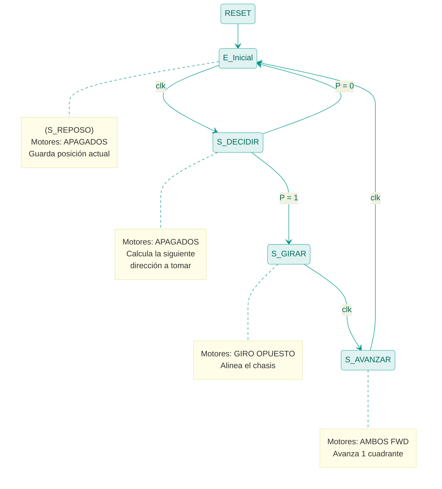

# Documentación: Robot Resolutor de Laberintos (laberinto.vhd)

## Descripción del Algoritmo
El circuito implementa un algoritmo autónomo para la resolución de laberintos basado en la técnica de **Búsqueda en Profundidad (DFS)** combinada con una variante del Algoritmo de Trémaux. 

A diferencia de enfoques simples como "seguir la pared derecha", este robot es capaz de:
1.  **Mapear internamente el espacio:** Traduce las lecturas de sus sensores relativos (frente, atrás, izquierda, derecha) a coordenadas absolutas (Norte, Este, Sur, Oeste) basándose en su registro interno de orientación (`ori`).
2.  **Memoria Cuadriculada (`visitados`):** Marca cada cuadrante de 1x1 por el que transita para jamás escoger voluntariamente un camino ya explorado, evitando atascos cíclicos o "bucles infinitos".
3.  **Historial de Decisiones (`pila` / Stack):** Cuando detecta un "callejón sin salida" físico o un espacio donde los únicos caminos abiertos ya fueron visitados, ejecuta una orden de retroceso (*Pop* del stack) e invierte su dirección para salir del bloqueo de forma segura.

## Interfaz (Puertos)
*   **Entradas:** 
    *   `clk`, `rst`: Reloj y reset del sistema.
    *   `sen_frente`, `sen_der`, `sen_izq`, `sen_atras`: Sensores de colisión locales (1 = Pared, 0 = Libre).
*   **Salidas:**
    *   `m_izq_fwd`, `m_der_fwd`: Activación de motores hacia adelante.
    *   `m_izq_rev`, `m_der_rev`: Activación de motores en reversa (usado para giros y medias vueltas).

---

## FSM Principal: Máquina de Moore

El corazón del robot está regido por una Máquina de Estados Finitos tipo **Moore**. Las acciones mecánicas del robot dependen directa y exclusivamente del estado en el que se encuentra.

Dado que el mapeo y la búsqueda introducen muchas variables, vamos a abstraer la lógica combinacional de decisión en una única variable lógica de entrada **`P`** (Path / Camino Posible):
*   **`P = 1`**: Existe un camino inexplorado viable o el robot necesita retroceder usando el historial.
*   **`P = 0`**: Bloqueo total (laberinto sin solución) o stack vacío.

### Diagrama de Estados

---

## Síntesis con Flip-Flops Tipo JK

Para implementar físicamente este controlador, realizaremos la codificación de estados binarios ($q_1, q_0$) en 2 bits para cubrir los 4 estados principales:
*   **E_Inicial (S_REPOSO):** `00`
*   **S_DECIDIR:** `01`
*   **S_GIRAR:** `10`
*   **S_AVANZAR:** `11`

Recordando la tabla de excitación general del Flip-Flop JK:

| $Q(t)$ | $Q(t+1)$ | J | K |
|:---:|:---:|:---:|:---:|
| 0 | 0 | 0 | X |
| 0 | 1 | 1 | X |
| 1 | 0 | X | 1 |
| 1 | 1 | X | 0 |

### Tabla Completa de Transición y Excitación

Tomando el diagrama anterior y codificándolo, obtenemos las entradas necesarias para nuestra memoria de control:

| Estado Actual ($q_1 q_0$) | Entrada ($P$) | Estado Sig. ($q_1^+ q_0^+$) | $J_1$ | $K_1$ | $J_0$ | $K_0$ |
|:---:|:---:|:---:|:---:|:---:|:---:|:---:|
| 0 0 (REPOSO)  | 0 | 0 1 (DECIDIR) | 0 | X | 1 | X |
| 0 0 (REPOSO)  | 1 | 0 1 (DECIDIR) | 0 | X | 1 | X |
| 0 1 (DECIDIR) | 0 | 0 0 (REPOSO)  | 0 | X | X | 1 |
| 0 1 (DECIDIR) | 1 | 1 0 (GIRAR)   | 1 | X | X | 1 |
| 1 0 (GIRAR)   | 0 | 1 1 (AVANZAR) | X | 0 | 1 | X |
| 1 0 (GIRAR)   | 1 | 1 1 (AVANZAR) | X | 0 | 1 | X |
| 1 1 (AVANZAR) | 0 | 0 0 (REPOSO)  | X | 1 | X | 1 |
| 1 1 (AVANZAR) | 1 | 0 0 (REPOSO)  | X | 1 | X | 1 |

*(Nota: En los estados REPOSO, GIRAR y AVANZAR la transición es incondicional, por lo que el comportamiento es idéntico valga P 0 o 1).*

---

### Mapas de Karnaugh y Ecuaciones Mínimas

Agrupando las condiciones aprovechando los términos "no importa" (`X`):

**Mapa para $J_1$:**

| $q_1$ \ $q_0 P$ | 00 | 01 | 11 | 10 |
|:---:|:---:|:---:|:---:|:---:|
| **0** | 0 | 0 | **1** | 0 |
| **1** | X | X | X | X |

*Agrupación:* Celda (0,11) con (1,11). 
* **Ecuación $J_1$:** $J_1 = q_0 \cdot P$

**Mapa para $K_1$:**

| $q_1$ \ $q_0 P$ | 00 | 01 | 11 | 10 |
|:---:|:---:|:---:|:---:|:---:|
| **0** | X | X | X | X |
| **1** | 0 | 0 | **1** | **1** |

*Agrupación:* Cuadrado en las columnas 11 y 10.
* **Ecuación $K_1$:** $K_1 = q_0$

**Mapa para $J_0$:**

| $q_1$ \ $q_0 P$ | 00 | 01 | 11 | 10 |
|:---:|:---:|:---:|:---:|:---:|
| **0** | **1** | **1** | X | X |
| **1** | **1** | **1** | X | X |

*Agrupación:* Todas las celdas posibles se agrupan en un gran bloque de 8.
* **Ecuación $J_0$:** $J_0 = 1$ ($V_{cc}$)

**Mapa para $K_0$:**

| $q_1$ \ $q_0 P$ | 00 | 01 | 11 | 10 |
|:---:|:---:|:---:|:---:|:---:|
| **0** | X | X | **1** | **1** |
| **1** | X | X | **1** | **1** |

*Agrupación:* Todas las celdas posibles se agrupan en un gran bloque de 8.
* **Ecuación $K_0$:** $K_0 = 1$ ($V_{cc}$)

### Resumen Lógico de Hardware

El circuito de control secuencial resulta extremadamente elegante y optimizado cuando se utiliza memoria tipo JK:

1.  **$J_1 = q_0 \cdot P$**
2.  **$K_1 = q_0$**
3.  **$J_0 = 1$** (Conectado a VCC)
4.  **$K_0 = 1$** (Conectado a VCC)

**Análisis Funcional del Flip-Flop $q_0$:**
Dado que tanto $J_0$ como $K_0$ valen `1` permanentemente, el Flip-Flop 0 se encuentra en **modo basculación (toggle)** continua en cada ciclo de reloj. Esto tiene total sentido físico: el robot siempre alterna entre "pensar/girar" (estados pares) y "preparar/avanzar" (estados impares), dictando el ritmo secuencial del control motor.

### Lógica de Salidas de los Motores

Siendo una FSM tipo Moore pura respecto a las órdenes motrices de los motores (las ruedas giran o no, según el estado actual general, delegando la dirección a una sub-fase):

*   `S_AVANZAR` ($q_1=1, q_0=1$): `m_izq_fwd = 1` y `m_der_fwd = 1`
*   `S_GIRAR` ($q_1=1, q_0=0$): Se emite la señal maestra de pivote habilitando los motores en giros diferenciales.

**Ecuación de avance:**
*   $FWD = q_1 \cdot q_0$