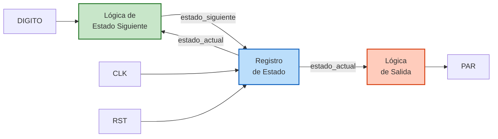
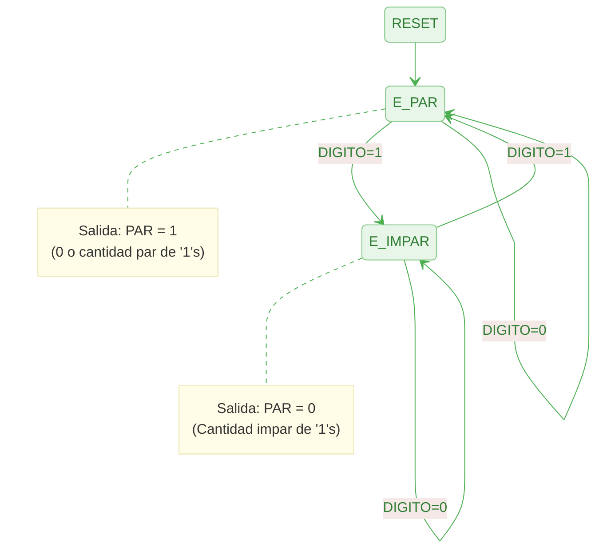

# Detector de Paridad Par (paridad)

## Descripción
Este circuito implementa un detector de paridad par mediante una Máquina de Estados Finito (FSM) de tipo Moore. El sistema examina una secuencia de entrada bit a bit (`DIGITO`) y actualiza una señal de salida (`PAR`) indicando si la cantidad total de "1s" recibidos hasta el momento es par (1) o impar (0). 

## Puertos
| Nombre | Dirección | Tamaño | Descripción |
| :--- | :--- | :--- | :--- |
| `CLK` | `IN` | 1 bit | Señal de reloj para sincronizar la máquina de estados. |
| `RST` | `IN` | 1 bit | Reset asíncrono. Reinicia la cuenta de paridad a cero. |
| `DIGITO`| `IN` | 1 bit | Entrada de datos en serie. |
| `PAR` | `OUT` | 1 bit | Salida indicadora (1 = Paridad Par, 0 = Paridad Impar). |

## Arquitectura de la Máquina de Estados

El diseño emplea la estructura clásica recomendada en VHDL que separa la FSM en tres procesos distintos para mayor claridad e inferencia correcta de hardware:

## Diagrama de Estados (FSM Moore)

Dado que es una FSM tipo Moore, la salida depende únicamente del estado actual, y las transiciones se evalúan en función de la entrada `DIGITO`.

## Tablas de Verdad y Lógica

A continuación, se desglosan las tres partes fundamentales de la máquina de estados según su implementación en los tres procesos (Registro de Estado, Lógica de Estado Siguiente y Lógica de Salida).

Para la síntesis en hardware, se asignan implícitamente valores binarios a los estados. Al ser solo dos estados, se requiere de un solo bit ($q$):
*   **E_PAR** = 0
*   **E_IMPAR** = 1

### 1. Lógica de Estado Siguiente

Este proceso combinacional evalúa el estado actual y la entrada para decidir cuál será el próximo estado de la máquina.

| Estado Actual ($q$) | Entrada (`DIGITO`) | Estado Siguiente ($q^+$) |
|:-----------------:|:------------------:|:----------------------:|
| **E_PAR** (0)     | 0                  | **E_PAR** (0)          |
| **E_PAR** (0)     | 1                  | **E_IMPAR** (1)        |
| **E_IMPAR** (1)   | 0                  | **E_IMPAR** (1)        |
| **E_IMPAR** (1)   | 1                  | **E_PAR** (0)          |

*   **Ecuación Mínima (Estado Siguiente $q^+$):** $q^+ = q \oplus \text{DIGITO}$ (Compuerta XOR)

### 2. Registro de Estado (Memoria)

Este proceso secuencial y síncrono actualiza el estado actual con el valor del estado siguiente en cada flanco de subida del reloj, y maneja el reinicio asíncrono prioritario.

| `RST` | `CLK` (Flanco) | Actualización de `estado_actual` ($q$) |
|:---:|:---:|:---|
| 1 | X (No importa) | Inmediatamente a **E_PAR** (0) |
| 0 | $\uparrow$ (Subida) | Toma el valor de `estado_siguiente` ($q^+$) |
| 0 | 0, 1, $\downarrow$ (Bajada) | Mantiene el valor actual ($q$) |

*   **Hardware inferido:** 1 Flip-Flop Tipo D con Reset Asíncrono activo en alto. La entrada D del Flip-Flop se conecta a la salida de la lógica de estado siguiente ($q^+$).

### 3. Lógica de Salida

Este proceso combinacional tipo Moore define la salida del sistema basándose única y exclusivamente en el estado actual.

| Estado Actual ($q$) | Salida (`PAR`) |
|:-----------------:|:--------------:|
| **E_PAR** (0)     | 1              |
| **E_IMPAR** (1)   | 0              |

*   **Ecuación Mínima (Salida `PAR`):** $\text{PAR} = \overline{q}$ (Compuerta NOT conectada a la salida del Flip-Flop)

### 4. Implementación Alternativa con Flip-Flop JK

Para implementar el diseño con un Flip-Flop tipo JK, primero recordamos su tabla de excitación (transición general), la cual define los valores necesarios en $J$ y $K$ para lograr una transición desde un estado actual $Q(t)$ hacia un estado siguiente $Q(t+1)$:

| $Q(t)$ | $Q(t+1)$ | $J$ | $K$ |
|:---:|:---:|:---:|:---:|
| 0 | 0 | 0 | X |
| 0 | 1 | 1 | X |
| 1 | 0 | X | 1 |
| 1 | 1 | X | 0 |

Con base en esta tabla de excitación y la lógica de estado siguiente obtenida en la sección 1, derivamos la tabla de estados completa para determinar las conexiones necesarias en las entradas $J$ y $K$:

| Estado Actual ($q_0$) | Entrada (`DIGITO`) | Estado Siguiente ($q_0^+$) | $J$ | $K$ | Salida (`PAR`) |
|:---:|:---:|:---:|:---:|:---:|:---:|
| 0 | 0 | 0 | 0 | X | 1 |
| 0 | 1 | 1 | 1 | X | 1 |
| 1 | 0 | 1 | X | 0 | 0 |
| 1 | 1 | 0 | X | 1 | 0 |

*   **Ecuaciones Mínimas (Flip-Flop JK):**
    *   $J = \text{DIGITO}$
    *   $K = \text{DIGITO}$

Como se puede observar, para este caso específico de detección de paridad, el uso de un Flip-Flop JK resulta en una simplificación máxima del circuito combinacional, donde ambas entradas $J$ y $K$ se conectarían directamente a la señal de entrada `DIGITO`.

