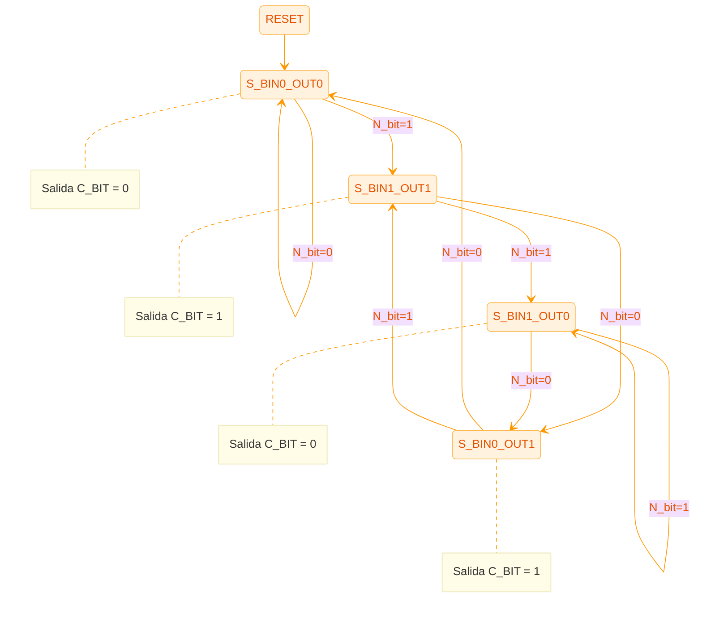
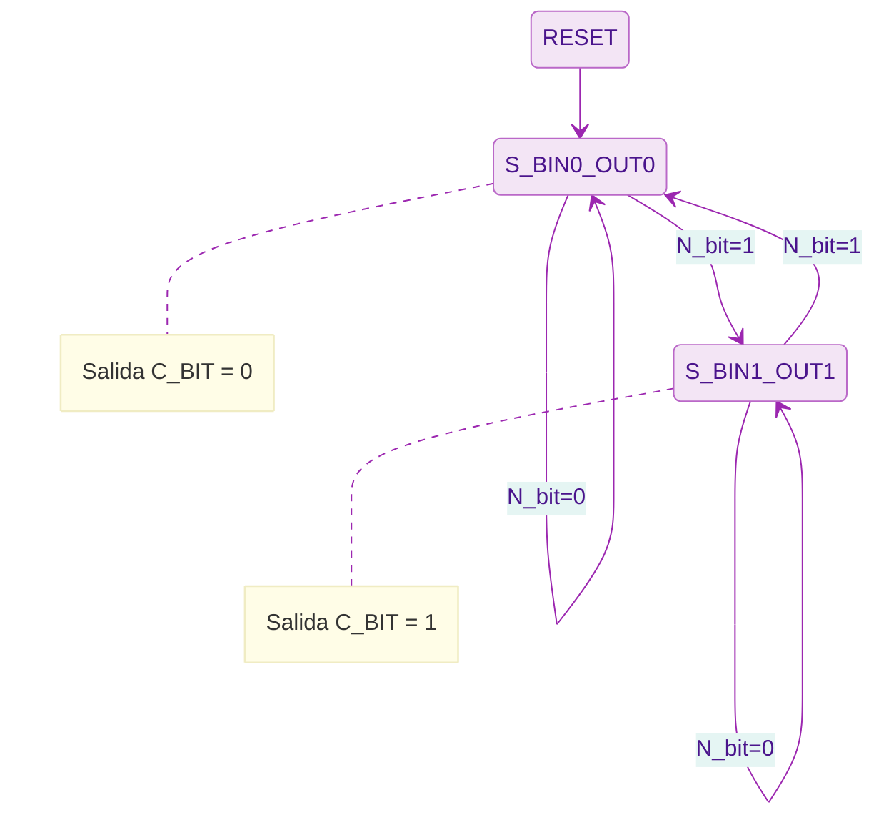

# Codificador Binario a Gray y Gray a Binario Serial

## 1. Introducción
Este documento técnico describe el diseño y la implementación de un conversor bidireccional serial entre los códigos Binario y Gray. El sistema procesa los datos bit a bit, comenzando por el bit más significativo (MSB), permitiendo una conversión eficiente en términos de hardware para cadenas de bits de cualquier longitud.

## 2. Entidad y Puertos
La entidad `codificadorBG` define la interfaz del sistema para la comunicación serial y el control de modo.

| Puerto | Dirección | Descripción |
| :--- | :--- | :--- |
| `clk` | `IN` | Reloj del sistema (sincroniza el procesamiento de cada bit). |
| `rst` | `IN` | Reset asíncrono. Inicia una nueva conversión de cadena de bits. |
| `SYS` | `IN` | Modo de operación (0: Gray a Binario, 1: Binario a Gray). |
| `N_bit` | `IN` | Bit de entrada serial (ingresar desde el MSB). |
| `C_BIT` | `OUT` | Bit de salida convertido. |

---

## 3. Diseño Implementado (FSM Moore)

### Descripción
La implementación real del sistema en VHDL utiliza una **Máquina de Estados Finitos (FSM) tipo Moore**. En este modelo, la salida `C_BIT` depende exclusivamente del estado actual del sistema. A diferencia de un modelo Mealy, esta arquitectura garantiza que la salida sea sincrónica con el reloj y esté completamente libre de transitorios combinacionales (*glitches*) derivados de cambios en la entrada `N_bit`.

El diseño requiere almacenar tanto el historial del bit binario previo como el valor de la salida actual, lo que resulta en una estructura de 4 estados robusta y fácilmente escalable.

### Estados
Para codificar la lógica de conversión en un modelo Moore, se definen los siguientes estados:
- `S_BIN0_OUT0`: Bit binario actual es `0` y la salida es `0`.
- `S_BIN0_OUT1`: Bit binario actual es `0` y la salida es `1`.
- `S_BIN1_OUT0`: Bit binario actual es `1` y la salida es `0`.
- `S_BIN1_OUT1`: Bit binario actual es `1` y la salida es `1`.

### Diagramas de Estados (Moore)
Las transiciones se basan en la entrada `N_bit` y el modo `SYS`. A continuación se detallan los comportamientos para cada modo:

#### Modo: Binario a Gray (`SYS = '1'`)

#### Modo: Gray a Binario (`SYS = '0'`)
En este modo, la conversión Gray a Binario simplifica el flujo, aunque mantiene la estructura de estados Moore para consistencia.

---

## 4. Implementaciones Alternativas

### 4.1 FSM tipo Mealy equivalente
Este modelo representa una alternativa conductual más compacta. En una FSM Mealy, la salida se calcula combinando el estado actual y la entrada en el mismo ciclo. Aunque reduce el número de estados a 2 (`S_PREV_BIN_0` y `S_PREV_BIN_1`), la salida es vulnerable a transitorios si la entrada `N_bit` no está perfectamente sincronizada.

**Diagrama Mealy (Simplificado):**
Las transiciones siguen el formato `entrada/salida`.
- En `SYS=1` (Bin a Gray): Transición `1/0` en estado `S_PREV_BIN_1`.
- En `SYS=0` (Gray a Bin): Transición `0/1` en estado `S_PREV_BIN_1`.

### 4.2 Implementación Estructural con Flip-Flops JK
A nivel estructural, la FSM de Moore puede implementarse físicamente mediante Flip-Flops y compuertas lógicas. Utilizando una codificación de estados óptima (`Q1`, `Q0`), se derivan las ecuaciones de excitación para los Flip-Flops JK.

**Ecuaciones de Excitación y Salida:**
- $J_1 = Q_0 \cdot SYS$
- $K_1 = \overline{SYS} + Q_0$
- $J_0 = K_0 = Q_1 \oplus N\_bit$
- $C\_BIT = Q_0$ (Salida directa del estado)

---

## 5. Conclusiones técnicas
- La **FSM Moore** elegida para la implementación en VHDL proporciona una salida estable y sincronizada, ideal para sistemas que operan a altas frecuencias de reloj donde los *glitches* combinacionales deben evitarse.
- La separación entre la lógica de estado siguiente (combinacional) y el registro de estado/salida (secuencial) facilita el análisis de tiempos y la síntesis en FPGA.
- Las implementaciones alternativas (Mealy y Estructural) confirman la versatilidad del diseño digital, permitiendo elegir entre optimización de área (Mealy) o estabilidad de señal (Moore).
