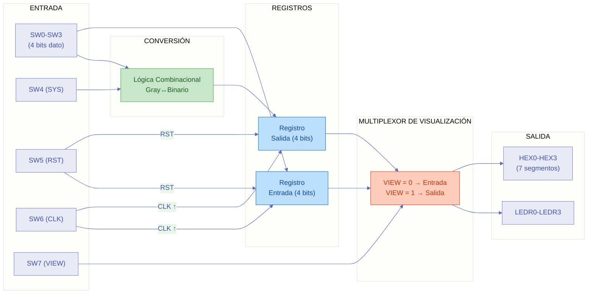
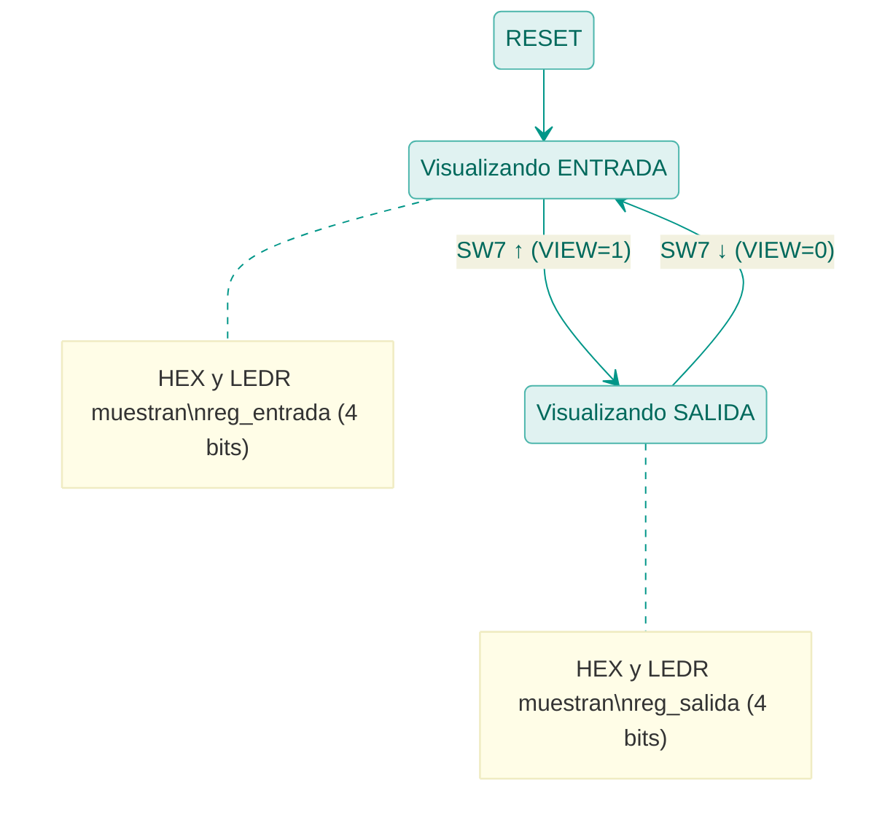

# Codificador Gray/Binario Paralelo para FPGA

## 1. Introducción
Este documento describe la implementación del codificador bidireccional Gray↔Binario adaptado para la placa FPGA **Cyclone II EP2C20F484C7N**. A diferencia del diseño base serial (`codificadorBG.vhd`), esta versión opera en modo **paralelo de 4 bits**, permitiendo la conversión simultánea de una palabra completa.

El diseño incluye un mecanismo de **visualización asíncrona** que permite alternar instantáneamente entre los bits de entrada y los bits de salida convertidos, tanto en los displays de 7 segmentos como en los LEDs rojos, mediante un switch de control dedicado.

---

## 2. Diferencias con el Diseño Base Serial

| Característica | Base Serial (`codificadorBG.vhd`) | FPGA Paralelo (`codificadorBG_FPGA.vhd`) |
| :--- | :--- | :--- |
| Procesamiento | Bit a bit (serial, desde MSB) | 4 bits simultáneos (paralelo) |
| Arquitectura | FSM Moore de 4 estados | Lógica combinacional + registros |
| Entrada | 1 bit (`N_bit`) | 4 bits (`SW0-SW3`) |
| Salida | 1 bit (`C_BIT`) | 4 bits (LEDs + displays) |
| Visualización | No aplica | Conmutable entrada/salida (VIEW) |
| CLK | Reloj del sistema | Switch manual (SW6) |

---

## 3. Mapeo de Pines y Funciones

### 3.1 Switches de Entrada (8 bits)

| Switch | Pin FPGA | Función | Descripción |
| :--- | :--- | :--- | :--- |
| **SW0** | `L22` | Bit de entrada 0 (LSB) | Dato de entrada, bit menos significativo |
| **SW1** | `L21` | Bit de entrada 1 | Dato de entrada |
| **SW2** | `M22` | Bit de entrada 2 | Dato de entrada |
| **SW3** | `V12` | Bit de entrada 3 (MSB) | Dato de entrada, bit más significativo |
| **SW4** | `W12` | Modo SYS | `0`: Gray → Binario · `1`: Binario → Gray |
| **SW5** | `U12` | Reset (RST) | Limpia registros de entrada y salida |
| **SW6** | `U11` | Reloj Manual (CLK) | Captura datos en flanco de subida |
| **SW7** | `M2` | Control de Visualización (VIEW) | `0`: Muestra entrada · `1`: Muestra salida |

### 3.2 LEDs Rojos de Salida (4 bits)

| LED | Pin FPGA | Función |
| :--- | :--- | :--- |
| **LEDR0** | `R20` | Bit 0 del dato visualizado (LSB) |
| **LEDR1** | `R19` | Bit 1 del dato visualizado |
| **LEDR2** | `U19` | Bit 2 del dato visualizado |
| **LEDR3** | `Y19` | Bit 3 del dato visualizado (MSB) |

> Los LEDs muestran los bits de **entrada** o **salida** según el estado de VIEW (SW7).

### 3.3 Displays de 7 Segmentos (Ánodo Común)

| Display | Pines (g, f, e, d, c, b, a) | Función |
| :--- | :--- | :--- |
| **HEX0** | `E2, F1, F2, H1, H2, J1, J2` | Bit 0 (LSB) mostrado como '0' o '1' |
| **HEX1** | `D1, D2, G3, H4, H5, H6, E1` | Bit 1 mostrado como '0' o '1' |
| **HEX2** | `D3, E4, E3, C1, C2, G6, G5` | Bit 2 mostrado como '0' o '1' |
| **HEX3** | `D4, F3, L8, J4, D6, D5, F4` | Bit 3 (MSB) mostrado como '0' o '1' |

> Cada display muestra el carácter `0` o `1` correspondiente al bit seleccionado por VIEW. El formato de pines sigue el orden (g, f, e, d, c, b, a) compatible con la placa Cyclone II.

---

## 4. Arquitectura del Diseño

### 4.1 Diagrama de Bloques



### 4.2 Descripción de las Secciones del Código

#### Sección 1: Lógica de Conversión Combinacional
La conversión opera directamente sobre los switches de entrada (`dato_in = SW3..SW0`) usando lógica combinacional pura, sin necesidad de una FSM. Esto permite que al momento del flanco de CLK, la salida ya esté calculada y lista para ser registrada.

**Conversión Gray → Binario:**
```
B(3) = G(3)
B(2) = G(3) ⊕ G(2)
B(1) = G(3) ⊕ G(2) ⊕ G(1)
B(0) = G(3) ⊕ G(2) ⊕ G(1) ⊕ G(0)
```

**Conversión Binario → Gray:**
```
G(3) = B(3)
G(2) = B(3) ⊕ B(2)
G(1) = B(2) ⊕ B(1)
G(0) = B(1) ⊕ B(0)
```

#### Sección 2: Registro de Captura
Un proceso secuencial sensible al flanco de subida de **CLK** (SW6) y al reset asíncrono **RST** (SW5):
- **Reset (`RST = '1'`):** Limpia ambos registros a `"0000"`.
- **Flanco de subida de CLK:** Captura simultáneamente:
  - `reg_entrada ← dato_in` (los 4 switches de datos)
  - `reg_salida ← conversión(dato_in)` (resultado según SYS)

> La conversión se calcula sobre `dato_in` en vivo (no sobre `reg_entrada`), evitando un desfase de un ciclo entre la entrada capturada y su conversión.

#### Sección 3: Multiplexor de Visualización (Asíncrono)
Una asignación condicional concurrente selecciona qué datos se envían a la visualización:

```vhdl
s_visualizar <= reg_salida WHEN VIEW = '1' ELSE reg_entrada;
```

- **VIEW = '0' (SW7 abajo):** Se muestran los bits de **entrada** capturados.
- **VIEW = '1' (SW7 arriba):** Se muestran los bits de **salida** convertidos.

Este cambio es **asíncrono al CLK**: al mover SW7, la visualización cambia instantáneamente sin esperar ningún flanco de reloj.

#### Sección 4: Salidas
- **LEDs rojos (LEDR0-3):** Muestran directamente los 4 bits seleccionados por VIEW.
- **Displays 7 segmentos (HEX0-3):** Cada display decodifica un bit individual del dato visualizado, mostrando el carácter `0` o `1` usando la función `to_7seg` (ánodo común, `'0'` enciende el segmento).

---

## 5. Ejemplo de Uso

### Conversión Gray → Binario (`SYS = '0'`)

1. Configurar **SW4 = 0** (modo Gray → Binario)
2. Colocar en **SW3-SW0** el código Gray deseado, por ejemplo `1101`
3. Subir **SW6** (CLK) para capturar el dato
4. Con **SW7 = 0** (VIEW): los displays y LEDs muestran la entrada `1101`
5. Con **SW7 = 1** (VIEW): los displays y LEDs muestran la salida `1001` (binario)

| Entrada Gray | Salida Binario | Verificación |
| :--- | :--- | :--- |
| `0000` | `0000` | ✔ |
| `0001` | `0001` | ✔ |
| `0011` | `0010` | ✔ |
| `0010` | `0011` | ✔ |
| `0110` | `0100` | ✔ |
| `0111` | `0101` | ✔ |
| `0101` | `0110` | ✔ |
| `0100` | `0111` | ✔ |
| `1100` | `1000` | ✔ |
| `1101` | `1001` | ✔ |
| `1111` | `1010` | ✔ |
| `1110` | `1011` | ✔ |
| `1010` | `1100` | ✔ |
| `1011` | `1101` | ✔ |
| `1001` | `1110` | ✔ |
| `1000` | `1111` | ✔ |

---

## 6. Control de Visualización (VIEW)

El switch **SW7 (VIEW)** permite inspeccionar los datos en cualquier momento sin afectar el funcionamiento interno:



> El cambio es **instantáneo y asíncrono**: no depende del estado de CLK ni requiere ningún flanco de reloj. Basta con mover el switch para que la visualización refleje el cambio.

---

## 7. Verificación de Pines

Todos los pines asignados fueron verificados contra los documentos de referencia:
- `Asignacion de pines.md`
- `Mapeo de placa.vhd`

| Recurso | Pines en código | Estado |
| :--- | :--- | :--- |
| SW0-SW7 | L22, L21, M22, V12, W12, U12, U11, M2 | ✔ Verificado |
| LEDR0-LEDR3 | R20, R19, U19, Y19 | ✔ Verificado |
| HEX0 (g..a) | E2, F1, F2, H1, H2, J1, J2 | ✔ Verificado |
| HEX1 (g..a) | D1, D2, G3, H4, H5, H6, E1 | ✔ Verificado |
| HEX2 (g..a) | D3, E4, E3, C1, C2, G6, G5 | ✔ Verificado |
| HEX3 (g..a) | D4, F3, L8, J4, D6, D5, F4 | ✔ Verificado |
