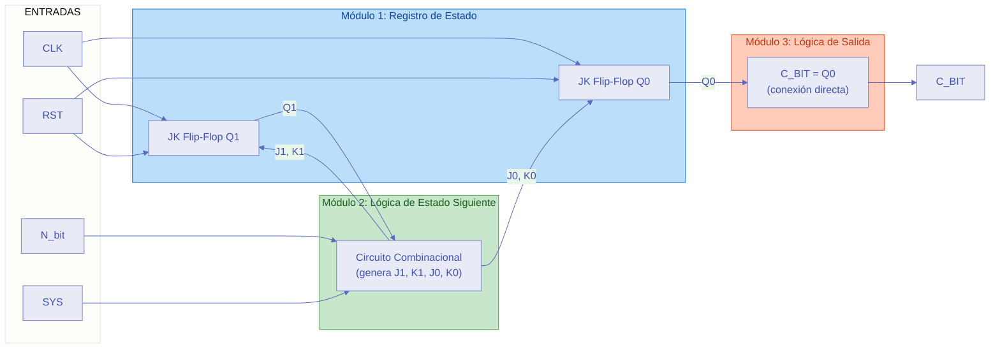
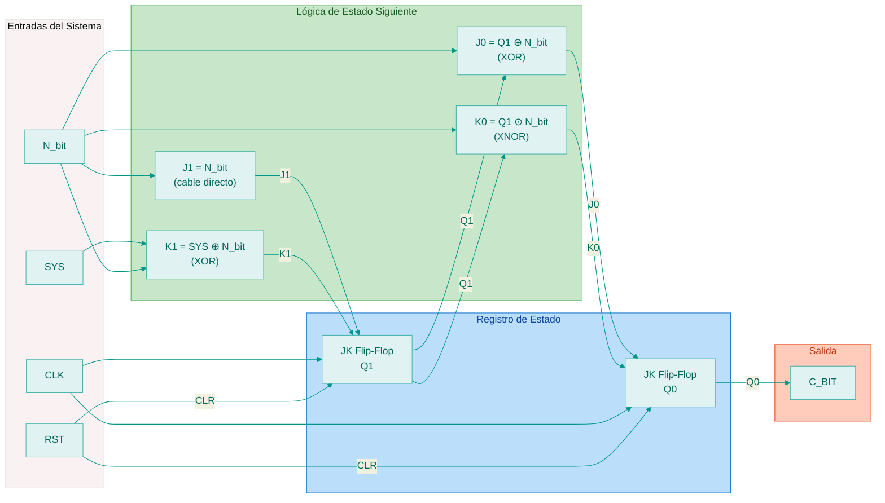
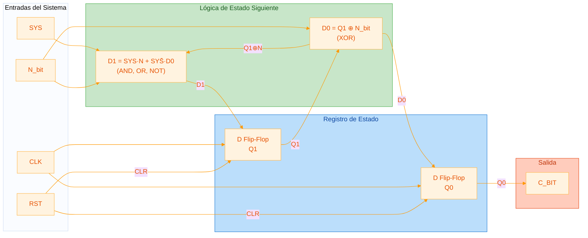

# Codificador Binario/Gray — Implementación en Logisim

## 1. Introducción

Este documento proporciona las tablas de verdad, ecuaciones lógicas y guía de construcción modular para implementar el codificador serial Binario↔Gray (`codificadorBG.vhd`) como circuito estructural en **Logisim Evolution v3.8.0**.

El diseño se basa en la FSM Moore de 4 estados descrita en la documentación del proyecto, descompuesta en tres módulos interconectados: **Registro de Estado**, **Lógica de Estado Siguiente** y **Lógica de Salida**.

La implementación principal utiliza **Flip-Flops JK** (opcionalmente se puede usar Flip-Flops D como alternativa, ver sección 6.6).

---

## 2. Tabla de Conversión Básica (16 valores)

La siguiente tabla muestra la equivalencia entre los primeros 16 valores en código Binario Natural y código Gray. Esta es la referencia fundamental para verificar el funcionamiento del codificador.

| Decimal | Binario (B3 B2 B1 B0) | Gray (G3 G2 G1 G0) |
| :---: | :---: | :---: |
| 0 | `0000` | `0000` |
| 1 | `0001` | `0001` |
| 2 | `0010` | `0011` |
| 3 | `0011` | `0010` |
| 4 | `0100` | `0110` |
| 5 | `0101` | `0111` |
| 6 | `0110` | `0101` |
| 7 | `0111` | `0100` |
| 8 | `1000` | `1100` |
| 9 | `1001` | `1101` |
| 10 | `1010` | `1111` |
| 11 | `1011` | `1110` |
| 12 | `1100` | `1010` |
| 13 | `1101` | `1011` |
| 14 | `1110` | `1001` |
| 15 | `1111` | `1000` |

**Reglas de conversión:**

**Binario → Gray:**

$$G_3 = B_3$$

$$G_i = B_{i+1} \oplus B_i \quad \text{para } i = 2, 1, 0$$

**Gray → Binario:**

$$B_3 = G_3$$

$$B_i = B_{i+1} \oplus G_i \quad \text{para } i = 2, 1, 0$$

> **Propiedad clave del código Gray:** entre dos valores consecutivos solo cambia un bit. Esto se puede verificar comparando filas adyacentes en la columna Gray.

---

## 3. Codificación de Estados de la FSM

### 3.1 Definición de Estados

La FSM Moore del `codificadorBG.vhd` define 4 estados que codifican dos informaciones simultáneas:
- **Bit binario almacenado** (necesario para la siguiente conversión)
- **Salida C_BIT** (resultado de la conversión actual)

| Estado | $Q_1$ (Bit Binario) | $Q_0$ (Salida C_BIT) | Significado |
| :--- | :---: | :---: | :--- |
| `S_BIN0_OUT0` | 0 | 0 | Binario previo = 0, Salida = 0 |
| `S_BIN0_OUT1` | 0 | 1 | Binario previo = 0, Salida = 1 |
| `S_BIN1_OUT0` | 1 | 0 | Binario previo = 1, Salida = 0 |
| `S_BIN1_OUT1` | 1 | 1 | Binario previo = 1, Salida = 1 |

> **Estado inicial (RESET):** `S_BIN0_OUT0` → $Q_1=0$, $Q_0=0$

### 3.2 Entradas y Salidas del Sistema

| Señal | Tipo | Descripción |
| :--- | :--- | :--- |
| `CLK` | Entrada | Reloj del sistema |
| `RST` | Entrada | Reset asíncrono |
| `SYS` | Entrada | Modo: 0 = Gray→Binario, 1 = Binario→Gray |
| $N_{bit}$ | Entrada | Bit de entrada serial (desde MSB) |
| $C_{BIT}$ | Salida | Bit de salida convertido = $Q_0$ |

---

## 4. Tablas de Verdad para la FSM

### 4.1 Tabla de Transiciones Completa

Esta tabla define, para cada combinación de estado actual ($Q_1$, $Q_0$), modo ($SYS$) y entrada ($N$), cuál es el estado siguiente ($Q_1^+$, $Q_0^+$).

Las columnas intermedias muestran el cálculo paso a paso según el VHDL:
- $v\_prev\_bin = Q_1$ (extraído del estado actual)
- $v\_curr\_out = N \oplus Q_1$ (salida calculada)
- $v\_curr\_bin = N$ cuando $SYS=1$, ó $v\_curr\_out$ cuando $SYS=0$

| # | $Q_1$ | $Q_0$ | $SYS$ | $N$ | $v\_prev\_bin$ | $v\_curr\_out$ | $v\_curr\_bin$ | $Q_1^+$ | $Q_0^+$ |
| :---: | :---: | :---: | :---: | :---: | :---: | :---: | :---: | :---: | :---: |
| 0  | 0 | 0 | 0 | 0 | 0 | 0 | 0 | 0 | 0 |
| 1  | 0 | 0 | 0 | 1 | 0 | 1 | 1 | 1 | 1 |
| 2  | 0 | 0 | 1 | 0 | 0 | 0 | 0 | 0 | 0 |
| 3  | 0 | 0 | 1 | 1 | 0 | 1 | 1 | 1 | 1 |
| 4  | 0 | 1 | 0 | 0 | 0 | 0 | 0 | 0 | 0 |
| 5  | 0 | 1 | 0 | 1 | 0 | 1 | 1 | 1 | 1 |
| 6  | 0 | 1 | 1 | 0 | 0 | 0 | 0 | 0 | 0 |
| 7  | 0 | 1 | 1 | 1 | 0 | 1 | 1 | 1 | 1 |
| 8  | 1 | 0 | 0 | 0 | 1 | 1 | 1 | 1 | 1 |
| 9  | 1 | 0 | 0 | 1 | 1 | 0 | 0 | 0 | 0 |
| 10 | 1 | 0 | 1 | 0 | 1 | 1 | 0 | 0 | 1 |
| 11 | 1 | 0 | 1 | 1 | 1 | 0 | 1 | 1 | 0 |
| 12 | 1 | 1 | 0 | 0 | 1 | 1 | 1 | 1 | 1 |
| 13 | 1 | 1 | 0 | 1 | 1 | 0 | 0 | 0 | 0 |
| 14 | 1 | 1 | 1 | 0 | 1 | 1 | 0 | 0 | 1 |
| 15 | 1 | 1 | 1 | 1 | 1 | 0 | 1 | 1 | 0 |

> **Observación importante:** $Q_0$ (salida actual) **no influye** en el cálculo de $Q_1^+$ ni $Q_0^+$. Esto se verifica comparando pares de filas: (0,4), (1,5), (2,6), etc. tienen idénticos $Q_1^+$ y $Q_0^+$. Esto simplifica la lógica combinacional.

### 4.2 Tablas de Excitación para Flip-Flops JK

Para cada transición $Q \rightarrow Q^+$ se determinan las entradas $J$ y $K$ necesarias:

| Transición $Q \rightarrow Q^+$ | $J$ | $K$ |
| :---: | :---: | :---: |
| $0 \rightarrow 0$ | 0 | X |
| $0 \rightarrow 1$ | 1 | X |
| $1 \rightarrow 0$ | X | 1 |
| $1 \rightarrow 1$ | X | 0 |

A continuación se presentan las tablas divididas por módulo funcional, listas para ingresar en la herramienta **"Analizar Circuito"** de Logisim. Los valores **X** representan condiciones *don't care*.

---

#### 4.2.1 Tabla para el Módulo: Lógica de Estado Siguiente

Esta tabla define la lógica combinacional que genera las señales de excitación $J_1$, $K_1$, $J_0$ y $K_0$ para los Flip-Flops JK.

**Entradas:** $Q_1$, $Q_0$, $SYS$, $N$
**Salidas:** $J_1$, $K_1$, $J_0$, $K_0$

| $Q_1$ | $Q_0$ | $SYS$ | $N$ | $J_1$ | $K_1$ | $J_0$ | $K_0$ |
| :---: | :---: | :---: | :---: | :---: | :---: | :---: | :---: |
| 0 | 0 | 0 | 0 | 0 | X | 0 | X |
| 0 | 0 | 0 | 1 | 1 | X | 1 | X |
| 0 | 0 | 1 | 0 | 0 | X | 0 | X |
| 0 | 0 | 1 | 1 | 1 | X | 1 | X |
| 0 | 1 | 0 | 0 | 0 | X | X | 1 |
| 0 | 1 | 0 | 1 | 1 | X | X | 0 |
| 0 | 1 | 1 | 0 | 0 | X | X | 1 |
| 0 | 1 | 1 | 1 | 1 | X | X | 0 |
| 1 | 0 | 0 | 0 | X | 0 | 1 | X |
| 1 | 0 | 0 | 1 | X | 1 | 0 | X |
| 1 | 0 | 1 | 0 | X | 1 | 1 | X |
| 1 | 0 | 1 | 1 | X | 0 | 0 | X |
| 1 | 1 | 0 | 0 | X | 0 | X | 0 |
| 1 | 1 | 0 | 1 | X | 1 | X | 1 |
| 1 | 1 | 1 | 0 | X | 1 | X | 0 |
| 1 | 1 | 1 | 1 | X | 0 | X | 1 |

> **Para ingresar en Logisim "Analizar Circuito":**
> 1. Ir a **Ventana → Analizar Circuito**
> 2. En la pestaña **Entradas**, agregar: `Q1`, `Q0`, `SYS`, `N`
> 3. En la pestaña **Salidas**, agregar: `J1`, `K1`, `J0`, `K0`
> 4. En la pestaña **Tabla**, ingresar los valores anteriores (usar `x` para los *don't care*)
> 5. Clic en **Construir Circuito** para generar automáticamente la lógica con compuertas

---

#### 4.2.2 Tabla para el Módulo: Lógica de Salida

En una FSM Moore, la salida depende **exclusivamente del estado actual**. La tabla es trivial:

**Entradas:** $Q_1$, $Q_0$
**Salidas:** $C_{BIT}$

| $Q_1$ | $Q_0$ | $C_{BIT}$ |
| :---: | :---: | :---: |
| 0 | 0 | 0 |
| 0 | 1 | 1 |
| 1 | 0 | 0 |
| 1 | 1 | 1 |

> **Resultado:** $C_{BIT} = Q_0$ (conexión directa, no requiere compuertas). En Logisim basta con un cable directo de $Q_0$ hacia la salida $C_{BIT}$.

---

### 4.3 Tabla de Excitación para Flip-Flops D (Alternativa)

Para flip-flops D la excitación es directa: $D = Q^+$. Esta tabla también se puede ingresar en **"Analizar Circuito"**.

**Entradas:** $Q_1$, $Q_0$, $SYS$, $N$
**Salidas:** $D_1$, $D_0$

| $Q_1$ | $Q_0$ | $SYS$ | $N$ | $D_1$ | $D_0$ |
| :---: | :---: | :---: | :---: | :---: | :---: |
| 0 | 0 | 0 | 0 | 0 | 0 |
| 0 | 0 | 0 | 1 | 1 | 1 |
| 0 | 0 | 1 | 0 | 0 | 0 |
| 0 | 0 | 1 | 1 | 1 | 1 |
| 0 | 1 | 0 | 0 | 0 | 0 |
| 0 | 1 | 0 | 1 | 1 | 1 |
| 0 | 1 | 1 | 0 | 0 | 0 |
| 0 | 1 | 1 | 1 | 1 | 1 |
| 1 | 0 | 0 | 0 | 1 | 1 |
| 1 | 0 | 0 | 1 | 0 | 0 |
| 1 | 0 | 1 | 0 | 0 | 1 |
| 1 | 0 | 1 | 1 | 1 | 0 |
| 1 | 1 | 0 | 0 | 1 | 1 |
| 1 | 1 | 0 | 1 | 0 | 0 |
| 1 | 1 | 1 | 0 | 0 | 1 |
| 1 | 1 | 1 | 1 | 1 | 0 |

> **Nota:** La lógica de salida para D es la misma que para JK: $C_{BIT} = Q_0$.

---

## 5. Ecuaciones Lógicas Simplificadas

### 5.1 Ecuaciones para Flip-Flops JK (Principal)

Derivadas de la tabla 4.2.1, asignando los valores óptimos a los *don't cares* (X):

$$J_1 = N_{bit}$$

$$K_1 = SYS \oplus N_{bit}$$

$$J_0 = Q_1 \oplus N_{bit}$$

$$K_0 = \overline{Q_1 \oplus N_{bit}} = Q_1 \odot N_{bit} \quad \text{(XNOR)}$$

> **Observación:** $J_0$ y $K_0$ son complementarios: $K_0 = \overline{J_0}$. Esto permite implementarlos con una sola compuerta XOR y un inversor (NOT), o directamente con una compuerta XNOR.

### 5.2 Ecuaciones para Flip-Flops D (Alternativa)

Derivadas directamente de la tabla 4.3:

$$D_0 = Q_1 \oplus N_{bit}$$

$$D_1 = SYS \cdot N_{bit} + \overline{SYS} \cdot (Q_1 \oplus N_{bit})$$

> **Nota:** $D_0$ no depende de $SYS$ ni de $Q_0$. $D_1$ no depende de $Q_0$.
> La ecuación de $D_1$ puede interpretarse como un **multiplexor**: cuando $SYS=0$ pasa $Q_1 \oplus N$, cuando $SYS=1$ pasa $N$.

### 5.3 Ecuación de Salida (Moore)

$$C_{BIT} = Q_0$$

La salida es directamente el bit $Q_0$ del registro de estado. No requiere lógica combinacional adicional.

### 5.4 Verificación de las Ecuaciones

Comprobación con el ejemplo: conversión de Gray `1101` a Binario ($SYS=0$):

| Ciclo | $N_{bit}$ | $Q_1$ (antes) | $Q_0$ (antes) | $C_{BIT}=Q_0$ | $Q_1^+$ | $Q_0^+$ |
| :---: | :---: | :---: | :---: | :---: | :---: | :---: |
| RST | — | 0 | 0 | 0 | — | — |
| 1 | 1 (MSB) | 0 | 0 | **1** $(=0 \oplus 1)$ | 1 | 1 |
| 2 | 1 | 1 | 1 | **0** $(=1 \oplus 1)$ | 0 | 0 |
| 3 | 0 | 0 | 0 | **0** $(=0 \oplus 0)$ | 0 | 0 |
| 4 | 1 (LSB) | 0 | 0 | **1** $(=0 \oplus 1)$ | 1 | 1 |

Resultado serial: `1001` → Gray `1101` = Binario `1001` ✔ (verificar con la tabla de la sección 2)

---

## 6. Implementación Modular en Logisim

### 6.1 Diagrama de Bloques de la FSM

### 6.2 Módulo 1: Registro de Estado

**Componentes en Logisim:**
- 2 Flip-Flops JK (Memoria → Flip-Flop JK)
- Conexión común de CLK a ambos flip-flops
- Conexión de RST a la entrada *Clear* (asíncrona) de ambos flip-flops

**Pasos en Logisim:**
1. Abrir el menú **Memoria → Flip-Flop JK**
2. Colocar dos flip-flops lado a lado
3. Conectar la entrada `CLK` de ambos al mismo cable de reloj
4. Conectar la entrada `CLR` (Clear) de ambos al cable `RST`
5. Las salidas `Q` de cada flip-flop serán $Q_1$ y $Q_0$ respectivamente
6. Etiquetar las salidas como `Q1` y `Q0`

### 6.3 Módulo 2: Lógica de Estado Siguiente (Combinacional)

Este es el módulo central. Se puede generar automáticamente o construir manualmente.

#### Generación automática con "Analizar Circuito"

1. En Logisim, ir a **Ventana → Analizar Circuito**
2. En la pestaña **Entradas**, agregar: `Q1`, `Q0`, `SYS`, `N`
3. En la pestaña **Salidas**, agregar: `J1`, `K1`, `J0`, `K0`
4. En la pestaña **Tabla**, ingresar los valores de la tabla **4.2.1** (usar `x` para los *don't care*)
5. Verificar en la pestaña **Expresión** que Logisim obtenga expresiones equivalentes a:
   - $J_1 = N$
   - $K_1 = SYS \oplus N$
   - $J_0 = Q_1 \oplus N$
   - $K_0 = \overline{Q_1 \oplus N}$
6. Clic en **Construir Circuito** para generar el esquemático automáticamente

#### Construcción manual

1. **Para $J_1$:** Conectar directamente $N_{bit}$ → $J_1$ (cable directo, sin compuerta)
2. **Para $K_1$:** Colocar una compuerta **XOR** con entradas $SYS$ y $N_{bit}$ → $K_1$
3. **Para $J_0$:** Colocar una compuerta **XOR** con entradas $Q_1$ y $N_{bit}$ → $J_0$
4. **Para $K_0$:** Colocar una compuerta **XNOR** con entradas $Q_1$ y $N_{bit}$ → $K_0$
   > Alternativa: compuerta XOR + inversor NOT

### 6.4 Módulo 3: Lógica de Salida

La salida en una FSM Moore depende exclusivamente del estado:

$$C_{BIT} = Q_0$$

**En Logisim:** simplemente conectar la salida $Q$ del flip-flop $Q_0$ directamente al pin de salida $C_{BIT}$. No se requiere ninguna compuerta adicional.

### 6.5 Interconexión de los Módulos

#### Diagrama principal: Flip-Flops JK

#### Diagrama alternativo: Flip-Flops D

### 6.6 Alternativa: Implementación con Flip-Flops D

Si se prefiere usar Flip-Flops D en lugar de JK, la lógica de estado siguiente cambia:

#### Generación automática con "Analizar Circuito"

1. En Logisim, ir a **Ventana → Analizar Circuito**
2. En la pestaña **Entradas**, agregar: `Q1`, `SYS`, `N`
   > No se incluye $Q_0$ porque no afecta a $D_0$ ni $D_1$
3. En la pestaña **Salidas**, agregar: `D1`, `D0`
4. En la pestaña **Tabla**, ingresar la siguiente tabla de verdad reducida:

| $Q_1$ | $SYS$ | $N$ | $D_1$ | $D_0$ |
| :---: | :---: | :---: | :---: | :---: |
| 0 | 0 | 0 | 0 | 0 |
| 0 | 0 | 1 | 1 | 1 |
| 0 | 1 | 0 | 0 | 0 |
| 0 | 1 | 1 | 1 | 1 |
| 1 | 0 | 0 | 1 | 1 |
| 1 | 0 | 1 | 0 | 0 |
| 1 | 1 | 0 | 0 | 1 |
| 1 | 1 | 1 | 1 | 0 |

5. Clic en **Construir Circuito**

#### Construcción manual

1. **Para $D_0$:** Compuerta **XOR** con entradas $Q_1$ y $N$ → $D_0$
2. **Para $D_1$:**
   - Reutilizar la señal $Q_1 \oplus N$ (salida de $D_0$)
   - Compuerta **AND** con entradas $SYS$ y $N$
   - Inversor **NOT** en $SYS$ → $\overline{SYS}$
   - Compuerta **AND** con entradas $\overline{SYS}$ y $(Q_1 \oplus N)$
   - Compuerta **OR** con las dos salidas AND → $D_1$

---

## 7. Guía Paso a Paso en Logisim Evolution

### Paso 1: Crear el subcircuito `NextState_JK` (Lógica combinacional)

1. **Proyecto → Añadir Circuito** → nombrar `NextState_JK`
2. Colocar 3 entradas: `Q1` (1 bit), `SYS` (1 bit), `N` (1 bit)
3. Colocar 4 salidas: `J1` (1 bit), `K1` (1 bit), `J0` (1 bit), `K0` (1 bit)
4. **Para $J_1$:** Cable directo desde `N` → salida `J1`
5. **Para $K_1$:** Compuerta **XOR** con entradas `SYS` y `N` → salida `K1`
6. **Para $J_0$:** Compuerta **XOR** con entradas `Q1` y `N` → salida `J0`
7. **Para $K_0$:** Compuerta **XNOR** (o XOR + NOT) con entradas `Q1` y `N` → salida `K0`
8. Verificar con la tabla de verdad de la sección 4.2.1

### Paso 2: Crear el circuito principal `CodificadorBG`

1. Colocar 4 entradas: `CLK`, `RST`, `SYS`, `N_bit`
2. Colocar 1 salida: `C_BIT`
3. Colocar 2 **Flip-Flops JK** (Memoria → Flip-Flop JK)
4. Colocar el subcircuito `NextState_JK`
5. Conectar según el diagrama de la sección 6.5:
   - `CLK` → entrada de reloj de ambos flip-flops JK
   - `RST` → entrada *Clear* de ambos flip-flops JK
   - $Q_1$ (salida JK1) → entrada `Q1` del subcircuito
   - `SYS` → entrada `SYS` del subcircuito
   - `N_bit` → entrada `N` del subcircuito
   - $J_1$ (salida subcircuito) → entrada J del JK1
   - $K_1$ (salida subcircuito) → entrada K del JK1
   - $J_0$ (salida subcircuito) → entrada J del JK0
   - $K_0$ (salida subcircuito) → entrada K del JK0
   - $Q_0$ (salida JK0) → pin de salida `C_BIT`

### Paso 3: Verificar el funcionamiento

1. Activar `RST` brevemente → ambos flip-flops a 0
2. Configurar `SYS=0` (modo Gray→Binario)
3. Ingresar la secuencia Gray `1101` bit a bit (MSB primero):
   
   | Ciclo CLK | $N_{bit}$ | $C_{BIT}$ esperado |
   | :---: | :---: | :---: |
   | 1 | 1 | 1 |
   | 2 | 1 | 0 |
   | 3 | 0 | 0 |
   | 4 | 1 | 1 |
   
   Resultado: `1001` binario ✔ (coincide con la tabla de la sección 2, decimal 9)

---

## 8. Diferencias con la Versión FPGA (`codificadorBG_FPGA.vhd`)

La versión para la placa Cyclone II es una reimplementación **completamente diferente** en su arquitectura, aunque realiza la misma conversión matemática.

| Característica | Serial / Logisim (`codificadorBG.vhd`) | Paralelo / FPGA (`codificadorBG_FPGA.vhd`) |
| :--- | :--- | :--- |
| **Procesamiento** | Serial (1 bit por ciclo CLK) | Paralelo (4 bits simultáneos) |
| **Arquitectura** | FSM Moore de 4 estados ($Q_1$, $Q_0$) | Lógica combinacional pura + registros |
| **Flip-Flops necesarios** | 2 (estado) + 1 (salida registrada) | 8 (4 entrada + 4 salida) |
| **Compuertas** | XOR, AND, OR, NOT (ecuaciones JK/D) | 10 XOR (4 Gray→Bin + 3 Bin→Gray + 3 compartidas) |
| **Entradas** | 1 bit serial ($N_{bit}$) | 4 bits paralelos (SW0-SW3) |
| **Controles** | CLK, RST, SYS | CLK manual (SW6), RST (SW5), SYS (SW4), VIEW (SW7) |
| **Salidas** | 1 bit ($C_{BIT}$) | 4 bits (LEDR0-3) + 4 displays HEX |
| **Visualización** | No tiene | MUX asíncrono: entrada ↔ salida (VIEW) |
| **Capacidad** | Cadenas de **cualquier longitud** | Exactamente **4 bits** |
| **Velocidad** | N ciclos para N bits | 1 ciclo para 4 bits |
| **Estado inicial** | El "binario previo" se almacena en la FSM | No aplica (sin memoria de estado) |
| **Reloj** | Reloj del sistema (cualquier frecuencia) | Switch manual (SW6, pin U11) |

### Diferencias clave en la lógica de conversión

**Versión Serial (FSM):**

$$Salida(t) = Entrada(t) \oplus BinarioPrevio(t-1)$$

La FSM recuerda el bit binario del ciclo anterior en $Q_1$. Cada bit se procesa individualmente.

**Versión FPGA (Paralela):**

$$\text{Gray} \rightarrow \text{Binario:} \quad B_3 = G_3, \quad B_i = \bigoplus_{k=3}^{i} G_k$$

$$\text{Binario} \rightarrow \text{Gray:} \quad G_3 = B_3, \quad G_i = B_{i+1} \oplus B_i$$

Todos los bits se convierten simultáneamente con cadenas de XOR. No hay FSM ni memoria de estado previo.

### Funcionalidad exclusiva de la versión FPGA

1. **Switch VIEW (SW7):** Conmuta instantáneamente (asíncrono al CLK) entre mostrar los bits de entrada y los bits de salida convertidos, tanto en los LEDs rojos como en los displays de 7 segmentos.

2. **Displays de 7 segmentos (HEX0-HEX3):** Cada display muestra el carácter `0` o `1` correspondiente a un bit individual. Esta decodificación usa una función `to_7seg` para ánodo común.

3. **LEDs rojos (LEDR0-LEDR3):** Indican el estado del dato seleccionado por VIEW de forma directa (nivel lógico alto enciende el LED).

4. **Registro de captura:** La entrada se "congela" al accionar SW6 (CLK manual), permitiendo modificar los switches de entrada sin alterar el dato ya capturado.
