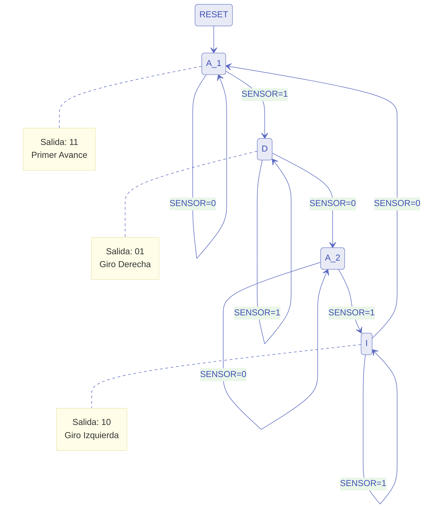

# Documentación: Barredora Automática (barredora.vhd)

## Descripción
Este módulo implementa el control de una barredora "inteligente" mediante una Máquina de Estados Finitos (FSM) de Moore. El sistema alterna el sentido del giro (derecha/izquierda) cada vez que encuentra un obstáculo, siguiendo una secuencia cíclica.

## Interfaz (Puertos)
*   **CLK:** Reloj del sistema.
*   **RST:** Reset asíncrono (activo en alto).
*   **SENSOR:** Entrada del sensor, corresponde a la señal **B** (1 = Obstáculo, 0 = Libre).
*   **MOTOR_IZQ:** Salida motor Rueda Izquierda.
*   **MOTOR_DER:** Salida motor Rueda Derecha.

## Lógica de Movimiento
*   **Avanzar:** `MOTOR_IZQ='1'`, `MOTOR_DER='1'`.
*   **Giro Derecha:** `MOTOR_IZQ='0'`, `MOTOR_DER='1'`.
*   **Giro Izquierda:** `MOTOR_IZQ='1'`, `MOTOR_DER='0'`.

## Tabla de Estados Siguientes

| Estado Actual | Descripción | Entrada (SENSOR/B) | Estado Siguiente | Salidas (MI, MD) |
|:-------------:|:-----------:|:------------------:|:----------------:|:----------------:|
| **A_1**       | Avance 1    | 0 (Libre)          | A_1              | 1, 1             |
| **A_1**       | Avance 1    | 1 (Obstáculo)      | D                | 1, 1             |
| **D**         | Derecha     | 1 (Obstáculo)      | D                | 0, 1             |
| **D**         | Derecha     | 0 (Libre)          | A_2              | 0, 1             |
| **A_2**       | Avance 2    | 0 (Libre)          | A_2              | 1, 1             |
| **A_2**       | Avance 2    | 1 (Obstáculo)      | I                | 1, 1             |
| **I**         | Izquierda   | 1 (Obstáculo)      | I                | 1, 0             |
| **I**         | Izquierda   | 0 (Libre)          | A_1              | 1, 0             |

## Diagrama de Estados (Moore)

## Observaciones
1.  **Diseño Moore:** Las salidas dependen exclusivamente del estado actual, lo que garantiza que no haya transiciones espurias (glitches) causadas directamente por la entrada `SENSOR`.
2.  **Seguridad:** En caso de error o estado no definido, la máquina vuelve a `A_1` (Paro) por seguridad.
3.  **Nomenclatura:** Se han utilizado nombres descriptivos (`MOTOR_IZQ`, `MOTOR_DER`, `SENSOR`) para cumplir con el requisito de claridad.