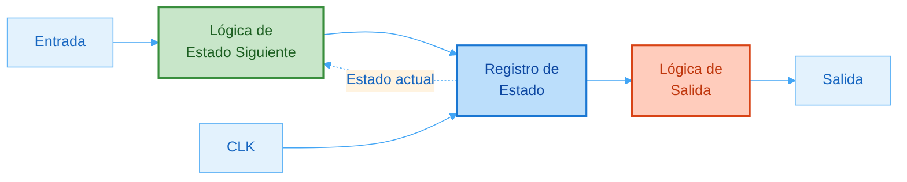
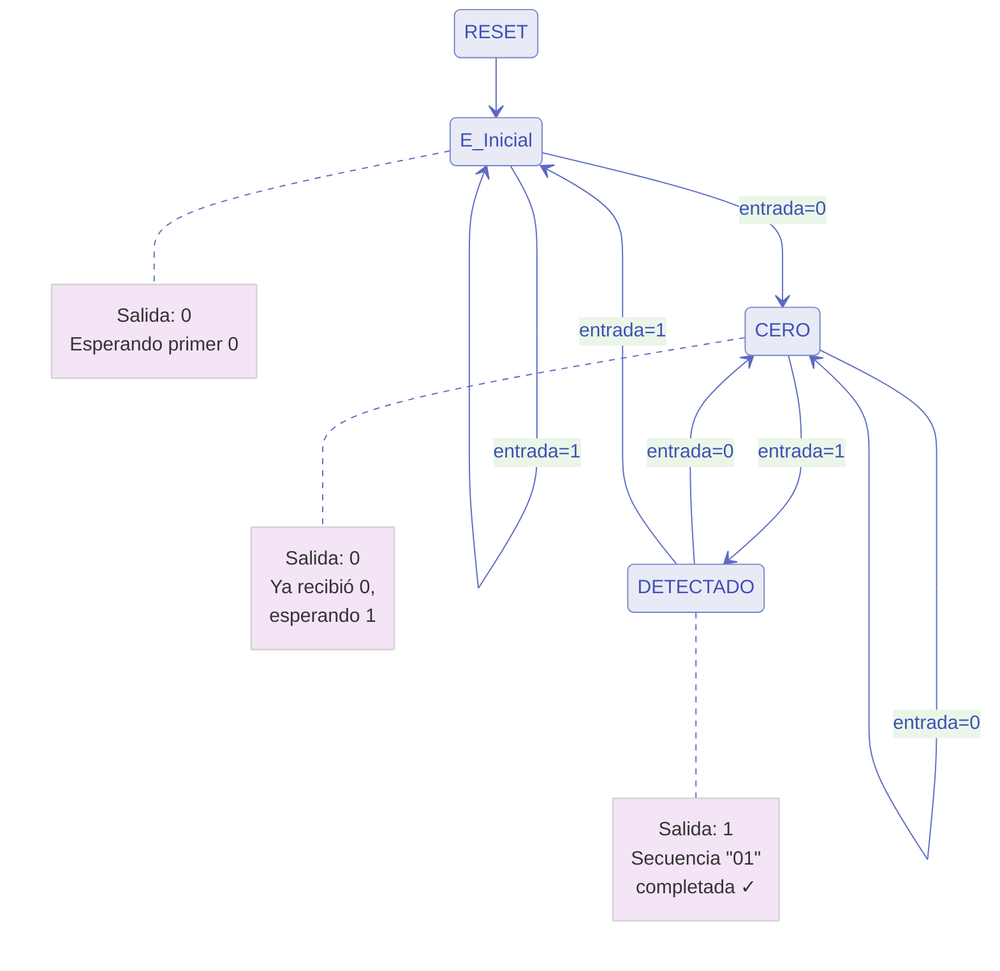
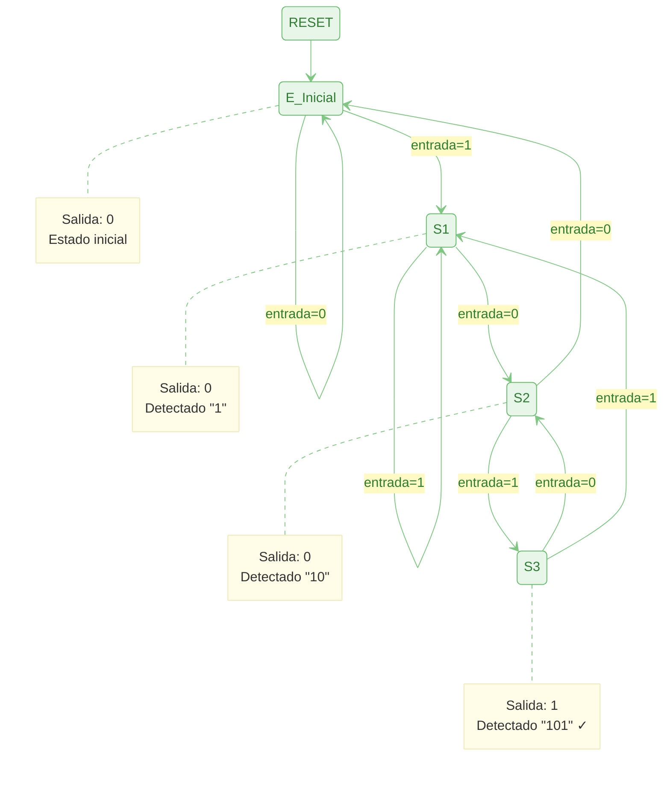
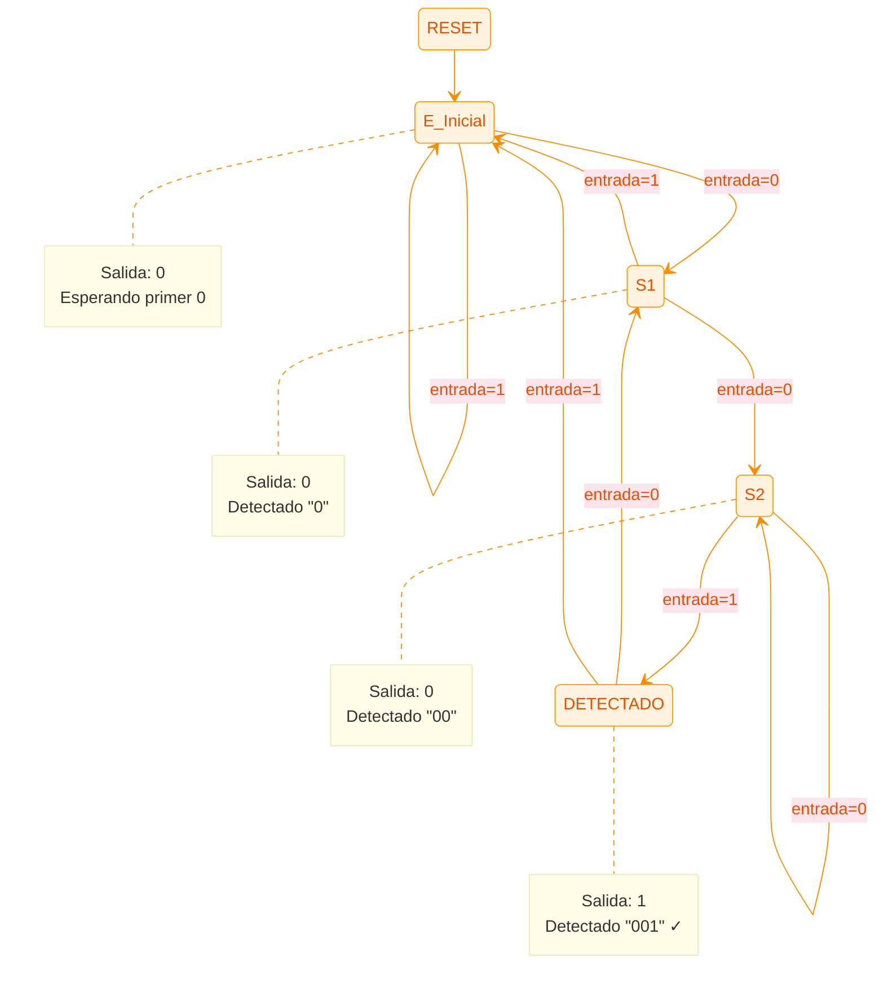
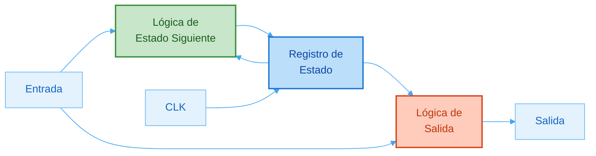
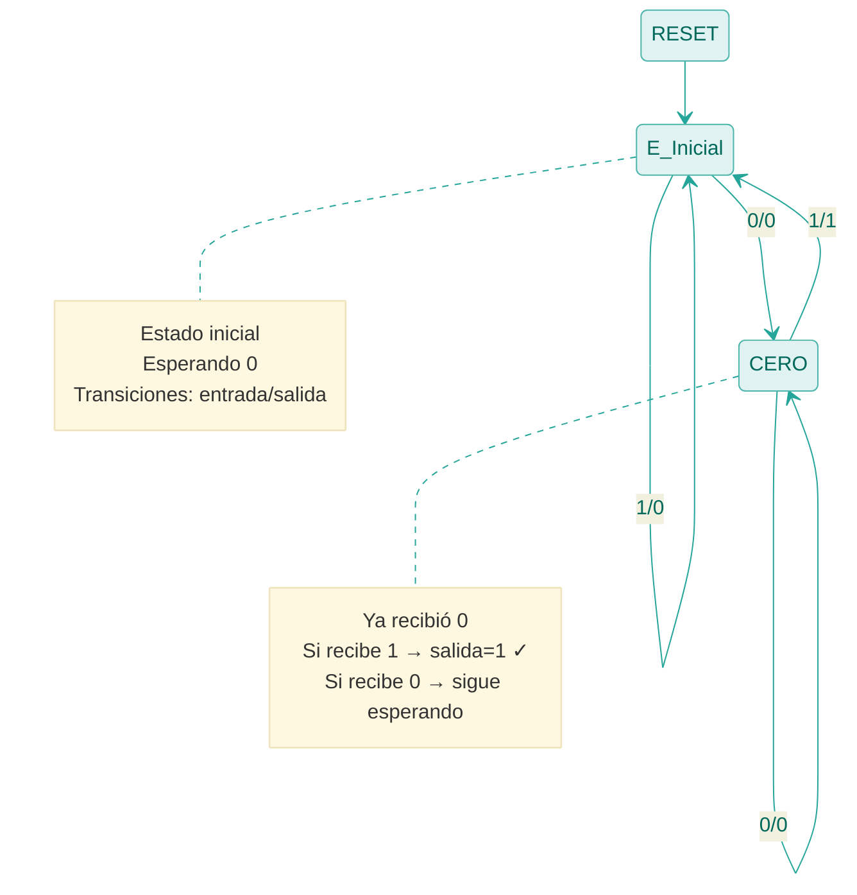
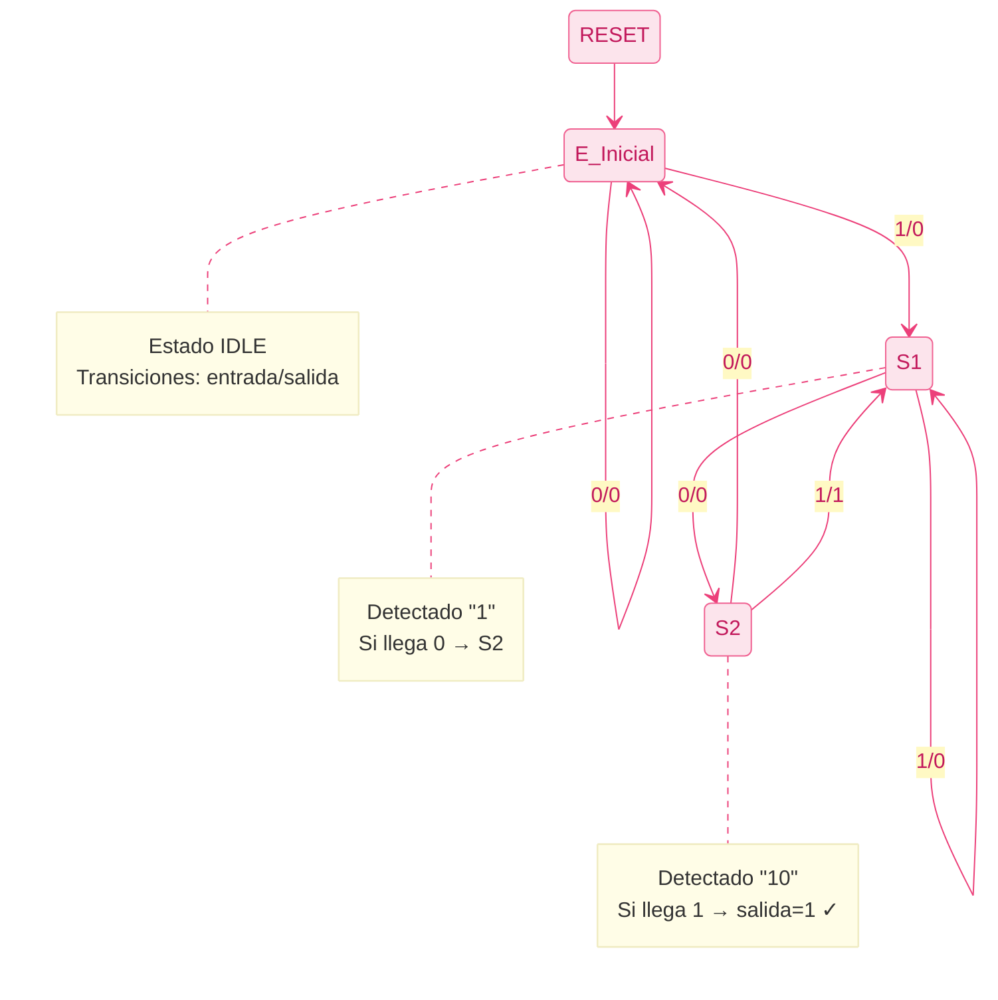
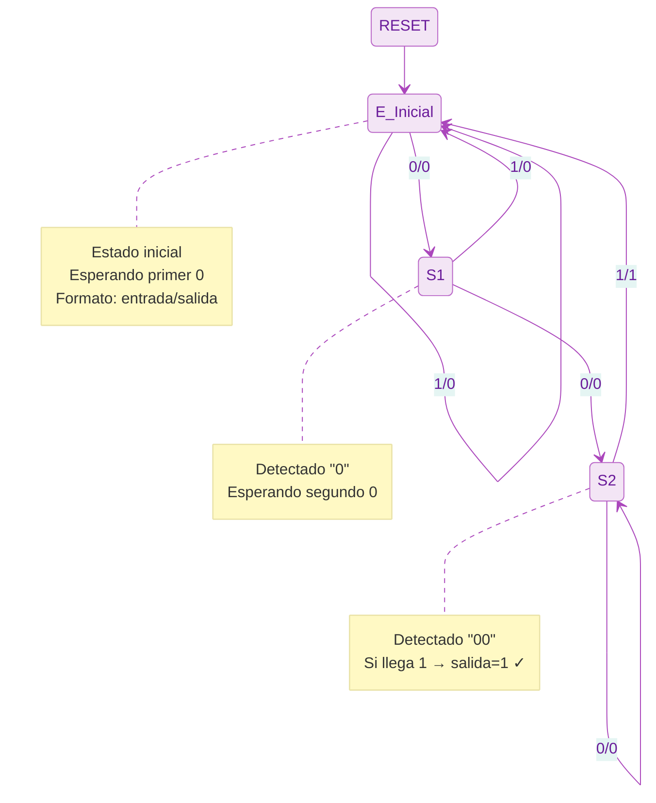

# Teoría de VHDL

## Índice

1. [Estructura estándar del código](#1-estructura-estándar-del-código)
   - [1.1 Librerías y paquetes](#11-librerías-y-paquetes)
   - [1.2 Entidad — modos de puerto](#12-entidad-entity)
   - [1.3 Arquitectura — estilos de descripción](#13-arquitectura-architecture)
   - [1.4 Genéricos — parámetros en tiempo de diseño](#14-genéricos-generic)

2. [Tipos de datos](#2-tipos-de-datos)
   - [2.1 Escalares: BIT, STD_LOGIC, BOOLEAN, INTEGER](#21-tipos-escalares-básicos)
   - [2.2 Vectores: STD_LOGIC_VECTOR, UNSIGNED, SIGNED y conversiones](#22-tipos-vectoriales)
   - [2.3 Tipos enumerados](#23-tipos-enumerados)
   - [2.4 Arreglos y registros](#24-arreglos-y-registros)

3. [Señales, Variables y Constantes](#3-señales-variables-y-constantes)
   - [El modelo de ejecución: delta-cycles](#el-modelo-de-ejecución-de-vhdl-delta-cycles)
   - [Comparativa general](#comparativa)
   - [SIGNAL — alambres y registros](#señal)
   - [VARIABLE — cálculo local inmediato](#variable)
   - [CONSTANT — parámetros fijos de elaboración](#constante)
   - [Atributos de señal: 'EVENT, 'STABLE, 'LAST_VALUE](#atributos-de-señal)
   - [Errores típicos](#errores-típicos-con-señales-y-variables)

4. [Palabras clave principales](#4-palabras-clave-principales)
   - [4.1 PROCESS — secuencial vs combinacional](#41-process)
   - [4.2 IF / ELSIF / ELSE — prioridad en hardware](#42-if--elsif--else)
   - [4.3 CASE — selección sin prioridad](#43-case)
   - [4.4 FOR ... LOOP — hardware replicado](#44-for--loop)
   - [4.5 WHILE ... LOOP — bucle condicional](#45-while--loop)
   - [4.6 GENERATE — instanciación masiva](#46-generate)
   - [4.7 COMPONENT / PORT MAP — jerarquía](#47-component-y-port-map)
   - [4.8 GENERIC / GENERIC MAP — parametrización](#48-generic--generic-map)
   - [4.9 FUNCTION — valor de retorno único](#49-function)
   - [4.10 PROCEDURE — múltiples salidas](#410-procedure)
   - [4.11 PACKAGE / PACKAGE BODY — código reutilizable](#411-package)
   - [4.12 WAIT — suspensión de proceso](#412-wait)
   - [4.13 ASSERT — verificación en simulación](#413-assert)

5. [Operadores](#5-operadores)
   - [5.1 Lógicos](#51-lógicos)
   - [5.2 Relacionales](#52-relacionales)
   - [5.3 Aritméticos](#53-aritméticos)
   - [5.4 Concatenación y desplazamiento](#54-concatenación-y-desplazamiento)
   - [5.5 Precedencia de operadores](#55-precedencia-de-operadores)

6. [Lógica concurrente vs. secuencial](#6-lógica-concurrente-vs-secuencial)
   - [6.1 Sentencias concurrentes: simple, condicional, selección](#61-sentencias-concurrentes)
   - [6.2 Sentencias secuenciales: combinacional, registros, latches](#62-sentencias-secuenciales)
   - [6.3 Comunicación entre procesos mediante señales](#63-comunicación-entre-procesos)
   - [6.4 Resumen: guía de elección](#64-resumen-guía-de-elección)

7. [Circuitos Secuenciales](#7-circuitos-secuenciales)
   - [7.1 Tipos de memoria: Latch vs. Flip-Flop](#71-tipos-de-memoria-latch-vs-flip-flop)
   - [7.2 Tipos de circuitos secuenciales](#72-tipos-de-circuitos-secuenciales)
   - [7.3 Máquinas de Estados Finitos (FSM): Mealy vs. Moore](#73-máquinas-de-estados-finitos-fsm)

8. [Memorias y su manejo en VHDL](#8-memorias-y-su-manejo-en-vhdl)
    - [8.1 Conceptos base](#81-conceptos-base)
    - [8.2 Memorias en FPGA: distribuida vs. BRAM](#82-memorias-en-fpga-distribuida-vs-bram)
    - [8.3 Modelado con arreglos (arrays) y direccionamiento](#83-modelado-con-arreglos-arrays-y-direccionamiento)
    - [8.4 ROM sintetizable](#84-rom-sintetizable)
    - [8.5 RAM single-port (1 puerto)](#85-ram-single-port-1-puerto)
    - [8.6 RAM dual-port (2 puertos)](#86-ram-dual-port-2-puertos)
    - [8.7 Shift registers (registros de desplazamiento)](#87-shift-registers-registros-de-desplazamiento)
    - [8.8 FIFO circular (buffer)](#88-fifo-circular-buffer)
    - [8.9 Inicialización y carga desde archivo (síntesis vs simulación)](#89-inicialización-y-carga-desde-archivo-síntesis-vs-simulación)
    - [8.10 Errores típicos y depuración](#810-errores-típicos-y-depuración)
    - [8.11 Checklist rápida](#811-checklist-rápida)

9. [Buenas prácticas de diseño y estilo en VHDL](#9-buenas-prácticas-de-diseño-y-estilo-en-vhdl)
    - [9.1 Mentalidad hardware vs. software](#91-mentalidad-hardware-vs-software)
    - [9.2 Estilo sintetizable: combinacional vs secuencial](#92-estilo-sintetizable-combinacional-vs-secuencial)
    - [9.3 Tipos, rangos y conversiones seguras](#93-tipos-rangos-y-conversiones-seguras)
    - [9.4 Modularidad y reutilización (DRY)](#94-modularidad-y-reutilización-dry)
    - [9.5 Interfaces y handshakes (valid/ready, req/ack)](#95-interfaces-y-handshakes-validready-reqack)
    - [9.6 Cruce de dominios de reloj (CDC) básico](#96-cruce-de-dominios-de-reloj-cdc-básico)

10. [Verificación práctica: testbenches y depuración](#10-verificación-práctica-testbenches-y-depuración)
    - [10.1 Estructura canónica de un testbench](#101-estructura-canónica-de-un-testbench)
    - [10.2 Generación de reloj y reset](#102-generación-de-reloj-y-reset)
    - [10.3 Testbench autocheck: ASSERT + scoreboard simple](#103-testbench-autocheck-assert--scoreboard-simple)
    - [10.4 Estímulos y archivos (TextIO) — solo simulación](#104-estímulos-y-archivos-textio--solo-simulación)
    - [10.5 Checklist de depuración](#105-checklist-de-depuración)
    - [10.6 Organización de tests (runner y suites)](#106-organización-de-tests-runner-y-suites)
    - [10.7 Scoreboard (cola de esperados)](#107-scoreboard-cola-de-esperados)
    - [10.8 Cobertura funcional y logging](#108-cobertura-funcional-y-logging)

---

## 1. Estructura estándar del código

Todo archivo VHDL se organiza en tres secciones obligatorias: **librerías**, **entidad** y **arquitectura**.

```
LIBRARY ...          -- Librerías a incluir
USE ...              -- Paquetes de las librerías

ENTITY nombre IS     -- Interfaz externa (puertos E/S)
    PORT (...);
END ENTITY nombre;

ARCHITECTURE rtl OF nombre IS
    -- Declaraciones internas (señales, componentes, etc.)
BEGIN
    -- Descripción del comportamiento o estructura
END ARCHITECTURE rtl;
```

### 1.1 Librerías y paquetes

VHDL es un lenguaje **fuertemente tipado**: los tipos de datos, funciones aritméticas
y operadores extendidos no están incorporados directamente en el lenguaje base, sino
en **librerías** que deben importarse explícitamente. Esto permite que el mismo
estándar sea usado desde simulación pura hasta síntesis en FPGA sin imponer
dependencias innecesarias.

Una **librería** (`LIBRARY`) es un repositorio compilado de paquetes. Un
**paquete** (`PACKAGE`) es una colección de declaraciones: tipos, constantes,
funciones y procedimientos. La cláusula `USE` importa el contenido de un paquete
al ámbito del archivo actual.

Las librerías más importantes son:

| Librería | Paquete | Qué aporta |
|----------|---------|------------|
| `ieee` | `std_logic_1164` | `STD_LOGIC`, `STD_LOGIC_VECTOR` y sus operaciones |
| `ieee` | `numeric_std` | `UNSIGNED`, `SIGNED` y aritmética (+, -, *, conversiones) |
| `std` | `standard` | Tipos básicos (`BIT`, `INTEGER`, `BOOLEAN`). **Siempre visible, no declarar** |
| `std` | `textio` | Lectura/escritura de archivos (solo simulación) |
| `work` | *(nombre del paquete)* | Código propio del proyecto actual |

```vhdl
LIBRARY ieee;
USE ieee.std_logic_1164.all;  -- STD_LOGIC y STD_LOGIC_VECTOR
USE ieee.numeric_std.all;     -- UNSIGNED, SIGNED y conversiones aritméticas
```

> **Uso recomendado:** usar `ieee.numeric_std` para aritmética. Las librerías
> `std_logic_arith` y `std_logic_unsigned` (de Synopsys) son no estándar y pueden
> generar conflictos cuando se mezclan con `numeric_std` en el mismo archivo.

> **Nota:** `LIBRARY std` y `USE std.standard.all` son **implícitos** siempre;
> nunca es necessary declararlos. `LIBRARY work` también es implícito.

### 1.2 Entidad (ENTITY)

Define los **puertos de entrada y salida**: la "caja negra" del módulo.

```vhdl
ENTITY sumador IS
    PORT (
        a      : IN  STD_LOGIC_VECTOR(3 DOWNTO 0);  -- entrada de 4 bits
        b      : IN  STD_LOGIC_VECTOR(3 DOWNTO 0);  -- entrada de 4 bits
        suma   : OUT STD_LOGIC_VECTOR(4 DOWNTO 0);  -- resultado (5 bits)
        acarreo: OUT STD_LOGIC                       -- bit de acarreo
    );
END ENTITY sumador;
```

Modos de puerto:

| Modo | Descripción |
|------|-------------|
| `IN` | Solo lectura desde el exterior |
| `OUT` | Solo escritura hacia el exterior |
| `INOUT` | Lectura y escritura (buses bidireccionales) |
| `BUFFER` | Salida que también puede leerse internamente |

### 1.3 Arquitectura (ARCHITECTURE)

Describe el **comportamiento o estructura** del módulo.

```vhdl
ARCHITECTURE rtl OF sumador IS
    SIGNAL resultado_interno : STD_LOGIC_VECTOR(4 DOWNTO 0);
BEGIN
    resultado_interno <= ('0' & a) + ('0' & b);
    suma    <= resultado_interno(3 DOWNTO 0);
    acarreo <= resultado_interno(4);
END ARCHITECTURE rtl;
```

Un mismo módulo puede tener múltiples arquitecturas (con distintos nombres). Solo
una se activa durante la compilación/síntesis.

> **Estilos de descripción comunes:**
> - `rtl` (Register Transfer Level): describe transferencias de registros, el más habitual.
> - `behavioral`: modela el comportamiento sin preocuparse de la implementación física.
> - `structural`: conecta componentes como en un esquemático.
> - `dataflow`: usa asignaciones concurrentes para describir flujo de datos.

### 1.4 Genéricos (GENERIC)

Permiten parametrizar un módulo en tiempo de diseño sin cambiar su código fuente.
Equivalen a los *parámetros* en Verilog o a las plantillas en C++.

```vhdl
ENTITY shift_reg IS
    GENERIC (
        ANCHO : INTEGER := 8;   -- valor por defecto
        ETAPAS: INTEGER := 4
    );
    PORT (
        clk   : IN  STD_LOGIC;
        entrada: IN  STD_LOGIC_VECTOR(ANCHO-1 DOWNTO 0);
        salida : OUT STD_LOGIC_VECTOR(ANCHO-1 DOWNTO 0)
    );
END ENTITY shift_reg;
```

Instanciar con **GENERIC MAP** para pasar los valores:

```vhdl
shift16: shift_reg
    GENERIC MAP (ANCHO => 16, ETAPAS => 8)
    PORT MAP    (clk => clk, entrada => dato_in, salida => dato_out);
```

> **Uso recomendado:** parametrizar anchos de bus, profundidad de FIFO, divisores de
> reloj. Evitar genéricos de tipo `STRING` en síntesis.

> **Error típico:** olvidar que los genéricos solo existen en tiempo de compilación;
> no se pueden modificar en tiempo de ejecución (simulación dinámica).

---

*[⬆ Volver al Índice](#índice)*

---

## 2. Tipos de datos

En VHDL, un **tipo** define dos cosas: el **conjunto de valores** posibles que puede
tomar un objeto y las **operaciones permitidas** sobre él. A diferencia de lenguajes
como C, VHDL no permite mezclar tipos libremente: asignar un `STD_LOGIC_VECTOR` a
un `UNSIGNED` directamente es un error de compilación aunque ambos sean vectores de
bits. Esta estrictez es intencional: ayuda a detectar errores de diseño antes de
llevar el circuito a hardware.

Desde la perspectiva del hardware, los tipos cumplen tres funciones:
1. **Determinar el ancho de bus** que el sintetizador asigna a cada señal.
2. **Indicar la semántica aritmética** (sin signo, con signo, sin interpretación numérica).
3. **Acotar el espacio de estados** de los contadores y registros para optimizar el área.

### 2.1 Tipos escalares básicos

Los tipos escalares representan un **único valor** (no un vector). Son el bloque
constructivo más simple del sistema de tipos de VHDL.

#### `BIT`

`BIT` es el tipo lógico **nativo** del estándar VHDL-87. Solo puede tomar los
valores `'0'` y `'1'`. Es el concepto más puro de un bit digital, pero carece de
representación para buses en alta impedancia o señales desconocidas, por lo que
resulta insuficiente para modelar hardware real con buses compartidos.

```vhdl
SIGNAL enable : BIT := '0';
enable <= '1';
-- Las operaciones permitidas son AND, OR, NOT, NAND, NOR, XOR, XNOR
```

> **Cuándo usar `BIT`:** rara vez en diseño real. Sirve en modelos abstractos o
> cuando se verifica la lógica pura sin importar efectos físicos del bus.

#### `STD_LOGIC`

`STD_LOGIC` es el tipo estándar de la industria para diseño digital en VHDL. Está
definido en `ieee.std_logic_1164` y extiende `BIT` con **9 valores posibles**, lo
que permite modelar situaciones reales del hardware: múltiples drivers en un bus,
buses tri-estado y señales no inicializadas.

El corazón de `STD_LOGIC` es su **tabla de resolución**: cuando dos drivers atacan
el mismo nodo (situación que ocurre en buses compartidos), la tabla determina el
valor resultante. Por ejemplo, `'0'` forzado + `'1'` forzado = `'X'` (conflicto);
`'0'` forzado + `'Z'` = `'0'` (el driver activo gana).

| Valor | Tipo | Significado |
|-------|------|-------------|
| `'U'` | Simulación | No inicializado (valor de arranque por defecto) |
| `'X'` | Simulación/síntesis | Desconocido forzado (conflicto de drivers) |
| `'0'` | Síntesis | Cero lógico forzado |
| `'1'` | Síntesis | Uno lógico forzado |
| `'Z'` | Síntesis | Alta impedancia (bus tri-estado) |
| `'W'` | Simulación | Desconocido débil |
| `'L'` | Simulación | Cero débil (pull-down) |
| `'H'` | Simulación | Uno débil (pull-up) |
| `'-'` | Síntesis/sim. | Don't care (indiferente, para optimización) |

En síntesis, solo `'0'`, `'1'` y `'Z'` se mapean directamente a transistores.
Los demás valores son herramientas de **simulación** para detectar problemas.

```vhdl
SIGNAL dato   : STD_LOGIC;         -- valor inicial: 'U' en simulación
SIGNAL bus_oe : STD_LOGIC := 'Z';  -- bus en alta impedancia por defecto
dato <= '1';

-- Bus tri-estado: el driver solo conduce cuando oe='1'
bus_out <= dato WHEN oe = '1' ELSE 'Z';
```

> **Uso recomendado:** usar `STD_LOGIC` para prácticamente todo. Si en simulación
> aparece `'X'` o `'U'` en señales de control críticas, indica un bug de diseño
> (señal sin driver, conflicto, o lógica no inicializada).

#### `BOOLEAN`

`BOOLEAN` es el tipo de resultado de expresiones **lógicas y comparaciones**.
No tiene representación directa en bits; el sintetizador lo convierte a lógica
combinacional. Su uso principal es en condiciones `IF`, `WHILE` y genéricos.

```vhdl
SIGNAL igual    : BOOLEAN;
SIGNAL en_rango : BOOLEAN;

igual    <= (a = b);                          -- TRUE si a y b son iguales bit a bit
en_rango <= (contador >= 5) AND (contador <= 10);  -- TRUE si está en [5, 10]

-- En síntesis se convierte en puertas lógicas:
-- igual -> comparador de igualdad de N bits
-- en_rango -> dos comparadores + puerta AND
```

#### `INTEGER`

`INTEGER` es un tipo entero con signo de implementación indefinida (el estándar
garantiza al menos 32 bits, de −2³¹ a 2³¹−1). El sintetizador **no puede inferir
el ancho de bus** a menos que se restrinja con `RANGE`. Sin restricción, puede
generar un bus de 32 bits aunque el valor nunca supere 255.

```vhdl
-- SIN RANGE: el sintetizador puede generar 32 bits (ineficiente)
SIGNAL contador_malo : INTEGER := 0;

-- CON RANGE: el sintetizador infiere exactamente ceil(log2(256)) = 8 bits
SIGNAL contador : INTEGER RANGE 0 TO 255 := 0;
contador <= contador + 1;  -- wrapping no automático; hay que manejarlo
```

> **Detalle técnico:** el sintetizador calcula el ancho mínimo como
> ⌈log₂(max − min + 1)⌉ bits para rangos sin signo, o un bit adicional para rangos
> negativos. El rango también actúa como verificación en simulación: asignar un
> valor fuera del rango genera un error en tiempo de simulación.

#### `NATURAL` y `POSITIVE`

Son **subtipos** de `INTEGER` con restricciones predefinidas. Un subtipo hereda
todos los operadores del tipo base pero limita el rango de valores válidos.

```vhdl
-- NATURAL: enteros >= 0  (0, 1, 2, ... 2^31-1)
-- POSITIVE: enteros >= 1 (1, 2, 3, ... 2^31-1)
SIGNAL indice   : NATURAL  := 0;
SIGNAL longitud : POSITIVE := 1;

-- Uso habitual: índices de arreglos y parámetros de tamaño
CONSTANT N : POSITIVE := 8;   -- garantiza que N no puede ser 0 ni negativo
```

### 2.2 Tipos vectoriales

Los tipos vectoriales representan **grupos de bits con una dirección** de indexado.
En hardware corresponden directamente a **buses**: grupos de conductores que
transportan palabras de datos, direcciones o señales de control.

VHDL permite declarar vectores en dos direcciones:
- `DOWNTO`: índice mayor en el MSB — `(7 DOWNTO 0)`, el más habitual en hardware.
- `TO`: índice menor en el MSB — `(0 TO 7)`, poco usado en síntesis.

Usar `DOWNTO` es el convenio universal porque coincide con la notación binaria
estándar: el bit 7 es el más significativo (2⁷ = 128) y el bit 0 es el menos
significativo (2⁰ = 1).

#### `STD_LOGIC_VECTOR`

`STD_LOGIC_VECTOR` es simplemente un **arreglo de `STD_LOGIC`**. No tiene
semántica numérica propia: el sintetizador lo trata como un conjunto de cables sin
interpretación aritmética. Esto significa que no se puede sumar directamente;
hay que convertirlo a `UNSIGNED` o `SIGNED` primero.

```vhdl
SIGNAL bus8  : STD_LOGIC_VECTOR(7 DOWNTO 0);
SIGNAL nibble: STD_LOGIC_VECTOR(3 DOWNTO 0) := "1010";

-- Acceso a bits individuales
bus8(7) <= '1';                  -- MSB
bus8(0) <= '0';                  -- LSB

-- Acceso a sub-rangos (slices)
bus8(7 DOWNTO 4) <= "1100";      -- nibble superior
bus8(3 DOWNTO 0) <= nibble;      -- nibble inferior = otro vector

-- (OTHERS => valor): inicializar todos los bits al mismo valor
bus8 <= (OTHERS => '0');         -- pone a cero todos los bits
bus8 <= (OTHERS => '1');         -- pone a uno todos los bits
```

Literales: VHDL permite escribir valores usando distintas bases. El prefijo
determina la base:

```vhdl
SIGNAL byte : STD_LOGIC_VECTOR(7 DOWNTO 0);
byte <= X"A3";        -- hexadecimal: A=1010, 3=0011 -> "10100011"
byte <= O"243";       -- octal: 2=010, 4=100, 3=011 -> "010100011" (requiere múltiplo de 3 bits)
byte <= B"1010_0011"; -- binario explícito con separador visual '_'
```

> **Detalle técnico:** `STD_LOGIC_VECTOR` no define qué número representa el
> patrón de bits. `"10000000"` puede ser 128 (sin signo) o −128 (complemento a 2).
> Para dar semántica numérica, usar `UNSIGNED` o `SIGNED`.

#### `UNSIGNED` y `SIGNED`

Definidos en `ieee.numeric_std`, estos tipos son también arreglos de `STD_LOGIC`
pero con **semántica aritmética** definida:

- `UNSIGNED`: interpreta el patrón de bits como un entero sin signo en base binaria.
  Rango: 0 a 2ᴺ−1 para N bits.
- `SIGNED`: interpreta el patrón de bits como entero con signo en **complemento a 2**.
  Rango: −2ᴺ⁻¹ a 2ᴺ⁻¹−1 para N bits.

Esta distinción es crítica en hardware: los circuitos de comparación y extensión
de signo son distintos para `UNSIGNED` y `SIGNED`.

```vhdl
SIGNAL u_val : UNSIGNED(7 DOWNTO 0) := (OTHERS => '0');  -- 0
SIGNAL s_val : SIGNED(7 DOWNTO 0)   := (OTHERS => '0');  -- 0

u_val <= u_val + 1;        -- wrap: 255 + 1 = 0  (overflow natural)
s_val <= s_val - 1;        -- wrap: -128 - 1 = 127 (overflow natural)

-- Comparación: el resultado es correcto según la semántica
-- "11111111" como UNSIGNED = 255 > "00000000" = 0  -> TRUE
-- "11111111" como SIGNED   = -1  < "00000000" = 0  -> TRUE
```

**Conversiones entre tipos** — tabla completa:

```vhdl
SIGNAL vec  : STD_LOGIC_VECTOR(7 DOWNTO 0);
SIGNAL unum : UNSIGNED(7 DOWNTO 0);
SIGNAL snum : SIGNED(7 DOWNTO 0);
SIGNAL inum : INTEGER;

-- Conversiones de tipo (type cast) - solo reinterpretan los bits, no los cambian
vec  <= STD_LOGIC_VECTOR(unum);   -- UNSIGNED  -> STD_LOGIC_VECTOR
vec  <= STD_LOGIC_VECTOR(snum);   -- SIGNED    -> STD_LOGIC_VECTOR
unum <= UNSIGNED(vec);            -- STD_LOGIC_VECTOR -> UNSIGNED
snum <= SIGNED(vec);              -- STD_LOGIC_VECTOR -> SIGNED

-- Conversiones de valor (cambian la representación)
inum <= TO_INTEGER(unum);         -- UNSIGNED -> INTEGER (valor numérico)
inum <= TO_INTEGER(snum);         -- SIGNED   -> INTEGER (valor numérico con signo)
unum <= TO_UNSIGNED(inum, 8);     -- INTEGER  -> UNSIGNED de 8 bits
snum <= TO_SIGNED(inum, 8);       -- INTEGER  -> SIGNED   de 8 bits

-- Resize: cambiar el ancho preservando el valor
unum <= RESIZE(u_pequeno, 8);     -- extiende por la izquierda con '0'
snum <= RESIZE(s_pequeno, 8);     -- extiende preservando el bit de signo
```

> **Error típico:** intentar sumar dos `STD_LOGIC_VECTOR` directamente:
> `resultado <= a + b;` — error de compilación porque `STD_LOGIC_VECTOR` no
> sobrecarga el operador `+`. Convertir a `UNSIGNED`/`SIGNED` primero.

### 2.3 Tipos enumerados

Un tipo enumerado es un tipo definido por el usuario que consiste en un **conjunto
ordinal y nombrado de valores**. El programador decide qué valores existen y les
asigna nombres descriptivos. El sintetizador se encarga de asignar automáticamente
una codificación binaria (usualmente one-hot o binaria compacta, configurable en
Quartus).

La ventaja frente a usar `STD_LOGIC_VECTOR` para los estados es doble:
1. **Legibilidad:** el código dice `WHEN PROCESANDO` en lugar de `WHEN "010"`, lo
   que reduce errores de tipeo y facilita el mantenimiento.
2. **Seguridad:** el sintetizador y el simulador verifican que solo se usen valores
   del tipo; asignar un valor inexistente es error de compilación.

```vhdl
-- Declaración del tipo (zona de declaraciones de la arquitectura)
TYPE estado_t IS (REPOSO, INICIO, PROCESANDO, FIN);
SIGNAL estado_actual : estado_t := REPOSO;  -- valor inicial obligatorio para simulación
```

**Codificación que elige Quartus por defecto:**

| Estado | Binario | One-hot |
|--------|---------|----------|
| REPOSO | `00` | `0001` |
| INICIO | `01` | `0010` |
| PROCESANDO | `10` | `0100` |
| FIN | `11` | `1000` |

En one-hot cada estado usa un flip-flop dedicado, lo que acelera la lógica siguiente
a expensas de más flip-flops. En FPGA (abundancia de FFs) es generalmente mejor.

```vhdl
-- FSM de 4 estados con CASE
PROCESS(clk, reset)
BEGIN
    IF reset = '1' THEN
        estado_actual <= REPOSO;    -- reset asíncrono
    ELSIF RISING_EDGE(clk) THEN
        CASE estado_actual IS
            WHEN REPOSO     =>
                IF iniciar = '1' THEN estado_actual <= INICIO; END IF;
            WHEN INICIO     => estado_actual <= PROCESANDO;
            WHEN PROCESANDO =>
                IF listo = '1'  THEN estado_actual <= FIN;
                ELSE                 estado_actual <= PROCESANDO; END IF;
            WHEN FIN        => estado_actual <= REPOSO;
        END CASE;
    END IF;
END PROCESS;
```

**Atributos útiles de tipos enumerados:**

```vhdl
-- T'POS(valor)  -> posición ordinal del valor (0, 1, 2...)
-- T'VAL(n)      -> valor en la posición n
-- T'SUCC(valor) -> siguiente valor en la enumeración
-- T'PRED(valor) -> valor anterior
SIGNAL sig : estado_t;
sig <= estado_t'SUCC(estado_actual);  -- avanza al siguiente estado (cuidado en el último)
```

> **Error típico:** no poner `WHEN OTHERS` en el `CASE` de una FSM. Aunque todos
> los estados estén cubiertos, los bits extra de la codificación pueden crear
> estados ilegales no manejados que corrompen la FSM en hardware real.

### 2.4 Arreglos y registros

VHDL permite construir **tipos compuestos** agrupando múltiples valores bajo un
único nombre. Hay dos categorías:

- **Array:** colección indexada de elementos del **mismo tipo**.
- **Record:** colección de elementos de **tipos distintos** identificados por nombre.

En hardware, ambos se implementan como grupos de bits concatenados (registros o
bancos de memoria).

#### Array personalizado

Un array se declara especificando el **rango de índices** y el **tipo del elemento**.
El índice puede ser cualquier tipo discreto (entero, enumerado).

```vhdl
-- Array de 16 palabras de 8 bits: equivale a una pequeña memoria ROM/RAM
TYPE memoria_t IS ARRAY (0 TO 15) OF STD_LOGIC_VECTOR(7 DOWNTO 0);
SIGNAL rom : memoria_t;

-- Inicialización por posición (aggregate literal)
rom <= (
    0      => X"FF",
    1      => X"00",
    2      => X"A5",
    OTHERS => X"00"   -- resto de posiciones a cero
);

-- Acceso por índice variable (requiere que el índice sea una señal o variable)
SIGNAL addr : INTEGER RANGE 0 TO 15;
dato_salida <= rom(addr);   -- mux de 16 entradas inferido por el sintetizador
```

**Array de un solo bit (bus interno):**

```vhdl
-- Arreglo de STD_LOGIC_VECTOR: útil para buses entre módulos
TYPE bus_array_t IS ARRAY (0 TO 3) OF STD_LOGIC_VECTOR(7 DOWNTO 0);
SIGNAL canales : bus_array_t;
canales(0) <= X"12";
canales(1) <= X"34";
```

**Atributos de arreglos:**

```vhdl
SIGNAL v : STD_LOGIC_VECTOR(7 DOWNTO 0);
-- v'LENGTH   -> número de elementos (8)
-- v'HIGH     -> índice mayor (7)
-- v'LOW      -> índice menor (0)
-- v'RANGE    -> rango completo (7 DOWNTO 0), usado en FOR LOOP
-- v'REVERSE_RANGE -> rango invertido (0 TO 7)

FOR i IN v'RANGE LOOP   -- itera de 7 a 0
    ...
END LOOP;
```

#### Record (registro)

Un record agrupa **campos de tipos distintos** bajo un nombre compuesto. Es el
equivalente VHDL de una `struct` en C. En hardware, todos los campos se
concatenan en un vector de bits del tamaño total.

```vhdl
-- Ejemplo: descriptor de un canal SPI
TYPE spi_config_t IS RECORD
    clk_div   : INTEGER RANGE 0 TO 255;          -- divisor de reloj
    modo      : STD_LOGIC_VECTOR(1 DOWNTO 0);    -- modo SPI (0..3)
    habilitar : STD_LOGIC;                       -- enable del módulo
    msb_first : BOOLEAN;                         -- orden de bits
END RECORD;

SIGNAL spi_cfg : spi_config_t;

-- Asignación campo a campo
spi_cfg.clk_div   <= 24;
spi_cfg.modo      <= "01";
spi_cfg.habilitar <= '1';
spi_cfg.msb_first <= TRUE;

-- Asignación por agregado (todos los campos a la vez)
spi_cfg <= (clk_div => 24, modo => "01", habilitar => '1', msb_first => TRUE);

-- Lectura de campos
IF spi_cfg.habilitar = '1' AND spi_cfg.msb_first THEN
    ...
END IF;
```

> **Nota:** un `RECORD` no puede tener valores por defecto en VHDL-93. En VHDL-2008
> sí es posible con la sintaxis `:= valor` en la declaración del campo.
> Quartus II 13 soporta un subconjunto de VHDL-2008.

> **Uso recomendado:** los records son ideales para pasar grupos de parámetros de
> configuración entre módulos mediante `PORT MAP`, haciendo el código más legible
> que usar decenas de señales individuales.

---

*[⬆ Volver al Índice](#índice)*

---

## 3. Señales, Variables y Constantes

VHDL dispone de tres clases de **objetos** para almacenar y transferir datos: señales,
variables y constantes. Comprender sus diferencias no es solo saber la sintaxis: es
entender el **modelo de ejecución** que usa VHDL y cómo se traduce en hardware real.

---

### El modelo de ejecución de VHDL: delta-cycles

Para entender por qué las señales y las variables se comportan diferente, es
necesario conocer el **motor de simulación** de VHDL, que es también el modelo que
rige la síntesis.

VHDL simula un **sistema de hardware concurrente**. Cuando múltiples procesos se
activan al mismo tiempo (por ejemplo, al cambiar una señal), todos deben ejecutarse
"simultáneamente". Para lograr esto sin ambigüedad, el simulador utiliza el concepto
de **delta-cycle** (δ):

1. En el instante T, varios procesos se activan.
2. Cada proceso **lee** los valores actuales de las señales y calcula nuevas asignaciones
   con `<=`. Estas asignaciones quedan en una "cola de pendientes", **no se aplican aún**.
3. Al terminar todos los procesos del instante T, el simulador aplica las asignaciones
   pendientes. Esto ocurre en el mismo instante T pero en un **δ posterior**: T + 1δ.
4. Si al aplicar esas asignaciones se activan más procesos, se repite el ciclo (T + 2δ,
   T + 3δ...) hasta que no haya más cambios. Solo entonces avanza el tiempo real.

```
Tiempo real:     T=0                    T=10ns
Delta-cycles:    δ0  δ1  δ2  ...        δ0  δ1  ...
                 |   |   |              |   |
                 procesos calculan      procesos calculan
                 señales en cola        señales en cola
                     |                      |
                     señales se aplican     señales se aplican
```

**Consecuencia práctica:** dentro de un proceso, si asignas una señal con `<=` y
luego la lees en la misma ejecución del proceso, **leerás el valor anterior** al de
la asignación, porque la nueva asignación aún no se ha aplicado (está en la cola).
Las **variables**, en cambio, se actualizan inmediatamente (`δ0`) dentro del proceso.

---

### Comparativa

| Característica | `SIGNAL` | `VARIABLE` | `CONSTANT` |
|:---|:---|:---|:---|
| **Operador de asignación** | `<=` (deferred/scheduled) | `:=` (inmediato) | `:=` (solo al declarar) |
| **Ámbito visible** | Toda la arquitectura | Solo el proceso/subprograma que la contiene | Arquitectura, paquete o subprograma |
| **Cuándo se actualiza** | Al terminar el proceso (siguiente δ) | En la línea donde se ejecuta | Nunca (valor fijo desde elaboración) |
| **Corresponde en hardware** | Alambre (combinacional) o registro (FF) | Nodo interno del proceso; puede mapearse a registro si se preserva entre activaciones | Parámetro literalizado o constante de síntesis |
| **Puede usarse fuera de un proceso** | Sí | No | Sí |
| **Visible entre procesos** | Sí (permite comunicación) | No | Sí |
| **Admite valor inicial** | Sí (`:=` en declaración) | Sí (`:=` en declaración) | Sí (obligatorio) |

---

### Señal

Una **señal** (`SIGNAL`) es el objeto fundamental de VHDL. Modela un **conductor
físico** del circuito: puede ser un alambre (lógica combinacional) o la salida de un
flip-flop (lógica secuencial), según el contexto en que se use.

Características clave:
- Se declara en la **zona de declaraciones de la arquitectura** (antes del `BEGIN`),
  por lo que es visible en todos los procesos y sentencias concurrentes de esa arquitectura.
- La asignación `<=` es **diferida**: el nuevo valor no es visible en el proceso actual,
  sino en el siguiente ciclo de simulación (delta-cycle) o en el siguiente flanco del
  reloj (en síntesis, si está dentro de `RISING_EDGE`).
- Múltiples asignaciones a la misma señal dentro del mismo proceso: **solo tiene efecto
  la última** (las anteriores se sobreescriben antes de que el valor se aplique).
- Permite que dos procesos distintos se comuniquen: proceso A escribe la señal,
  proceso B la lee cuando cambia.

**Señal como alambre (combinacional):**

```vhdl
ARCHITECTURE rtl OF puertas IS
    SIGNAL y_and : STD_LOGIC;
    SIGNAL y_or  : STD_LOGIC;
BEGIN
    -- Asignaciones concurrentes: se evalúan SIEMPRE que cambie a o b
    y_and <= a AND b;
    y_or  <= a OR b;
    -- En hardware: y_and es la salida de una puerta AND, nada más
END ARCHITECTURE rtl;
```

**Señal como registro (secuencial):**

```vhdl
ARCHITECTURE rtl OF registro IS
    SIGNAL q_interno : STD_LOGIC_VECTOR(7 DOWNTO 0) := X"00";
BEGIN
    PROCESS(clk, reset)
    BEGIN
        IF reset = '1' THEN
            q_interno <= (OTHERS => '0');   -- FF reset a 0
        ELSIF RISING_EDGE(clk) THEN
            q_interno <= d;                 -- FF captura d en cada flanco
        END IF;
    END PROCESS;
    -- q_interno es la salida de 8 flip-flops D en hardware
    q <= q_interno;
END ARCHITECTURE rtl;
```

**Señal con valor inicial:**

```vhdl
-- El valor inicial (:= X"00") solo se aplica en el instante 0 de la simulación.
-- En hardware real (FPGA), el valor inicial puede o no respetarse según el dispositivo.
-- Se recomienda usar reset explícito para garantizar el estado inicial en hardware.
SIGNAL cuenta : INTEGER RANGE 0 TO 9 := 0;
```

**Contador de 0 a 9 con señal:**

```vhdl
ARCHITECTURE rtl OF contador_bcd IS
    SIGNAL cuenta : INTEGER RANGE 0 TO 9 := 0;
BEGIN
    PROCESS(clk, reset)
    BEGIN
        IF reset = '1' THEN
            cuenta <= 0;
        ELSIF RISING_EDGE(clk) THEN
            IF cuenta = 9 THEN
                cuenta <= 0;
            ELSE
                cuenta <= cuenta + 1;
            END IF;
        END IF;
    END PROCESS;
    salida <= STD_LOGIC_VECTOR(TO_UNSIGNED(cuenta, 4));
END ARCHITECTURE rtl;
```

---

### Variable

Una **variable** (`VARIABLE`) es un objeto de **actualización inmediata**. A diferencia
de las señales, no tiene el concepto de "valor anterior vs valor programado": cuando
ejecutas `v := expresion`, el nuevo valor está disponible en la **línea siguiente**.

Características clave:
- Se declara en la **zona de declaraciones del proceso** (entre `PROCESS` y `BEGIN`),
  por lo que es completamente privada a ese proceso. Ningún otro proceso puede leerla.
- La asignación `:=` es **inmediata**: el valor actualizado se puede leer en la
  siguiente instrucción del mismo proceso, en el mismo δ.
- **Persiste entre activaciones del proceso:** si el proceso se activa varias veces,
  la variable recuerda el valor de la última activación. Esto la hace candidata a ser
  sintetizada como un **registro** (flip-flop), al igual que una señal secuencial.
- Son especialmente útiles para **cálculos intermedios encadenados** donde cada paso
  depende del resultado inmediato del paso anterior.

**Diferencia crítica señal vs variable — mismo contador:**

```vhdl
-- CON SEÑAL: la comparación se hace con el valor ANTES del incremento
PROCESS(clk)
BEGIN
    IF RISING_EDGE(clk) THEN
        cuenta_s <= cuenta_s + 1;      -- (A) el nuevo valor aún no existe
        IF cuenta_s = 9 THEN           -- (B) lee el valor ANTERIOR a (A): bug sutil
            cuenta_s <= 0;
        END IF;
    END IF;
END PROCESS;
-- Bug: el contador llega a 10 antes de resetear, porque en (B) cuenta_s
-- todavía vale 9 cuando se llegó a 9, así que en el siguiente ciclo valdrá 10.

-- CON VARIABLE: la comparación se hace con el valor ya incrementado
PROCESS(clk)
    VARIABLE v : INTEGER RANGE 0 TO 10 := 0;
BEGIN
    IF RISING_EDGE(clk) THEN
        v := v + 1;         -- (A) actualización inmediata
        IF v = 10 THEN      -- (B) lee el nuevo valor: correcto
            v := 0;
        END IF;
        cuenta_v <= v;      -- señal recibe el valor final correcto
    END IF;
END PROCESS;
```

**Variable para acumulación en un solo ciclo (pipeline de cálculo):**

```vhdl
PROCESS(datos)
    VARIABLE suma : UNSIGNED(11 DOWNTO 0);  -- 12 bits para sumar 8 valores de 8 bits
BEGIN
    suma := (OTHERS => '0');
    FOR i IN 0 TO 7 LOOP
        suma := suma + UNSIGNED(datos(i));   -- cada suma usa el resultado anterior
    END LOOP;
    -- Si suma fuera SIGNAL, todos los += usarían el valor original (0), no el acumulado
    total <= suma;
END PROCESS;
```

**Cuándo una variable genera un registro (FF):**

```vhdl
-- Una variable que se ESCRIBE en un ciclo y se LEE en el SIGUIENTE
-- (no se inicializa en cada activación) → el sintetizador infiere un FF
PROCESS(clk)
    VARIABLE ff_var : STD_LOGIC;
BEGIN
    IF RISING_EDGE(clk) THEN
        salida <= ff_var;           -- lee el valor de la activación ANTERIOR
        ff_var := entrada;          -- escribe para la PRÓXIMA activación
    END IF;
END PROCESS;
-- ff_var se convierte en un flip-flop exactamente igual que si fuera una señal
```

---

### Constante

Una **constante** (`CONSTANT`) es un objeto de **solo lectura** cuyo valor se fija en
tiempo de **elaboración** (cuando el sintetizador o simulador procesa el diseño,
antes de que comience cualquier ejecución). No consume recursos de hardware propios:
el sintetizador sustituye cada aparición de la constante por su valor literalizado
directamente en el circuito.

Características clave:
- Se puede declarar en la arquitectura, en un proceso, en un subprograma, o en un
  paquete (para compartirla entre archivos).
- El tipo y el valor son inmutables; intentar asignarle un nuevo valor es error de
  compilación.
- Acepta expresiones calculadas en elaboración (sumas, restas, funciones puras).
- Es la forma preferida de nombrar cualquier **número mágico** del diseño.

```vhdl
-- Constantes de proyecto en la zona de declaraciones de arquitectura
CONSTANT CLK_HZ     : INTEGER := 50_000_000;   -- frecuencia de reloj
CONSTANT BAUDRATE   : INTEGER := 9_600;
CONSTANT CLK_DIV    : INTEGER := CLK_HZ / BAUDRATE;  -- 5208 (calculado al elaborar)
CONSTANT HALF_DIV   : INTEGER := CLK_DIV / 2;        -- 2604

-- Constante de tipo vectorial
CONSTANT RESET_VEC  : STD_LOGIC_VECTOR(7 DOWNTO 0) := X"FF";
CONSTANT MASCARA    : UNSIGNED(7 DOWNTO 0) := "00001111";  -- nibble inferior
```

**Divisor de frecuencia con constantes:**

```vhdl
ARCHITECTURE rtl OF divisor IS
    CONSTANT CLK_HZ   : INTEGER := 50_000_000;
    CONSTANT FREQ_OUT : INTEGER := 1;           -- 1 Hz de salida
    CONSTANT MAX_CNT  : INTEGER := (CLK_HZ / FREQ_OUT) - 1;  -- 49_999_999

    SIGNAL contador : INTEGER RANGE 0 TO MAX_CNT := 0;
    SIGNAL toggle   : STD_LOGIC := '0';
BEGIN
    PROCESS(clk)
    BEGIN
        IF RISING_EDGE(clk) THEN
            IF contador = MAX_CNT THEN
                contador <= 0;
                toggle   <= NOT toggle;
            ELSE
                contador <= contador + 1;
            END IF;
        END IF;
    END PROCESS;
    salida <= toggle;
END ARCHITECTURE rtl;
```

**Constante local a un proceso:**

```vhdl
PROCESS(clk)
    CONSTANT UMBRAL : INTEGER := 200;   -- solo visible dentro de este proceso
BEGIN
    IF RISING_EDGE(clk) THEN
        IF sensor > UMBRAL THEN
            alarma <= '1';
        END IF;
    END IF;
END PROCESS;
```

> **Uso recomendado:** declarar todas las constantes de proyecto en un `PACKAGE`
> dedicado. Así, cambiar un valor (por ejemplo la frecuencia del reloj) se hace en
> un único lugar y se propaga automáticamente a todo el diseño.

---

### Atributos de señal

Las señales en VHDL tienen **atributos predefinidos** que permiten interrogar su
historia o sus características. Los más usados en síntesis son `'EVENT` y `'STABLE`.

```vhdl
-- 'EVENT: TRUE si la señal cambió en el delta-cycle actual
IF clk'EVENT AND clk = '1' THEN ...   -- detección de flanco de subida (estilo antiguo)
IF RISING_EDGE(clk) THEN ...           -- equivalente, forma moderna recomendada

-- 'STABLE(tiempo): TRUE si la señal NO ha cambiado en el tiempo especificado
-- Solo útil en simulación y en restricciones de timing, no en síntesis.
ASSERT clk'STABLE(4 ns) REPORT "Glitch detectado en CLK" SEVERITY WARNING;

-- 'LAST_VALUE: valor que tenía la señal antes del último cambio
IF clk = '1' AND clk'LAST_VALUE = '0' THEN ...  -- flanco de subida manual

-- 'LAST_EVENT: tiempo transcurrido desde el último cambio
-- Solo simulación
ASSERT (reset'LAST_EVENT >= 10 ns) REPORT "Reset demasiado corto" SEVERITY ERROR;
```

### Errores típicos con señales y variables

**Error 1 — leer una señal recién asignada dentro del mismo proceso:**

```vhdl
-- INCORRECTO: conta aún tiene el valor anterior en esta iteración
PROCESS(clk)
BEGIN
    IF RISING_EDGE(clk) THEN
        conta <= conta + 1;
        IF conta = 9 THEN      -- se evalúa con el valor ANTES del +1
            conta <= 0;
        END IF;
    END IF;
END PROCESS;

-- CORRECTO: usar variable para leer inmediatamente
PROCESS(clk)
    VARIABLE v : INTEGER RANGE 0 TO 9 := 0;
BEGIN
    IF RISING_EDGE(clk) THEN
        v := v + 1;            -- actualización inmediata
        IF v = 10 THEN
            v := 0;
        END IF;
        conta <= v;            -- señal toma el valor final al terminar
    END IF;
END PROCESS;
```

**Error 2 — asignar múltiples veces la misma señal en un proceso:**

```vhdl
-- Solo tiene efecto la ÚLTIMA asignación (las anteriores se descartan)
PROCESS(a, b)
BEGIN
    salida <= a;   -- esta asignación se cancela
    salida <= b;   -- esta es la que vale
END PROCESS;
```

**Error 3 — variable declarada fuera del proceso (no permitido):**

```vhdl
-- INCORRECTO: VARIABLE no puede ir en la zona de declaraciones de arquitectura
ARCHITECTURE rtl OF ejemplo IS
    VARIABLE v : INTEGER := 0;  -- ERROR de compilación
BEGIN
    ...
```

---

*[⬆ Volver al Índice](#índice)*

---

## 4. Palabras clave principales

---

### 4.1 `PROCESS`

Un proceso es el bloque fundamental de la descripción **secuencial** en VHDL. Su
contenido se ejecuta línea por línea, pero el proceso en sí es una sentencia
concurrente (puede haber varios procesos activos en paralelo dentro de una
arquitectura).

**Sintaxis:**

```vhdl
[etiqueta:] PROCESS [(lista_de_sensibilidad)]
    -- declaraciones locales (variables, constantes, subprogramas)
BEGIN
    -- sentencias secuenciales
END PROCESS [etiqueta];
```

**Proceso combinacional** — todas las señales leídas deben estar en la lista de
sensibilidad; si falta alguna se infieren latches no deseados:

```vhdl
-- Mux 4:1 de 1 bit
PROCESS(a, b, c, d, sel)   -- todas las entradas deben estar aquí
BEGIN
    CASE sel IS
        WHEN "00"   => y <= a;
        WHEN "01"   => y <= b;
        WHEN "10"   => y <= c;
        WHEN OTHERS => y <= d;
    END CASE;
END PROCESS;
```

**Proceso secuencial (registro con reset síncrono):**

```vhdl
PROCESS(clk)
BEGIN
    IF RISING_EDGE(clk) THEN
        IF reset = '1' THEN
            q <= (OTHERS => '0');
        ELSE
            q <= d;
        END IF;
    END IF;
END PROCESS;
```

**Proceso secuencial (registro con reset asíncrono):**

```vhdl
-- reset asíncrono: va en la lista de sensibilidad Y es el primer IF
PROCESS(clk, reset)
BEGIN
    IF reset = '1' THEN            -- evaluado en cualquier flanco de reset
        q <= (OTHERS => '0');
    ELSIF RISING_EDGE(clk) THEN
        q <= d;
    END IF;
END PROCESS;
```

> **Uso recomendado:**
> - Lógica combinacional: lista de sensibilidad completa o usar `PROCESS(ALL)` (VHDL-2008).
> - Lógica secuencial: solo `clk` (sin reset) o `clk` + `reset` (con reset asíncrono).
> - Nombrar siempre los procesos para facilitar la depuración.

> **Errores típicos:**
> - Omitir señales de la lista de sensibilidad → latches no intencionales.
> - Usar `FALLING_EDGE` cuando el diseño mezcla flancos → violaciones de setup/hold.
> - Asignar la misma señal en dos procesos distintos → driver múltiple, error de síntesis.

---

### 4.2 `IF / ELSIF / ELSE`

Controla el flujo dentro de un proceso. En hardware, cada rama `IF` se convierte en
un **multiplexor con prioridad**: la primera condición verdadera tiene mayor prioridad.

**Sintaxis:**

```vhdl
IF condicion THEN
    ...
ELSIF condicion THEN
    ...
ELSE
    ...
END IF;
```

**Ejemplo — codificador de prioridad de 4 bits:**

```vhdl
PROCESS(req)
BEGIN
    IF    req(3) = '1' THEN salida <= "11";
    ELSIF req(2) = '1' THEN salida <= "10";
    ELSIF req(1) = '1' THEN salida <= "01";
    ELSIF req(0) = '1' THEN salida <= "00";
    ELSE                    salida <= "XX";
    END IF;
END PROCESS;
```

**Ejemplo — detección de rango (imposible con CASE):**

```vhdl
PROCESS(temperatura)
BEGIN
    IF temperatura > 80 THEN
        alarma <= '1';
        ventilador <= '1';
    ELSIF temperatura > 60 THEN
        alarma <= '0';
        ventilador <= '1';
    ELSE
        alarma <= '0';
        ventilador <= '0';
    END IF;
END PROCESS;
```

> **Uso recomendado:**
> - Cuando existe jerarquía de prioridad real en el diseño.
> - Para condiciones de rango (mayor que, menor que).
> - Preferir `CASE` si todas las ramas son mutuamente excluyentes sin prioridad.

> **Errores típicos:**
> - No cubrir todos los casos y no asignar un valor por defecto → latch inferido.
> - Confundir lógica de prioridad con selección paralela (usar `CASE` en ese caso).

---

### 4.3 `CASE`

Selección múltiple **sin prioridad**: todas las ramas son mutuamente excluyentes y se
evalúan en paralelo (hardware de multiplexor). Requiere cubrir **todos** los valores
posibles del selector.

**Sintaxis:**

```vhdl
CASE expresion IS
    WHEN valor1         => ...;
    WHEN valor2 | valor3 => ...;    -- varios valores con |
    WHEN OTHERS         => ...;     -- obligatorio si no se cubren todos los casos
END CASE;
```

**Ejemplo — decodificador BCD a 7 segmentos:**

```vhdl
PROCESS(bcd)
BEGIN
    CASE bcd IS
        -- segmentos: gfedcba
        WHEN "0000" => seg <= "0111111";  -- 0
        WHEN "0001" => seg <= "0000110";  -- 1
        WHEN "0010" => seg <= "1011011";  -- 2
        WHEN "0011" => seg <= "1001111";  -- 3
        WHEN "0100" => seg <= "1100110";  -- 4
        WHEN "0101" => seg <= "1101101";  -- 5
        WHEN "0110" => seg <= "1111101";  -- 6
        WHEN "0111" => seg <= "0000111";  -- 7
        WHEN "1000" => seg <= "1111111";  -- 8
        WHEN "1001" => seg <= "1101111";  -- 9
        WHEN OTHERS => seg <= "0000000";  -- apagado para valores > 9
    END CASE;
END PROCESS;
```

**Ejemplo — FSM con CASE (Moore):**

```vhdl
TYPE estado_t IS (S_IDLE, S_FETCH, S_EXEC, S_WRITE);
SIGNAL estado : estado_t := S_IDLE;

PROCESS(clk, reset)
BEGIN
    IF reset = '1' THEN
        estado <= S_IDLE;
    ELSIF RISING_EDGE(clk) THEN
        CASE estado IS
            WHEN S_IDLE  => IF start = '1' THEN estado <= S_FETCH; END IF;
            WHEN S_FETCH => estado <= S_EXEC;
            WHEN S_EXEC  => IF done = '1'  THEN estado <= S_WRITE;
                            ELSE estado <= S_EXEC; END IF;
            WHEN S_WRITE => estado <= S_IDLE;
        END CASE;
    END IF;
END PROCESS;
```

> **Uso recomendado:**
> - Decodificadores y tablas de verdad.
> - Máquinas de estado finito (FSM): el estado enumerado hace el código legible.
> - Siempre incluir `WHEN OTHERS` aunque se crean cubiertas todas las combinaciones.

> **Errores típicos:**
> - Omitir `WHEN OTHERS` con `STD_LOGIC_VECTOR` (tiene más de 2^n combinaciones por los 9 valores de STD_LOGIC) → advertencia o latch.
> - Usar `CASE` con un selector de tipo `INTEGER` sin `RANGE` → el rango puede ser enorme.
> - Intentar comparar rangos (`WHEN valor > 5`) → no válido en CASE; usar `IF`.

---

### 4.4 `FOR ... LOOP`

Bucle con número de iteraciones **conocido en compilación**. El sintetizador lo
despliega como hardware paralelo replicado (unrolling), no como un contador.

**Sintaxis:**

```vhdl
FOR variable IN rango LOOP
    -- sentencias
END LOOP;
```

**Ejemplo — inversor de bits (espejo de vector):**

```vhdl
PROCESS(entrada)
BEGIN
    FOR i IN 0 TO 7 LOOP
        salida(7 - i) <= entrada(i);
    END LOOP;
END PROCESS;
```

**Ejemplo — detector de primero-en-uno (priority encoder) iterativo:**

```vhdl
PROCESS(req)
    VARIABLE encontrado : BOOLEAN := FALSE;
BEGIN
    indice   <= (OTHERS => '0');
    encontrado := FALSE;
    FOR i IN 0 TO 15 LOOP
        IF req(i) = '1' AND NOT encontrado THEN
            indice    <= TO_UNSIGNED(i, 4);
            encontrado := TRUE;
        END IF;
    END LOOP;
END PROCESS;
```

**Ejemplo — suma de acumulador (uso en simulación):**

```vhdl
PROCESS
    VARIABLE suma : INTEGER := 0;
BEGIN
    FOR i IN 1 TO 100 LOOP
        suma := suma + i;
    END LOOP;
    resultado <= TO_UNSIGNED(suma, 16);
    WAIT;
END PROCESS;
```

> **Uso recomendado:**
> - Operar sobre todos los bits de un vector.
> - Generar estructuras regulares (flip-flops en cadena, CRC, etc.).
> - El índice del bucle es **solo de lectura** dentro del loop; no se puede asignar.

> **Errores típicos:**
> - Intentar usar el índice como señal destino (`i <= i + 1`) → error; `i` es inmutable.
> - Bucles con límites dependientes de señales (no constantes) → el sintetizador rechaza.
> - Confundir `FOR LOOP` concurrente (`GENERATE`) con el secuencial (`PROCESS`).

---

### 4.5 `WHILE ... LOOP`

Bucle cuya condición se evalúa antes de cada iteración. El número de ciclos puede ser
**desconocido** en compilación, por eso **no es sintetizable** en la mayoría de
herramientas. Su uso principal es en testbenches.

**Sintaxis:**

```vhdl
WHILE condicion LOOP
    -- sentencias
END LOOP;
```

**Ejemplo — testbench que estimula hasta encontrar resultado esperado:**

```vhdl
PROCESS
    VARIABLE intentos : INTEGER := 0;
BEGIN
    entrada <= (OTHERS => '0');
    WAIT FOR 5 ns;
    WHILE salida /= X"FF" AND intentos < 256 LOOP
        entrada <= STD_LOGIC_VECTOR(TO_UNSIGNED(intentos, 8));
        WAIT FOR 10 ns;
        intentos := intentos + 1;
    END LOOP;
    ASSERT salida = X"FF"
        REPORT "No se encontró el valor esperado"
        SEVERITY WARNING;
    WAIT;
END PROCESS;
```

> **Uso recomendado:** exclusivamente en testbenches y modelos de simulación.

> **Errores típicos:**
> - Intentar sintetizar un `WHILE` con condición dependiente de señales → error de herramienta.
> - Bucle infinito en simulación por no actualizar la condición de salida.

---

### 4.6 `GENERATE`

Replica sentencias **concurrentes** (no dentro de `PROCESS`). Equivale al `FOR LOOP`
pero a nivel estructural: crea múltiples instancias de hardware en paralelo.

**Sintaxis FOR GENERATE:**

```vhdl
etiqueta: FOR variable IN rango GENERATE
    -- sentencias concurrentes / instancias de componentes
END GENERATE etiqueta;
```

**Ejemplo — registros de desplazamiento en cadena:**

```vhdl
-- Conecta N flip-flops en serie automáticamente
ARCHITECTURE rtl OF shift_n IS
    SIGNAL cadena : STD_LOGIC_VECTOR(N DOWNTO 0);
BEGIN
    cadena(0) <= entrada;

    gen_etapas: FOR i IN 0 TO N-1 GENERATE
        ff: d_flipflop PORT MAP (
            clk => clk,
            d   => cadena(i),
            q   => cadena(i+1)
        );
    END GENERATE gen_etapas;

    salida <= cadena(N);
END ARCHITECTURE rtl;
```

**Sintaxis IF GENERATE (VHDL-93/2008):**

```vhdl
-- Incluir o excluir hardware según un genérico
gen_rst: IF TIENE_RESET GENERATE
    reset_sig <= NOT reset_n;
END GENERATE gen_rst;

gen_no_rst: IF NOT TIENE_RESET GENERATE
    reset_sig <= '0';
END GENERATE gen_no_rst;
```

> **Uso recomendado:**
> - Módulos parametrizables donde `N` viene de un `GENERIC`.
> - Evitar copiar y pegar instancias manuales de componentes idénticos.

> **Errores típicos:**
> - Usar `GENERATE` dentro de un `PROCESS` → error de sintaxis; GENERATE es concurrente.
> - Olvidar la etiqueta de cierre `END GENERATE etiqueta` → error de compilación en Quartus.

---

### 4.7 `COMPONENT` y `PORT MAP`

Permiten reutilizar módulos y construir diseños **jerárquicos** (estructurales).
Un componente es la "declaración de interfaz" de un módulo externo.

**Flujo completo en tres pasos:**

```vhdl
ARCHITECTURE estructural OF sumador4b IS

    ---------- PASO 1: declarar el componente ----------
    COMPONENT fa IS   -- full adder de 1 bit
        PORT (
            a, b, cin : IN  STD_LOGIC;
            s, cout   : OUT STD_LOGIC
        );
    END COMPONENT fa;

    ---------- PASO 2: señales de interconexión ----------
    SIGNAL c : STD_LOGIC_VECTOR(3 DOWNTO 1);

BEGIN
    ---------- PASO 3: instanciar con PORT MAP ----------
    -- Mapeo posicional (por orden de puertos):
    u0: fa PORT MAP (a(0), b(0), '0',  s(0), c(1));
    -- Mapeo nominal (recomendado, más legible):
    u1: fa PORT MAP (a => a(1), b => b(1), cin => c(1), s => s(1), cout => c(2));
    u2: fa PORT MAP (a => a(2), b => b(2), cin => c(2), s => s(2), cout => c(3));
    u3: fa PORT MAP (a => a(3), b => b(3), cin => c(3), s => s(3), cout => cout);

END ARCHITECTURE estructural;
```

**Puerto no conectado — usar `OPEN`:**

```vhdl
-- Si un puerto de salida no se usa
u4: fa PORT MAP (a => x, b => y, cin => '0', s => res, cout => OPEN);
```

> **Uso recomendado:**
> - Mapeo nominal (`puerto => señal`) en lugar de posicional para evitar errores.
> - Para diseños con muchos componentes iguales, combinar con `GENERATE`.
> - Declarar componentes en un `PACKAGE` compartido cuando se usan en varios archivos.

> **Errores típicos:**
> - El nombre del componente no coincide exactamente con el nombre de la entidad → error de enlace.
> - Usar `OPEN` en puertos de **entrada** (no válido; siempre deben conectarse).
> - Confundir el orden de los puertos en mapeo posicional.

---

### 4.8 `GENERIC` / `GENERIC MAP`

Los genéricos son **parámetros de tiempo de diseño** que permiten crear módulos
configurables sin duplicar código. Se declaran en la entidad antes de los puertos.

**Declaración con valores por defecto:**

```vhdl
ENTITY contador IS
    GENERIC (
        NBITS  : INTEGER := 8;      -- ancho del contador
        MODULO : INTEGER := 256     -- valor de desbordamiento
    );
    PORT (
        clk    : IN  STD_LOGIC;
        reset  : IN  STD_LOGIC;
        q      : OUT STD_LOGIC_VECTOR(NBITS-1 DOWNTO 0)
    );
END ENTITY contador;

ARCHITECTURE rtl OF contador IS
    SIGNAL cuenta : INTEGER RANGE 0 TO MODULO-1 := 0;
BEGIN
    q <= STD_LOGIC_VECTOR(TO_UNSIGNED(cuenta, NBITS));

    PROCESS(clk, reset)
    BEGIN
        IF reset = '1' THEN
            cuenta <= 0;
        ELSIF RISING_EDGE(clk) THEN
            IF cuenta = MODULO - 1 THEN
                cuenta <= 0;
            ELSE
                cuenta <= cuenta + 1;
            END IF;
        END IF;
    END PROCESS;
END ARCHITECTURE rtl;
```

**Instanciar con GENERIC MAP:**

```vhdl
-- Contador de 4 bits módulo 10 (BCD)
cnt_bcd: contador
    GENERIC MAP (NBITS => 4, MODULO => 10)
    PORT MAP   (clk => clk, reset => rst, q => digito);

-- Contador de 8 bits módulo 256 (usa valores por defecto)
cnt_byte: contador
    PORT MAP (clk => clk, reset => rst, q => byte_out);
```

> **Uso recomendado:**
> - Parametrizar anchos de bus, profundidad de memorias, divisores de frecuencia.
> - Siempre asignar valores por defecto para que el módulo compile solo sin `GENERIC MAP`.

> **Errores típicos:**
> - Usar el genérico como límite de señal sin verificar que sea potencia de 2.
> - Pasar un genérico a un rango que genere tamaño 0 o negativo → error de elaboración.

---

### 4.9 `FUNCTION`

Una función toma parámetros de **solo lectura** y devuelve **un único valor**. Puede
usarse tanto dentro de procesos como en sentencias concurrentes.

**Sintaxis:**

```vhdl
FUNCTION nombre (parametro1 : tipo; ...) RETURN tipo_retorno IS
    -- declaraciones locales
BEGIN
    -- sentencias secuenciales
    RETURN expresion;
END FUNCTION nombre;
```

**Ejemplo — función de paridad:**

```vhdl
FUNCTION paridad_par(v : STD_LOGIC_VECTOR) RETURN STD_LOGIC IS
    VARIABLE resultado : STD_LOGIC := '0';
BEGIN
    FOR i IN v'RANGE LOOP
        resultado := resultado XOR v(i);
    END LOOP;
    RETURN resultado;
END FUNCTION paridad_par;

-- Uso concurrente (fuera de proceso)
bit_paridad <= paridad_par(datos);

-- Uso dentro de proceso
PROCESS(datos)
BEGIN
    IF paridad_par(datos) = '1' THEN
        error_par <= '1';
    END IF;
END PROCESS;
```

**Ejemplo — función de conversión de entero a BCD (2 dígitos):**

```vhdl
FUNCTION int_a_bcd2(val : INTEGER RANGE 0 TO 99)
    RETURN STD_LOGIC_VECTOR IS
    VARIABLE decenas, unidades : INTEGER;
BEGIN
    decenas  := val / 10;
    unidades := val MOD 10;
    RETURN STD_LOGIC_VECTOR(TO_UNSIGNED(decenas,  4)) &
           STD_LOGIC_VECTOR(TO_UNSIGNED(unidades, 4));
END FUNCTION int_a_bcd2;
```

> **Uso recomendado:**
> - Operaciones que se repiten en varios puntos del diseño (paridad, CRC, conversiones).
> - Los atributos de vector (`v'LENGTH`, `v'RANGE`, `v'HIGH`, `v'LOW`) hacen las
>   funciones genéricas.

> **Errores típicos:**
> - No poner `RETURN` en todos los caminos de ejecución → error de compilación.
> - Intentar asignar señales dentro de una función pura → usar `PROCEDURE` en su lugar.
> - Función con bucle de límite variable que el sintetizador no puede inferir.

---

### 4.10 `PROCEDURE`

Un procedimiento puede tener parámetros `IN`, `OUT` e `INOUT` y **no devuelve valor**
directamente. Se llama desde dentro de un proceso o como sentencia concurrente.

**Sintaxis:**

```vhdl
PROCEDURE nombre (
    SIGNAL   entrada  : IN  tipo;
    SIGNAL   salida   : OUT tipo;
    VARIABLE var_io   : INOUT tipo
) IS
    -- declaraciones locales
BEGIN
    -- sentencias secuenciales
END PROCEDURE nombre;
```

**Ejemplo — procedimiento de reset de bus:**

```vhdl
PROCEDURE limpiar_bus (
    SIGNAL bus : OUT STD_LOGIC_VECTOR(7 DOWNTO 0);
    SIGNAL oe  : OUT STD_LOGIC
) IS
BEGIN
    bus <= (OTHERS => '0');
    oe  <= '0';
END PROCEDURE limpiar_bus;

-- Llamada desde un proceso
PROCESS(reset)
BEGIN
    IF reset = '1' THEN
        limpiar_bus(dato_bus, output_enable);
    END IF;
END PROCESS;
```

**Ejemplo — procedimiento de testbench para generar pulso de reloj:**

```vhdl
PROCEDURE gen_clk (
    SIGNAL clk    : OUT STD_LOGIC;
    CONSTANT ciclos : IN INTEGER
) IS
BEGIN
    FOR i IN 1 TO ciclos LOOP
        clk <= '0'; WAIT FOR 10 ns;
        clk <= '1'; WAIT FOR 10 ns;
    END LOOP;
END PROCEDURE gen_clk;

-- Uso en testbench
gen_clk(clk_tb, 100);  -- genera 100 ciclos de reloj
```

> **Uso recomendado:**
> - Secuencias de inicialización en testbenches.
> - Operaciones que modifican múltiples señales simultáneamente.

> **Errores típicos:**
> - Usar `WAIT` dentro de un procedimiento llamado desde un proceso con lista de
>   sensibilidad → error; solo se puede usar `WAIT` en procesos sin lista de sensibilidad.

---

### 4.11 `PACKAGE`

Un paquete agrupa declaraciones (tipos, constantes, funciones, procedimientos) que
se quieren compartir entre múltiples archivos del proyecto.

**Estructura — dos archivos separados (recomendado):**

```vhdl
-- Archivo: tipos_proyecto.vhd
PACKAGE tipos_proyecto IS
    -- Tipos globales del proyecto
    CONSTANT CLK_FREQ  : INTEGER := 50_000_000;  -- 50 MHz
    CONSTANT BUS_ANCHO : INTEGER := 8;

    TYPE byte_t  IS ARRAY (0 TO 7)  OF STD_LOGIC;
    TYPE estado_t IS (REPOSO, ACTIVO, ERROR, RESET);

    -- Solo declaración; implementación en PACKAGE BODY
    FUNCTION suma_saturada(a, b : UNSIGNED(7 DOWNTO 0))
        RETURN UNSIGNED;
END PACKAGE tipos_proyecto;

PACKAGE BODY tipos_proyecto IS
    FUNCTION suma_saturada(a, b : UNSIGNED(7 DOWNTO 0))
        RETURN UNSIGNED IS
        VARIABLE r : UNSIGNED(8 DOWNTO 0);
    BEGIN
        r := ('0' & a) + ('0' & b);
        IF r(8) = '1' THEN
            RETURN X"FF";       -- satura en 255
        ELSE
            RETURN r(7 DOWNTO 0);
        END IF;
    END FUNCTION suma_saturada;
END PACKAGE BODY tipos_proyecto;
```

**Uso en otro archivo:**

```vhdl
LIBRARY work;
USE work.tipos_proyecto.all;

ENTITY mi_modulo IS
    PORT (a, b : IN UNSIGNED(7 DOWNTO 0); r : OUT UNSIGNED(7 DOWNTO 0));
END ENTITY mi_modulo;

ARCHITECTURE rtl OF mi_modulo IS
BEGIN
    r <= suma_saturada(a, b);   -- función del paquete
END ARCHITECTURE rtl;
```

> **Uso recomendado:**
> - Crear un paquete por proyecto con todos los tipos y constantes compartidos.
> - Compilar el paquete antes que los módulos que lo usan (orden de compilación).

> **Errores típicos:**
> - Olvidar compilar el paquete primero → error "unit not found".
> - Declarar el mismo tipo en el paquete y en la arquitectura → conflicto de tipos.
> - Modificar el paquete y no recompilar todos los módulos que dependen de él.

---

### 4.12 `WAIT`

Suspende la ejecución de un proceso hasta que se cumpla una condición. Se usa casi
exclusivamente en **testbenches**. Un proceso con `WAIT` **no puede tener** lista de
sensibilidad.

**Formas de WAIT:**

```vhdl
-- 1. Espera por tiempo absoluto
WAIT FOR 20 ns;

-- 2. Espera hasta que cambie cualquiera de las señales listadas
WAIT ON clk, reset;

-- 3. Espera hasta que se cumpla una expresión
WAIT UNTIL clk = '1';
WAIT UNTIL RISING_EDGE(clk);
WAIT UNTIL (contador = 10 AND listo = '1');

-- 4. Combinación de condición y tiempo límite
WAIT UNTIL listo = '1' FOR 100 ns;  -- máximo 100 ns

-- 5. Suspensión indefinida (detiene la simulación)
WAIT;
```

**Ejemplo — testbench típico con WAIT:**

```vhdl
PROCESS
BEGIN
    -- Condiciones iniciales
    reset <= '1'; entrada <= X"00";
    WAIT FOR 20 ns;

    -- Liberar reset
    reset <= '0';
    WAIT FOR 10 ns;

    -- Aplicar estímulos
    entrada <= X"A5";
    WAIT UNTIL RISING_EDGE(clk);     -- espera 1 ciclo
    WAIT UNTIL RISING_EDGE(clk);     -- espera otro ciclo

    ASSERT salida = X"5A"
        REPORT "Fallo: resultado incorrecto" SEVERITY ERROR;

    WAIT;   -- fin de la simulación
END PROCESS;
```

> **Uso recomendado:**
> - Testbenches: primera opción para controlar el flujo temporal.
> - No usar en procesos de síntesis.

> **Errores típicos:**
> - Mezclar lista de sensibilidad y `WAIT` en el mismo proceso → error de compilación.
> - `WAIT FOR` con tiempo 0 (`WAIT FOR 0 ns`) no avanza el tiempo, crea un delta-cycle.
> - Olvidar el `WAIT` final → el proceso se reinicia infinitamente y la simulación no termina.

---

### 4.13 `ASSERT`

Verifica condiciones en simulación e imprime mensajes. No sintetiza como hardware;
es ignorado por el sintetizador. Fundamental para **auto-verificar testbenches**.

**Sintaxis:**

```vhdl
ASSERT condicion
    REPORT "mensaje"
    SEVERITY nivel;
```

**Niveles de severidad:**

| Nivel | Comportamiento típico del simulador |
|-------|-------------------------------------|
| `NOTE` | Imprime el mensaje, continúa |
| `WARNING` | Imprime advertencia, continúa |
| `ERROR` | Imprime error, puede detener la simulación |
| `FAILURE` | Detiene la simulación inmediatamente |

**Ejemplos:**

```vhdl
-- Verificación de resultado esperado
ASSERT (salida = esperado)
    REPORT "ERROR: salida=" & TO_STRING(salida) &
           " esperado=" & TO_STRING(esperado)
    SEVERITY ERROR;

-- Marca el fin de la simulación de forma limpia
ASSERT FALSE
    REPORT "*** Simulación completada sin errores ***"
    SEVERITY NOTE;

-- Verificación de precondición en arquitectura
ASSERT (NBITS >= 2 AND NBITS <= 16)
    REPORT "NBITS fuera de rango válido (2..16)"
    SEVERITY FAILURE;
```

**ASSERT concurrente (fuera de proceso):**

```vhdl
ARCHITECTURE rtl OF modulo IS
BEGIN
    -- Se evalúa siempre que cambien las señales involucradas
    ASSERT NOT (wr = '1' AND rd = '1')
        REPORT "Conflicto: escritura y lectura simultáneas"
        SEVERITY ERROR;
END ARCHITECTURE rtl;
```

> **Uso recomendado:**
> - Verificar salidas esperadas en testbenches en lugar de inspeccionar manualmente.
> - Verificar restricciones de genéricos en tiempo de elaboración.
> - Señalar fin de simulación con `SEVERITY NOTE` para distinguirlo de un error.

> **Errores típicos:**
> - Confundir `ASSERT condicion` (falla si es `FALSE`) con un `IF`: la condición debe
>   ser la situación **correcta**, no el error.
> - Usar `TO_STRING` sin `USE std.textio.all` en simuladores que lo requieren.

---

*[⬆ Volver al Índice](#índice)*

---

## 5. Operadores

### 5.1 Lógicos
Aplicables a `STD_LOGIC`, `STD_LOGIC_VECTOR`, `BIT` y `BOOLEAN`.

| Operador | Descripción | Ejemplo |
|----------|-------------|---------|
| `AND`  | Y lógico | `s <= a AND b;` |
| `OR`   | O lógico | `s <= a OR b;` |
| `NAND` | Y negado | `s <= a NAND b;` |
| `NOR`  | O negado | `s <= a NOR b;` |
| `XOR`  | O exclusivo | `s <= a XOR b;` |
| `XNOR` | O exclusivo negado | `s <= a XNOR b;` |
| `NOT`  | Negación | `s <= NOT a;` |

```vhdl
SIGNAL a, b, c, y : STD_LOGIC;
y <= (a AND b) OR (NOT c);
```

### 5.2 Relacionales
Devuelven `BOOLEAN`. Se usan en condiciones `IF` y `WHEN`.

| Operador | Significado |
|----------|-------------|
| `=`  | Igual |
| `/=` | Distinto |
| `<`  | Menor que |
| `<=` | Menor o igual |
| `>`  | Mayor que |
| `>=` | Mayor o igual |

```vhdl
IF (contador >= MAX_CUENTA) THEN ...
IF (estado /= ERROR) THEN ...
```

> `<=` se usa también como operador de asignación de señal. El contexto determina
> si es comparación o asignación.

### 5.3 Aritméticos
Requieren `ieee.numeric_std` con tipos `UNSIGNED` o `SIGNED`.

| Operador | Descripción |
|----------|-------------|
| `+` | Suma |
| `-` | Resta |
| `*` | Multiplicación |
| `/` | División (solo potencias de 2 en síntesis) |
| `MOD` | Módulo |
| `REM` | Resto |
| `ABS` | Valor absoluto |

```vhdl
SIGNAL a, b, suma : UNSIGNED(7 DOWNTO 0);
suma <= a + b;
suma <= a - b;
suma <= a * b;  -- el resultado puede necesitar más bits
```

### 5.4 Concatenación y desplazamiento

```vhdl
-- Concatenación con &
SIGNAL hi    : STD_LOGIC_VECTOR(7 DOWNTO 0) := X"AB";
SIGNAL lo    : STD_LOGIC_VECTOR(7 DOWNTO 0) := X"CD";
SIGNAL bytes : STD_LOGIC_VECTOR(15 DOWNTO 0);
bytes <= hi & lo;   -- resultado: X"ABCD"

-- Insertar un bit en la posición más significativa (shift-in)
SIGNAL sreg : STD_LOGIC_VECTOR(7 DOWNTO 0);
sreg <= bit_entrada & sreg(7 DOWNTO 1);  -- desplaza derecha e inserta

-- Desplazamiento con operadores nativos
SIGNAL vec : STD_LOGIC_VECTOR(7 DOWNTO 0);
vec <= vec SLL 1;  -- desplazamiento lógico izquierda (rellena con '0')
vec <= vec SRL 1;  -- desplazamiento lógico derecha  (rellena con '0')
vec <= vec SLA 1;  -- desplazamiento aritmético izq. (rellena con bit[0])
vec <= vec SRA 1;  -- desplazamiento aritmético der. (rellena con MSB)
vec <= vec ROL 1;  -- rotación circular izquierda
vec <= vec ROR 1;  -- rotación circular derecha
```

> **Nota:** los operadores `SLL`/`SRL`/`SLA`/`SRA`/`ROL`/`ROR` tienen soporte
> irregular en herramientas de síntesis. Para máxima compatibilidad (Quartus II 13),
> preferir la concatenación explícita con `&` y slices.

### 5.5 Precedencia de operadores

De mayor a menor prioridad (los de mayor prioridad se evalúan primero):

| Prioridad | Operadores |
|-----------|------------|
| 1 (máxima) | `NOT`, `ABS`, `**` |
| 2 | `*`, `/`, `MOD`, `REM` |
| 3 | `+`, `-` (unarios) |
| 4 | `+`, `-`, `&` |
| 5 | `SLL`, `SRL`, `SLA`, `SRA`, `ROL`, `ROR` |
| 6 | `=`, `/=`, `<`, `<=`, `>`, `>=` |
| 7 | `AND`, `OR`, `NAND`, `NOR`, `XOR`, `XNOR` |

> **Regla práctica:** `AND`, `OR`, `XOR`, etc. tienen la **misma** prioridad en VHDL
> (a diferencia de C o Python). Usar paréntesis siempre que se mezclen:

```vhdl
-- INCORRECTO (ambigüedad, comportamiento inesperado):
y <= a AND b OR c;

-- CORRECTO (explícito):
y <= (a AND b) OR c;
```

---

*[⬆ Volver al Índice](#índice)*

---

## 6. Lógica concurrente vs. secuencial

Una de las diferencias fundamentales entre VHDL y los lenguajes de programación
convencionales es que VHDL describe **hardware que existe físicamente en paralelo**.
Varias puertas, registros y bloques de lógica operan **al mismo tiempo**, no uno
tras otro. El lenguaje refleja esta realidad con dos tipos de sentencias:

- **Sentencias concurrentes:** existen fuera de cualquier proceso. Todas se "ejecutan"
  permanentemente y en paralelo, exactamente como las puertas de un circuito.
- **Sentencias secuenciales:** existen dentro de un `PROCESS`. Se ejecutan en orden,
  pero el proceso completo es, en sí mismo, una entidad concurrente.

La clave es entender que **un proceso es una sentencia concurrente** cuyo contenido
se ejecuta de forma secuencial cuando se activa. Varios procesos coexisten en paralelo
en la arquitectura, pero el interior de cada proceso es algorítmico.

---

### 6.1 Sentencias concurrentes

Las sentencias concurrentes describen **relaciones permanentes** entre señales.
Equivalen a conexiones de hardware: no hay "orden de ejecución", simplemente se
reevalúan cada vez que cambien las señales de las que dependen (igual que una puerta
lógica que reacciona instantáneamente a sus entradas).

**Tipos de sentencias concurrentes en VHDL:**

#### Asignación de señal simple
La forma más directa. Describe una función combinacional pura.

```vhdl
ARCHITECTURE rtl OF logica IS
BEGIN
    -- Estas tres líneas coexisten en paralelo; no hay orden entre ellas
    y1 <= a AND b;
    y2 <= a OR  c;
    y3 <= NOT (a XOR b);  -- en hardware: un inversor alimentado por un XOR
END ARCHITECTURE rtl;
```

#### Asignación condicional (`WHEN ... ELSE`)
Equivale a un **multiplexor con prioridad** (igual que un `IF` secuencial).
La primera condición verdadera gana; las demás se ignoran.

```vhdl
ARCHITECTURE rtl OF mux4 IS
BEGIN
    -- Estructura hardware: árbol de mux 2:1 encadenados
    salida <= a WHEN sel = "00" ELSE
              b WHEN sel = "01" ELSE
              c WHEN sel = "10" ELSE
              d;  -- caso por defecto (equivale al ELSE final)
END ARCHITECTURE rtl;
```

> **Detalle:** la prioridad existe porque el hardware sintetizado es un árbol de
> multiplexores, no lógica paralela. Si todas las condiciones son mutuamente
> excluyentes y no importa el orden, `WITH ... SELECT` es más eficiente.

#### Asignación con selección (`WITH ... SELECT`)
Equivale a un **multiplexor sin prioridad**: todas las ramas son paralelas y
mutuamente excluyentes. Genera hardware más compacto que `WHEN ... ELSE` cuando
todas las condiciones dependen del mismo selector.

```vhdl
WITH sel SELECT
    salida <= a   WHEN "00",
              b   WHEN "01",
              c   WHEN "10",
              d   WHEN "11",
              'X' WHEN OTHERS;  -- obligatorio para STD_LOGIC_VECTOR
```

#### Instancias de componentes y `GENERATE`
También son sentencias concurrentes (ver secciones 4.7 y 4.6).

```vhdl
ARCHITECTURE rtl OF sistema IS
BEGIN
    u1: sumador PORT MAP (...);   -- concurrente: instancia de hardware
    u2: sumador PORT MAP (...);   -- concurrente: otra instancia independiente
    enable <= sel AND cs_n;       -- concurrente: puerta lógica
END ARCHITECTURE rtl;
```

---

### 6.2 Sentencias secuenciales

Las sentencias secuenciales solo pueden aparecer dentro de un `PROCESS`, una
`FUNCTION` o una `PROCEDURE`. Se ejecutan **en orden, línea por línea**, como un
programa de software, pero recordando siempre que el proceso completo es una
unidad concurrente para el resto del diseño.

El sintetizador analiza el comportamiento del proceso para inferir el tipo de hardware:

- Si todas las salidas del proceso dependen solo de sus entradas actuales (sin memoria
  entre activaciones) → **lógica combinacional** (puertas, muxes).
- Si el proceso tiene condiciones sobre `RISING_EDGE(clk)` o `clk'EVENT` → **lógica
  secuencial** (flip-flops, registros).
- Si alguna salida no es asignada en todas las ramas del proceso → **latch** (elemento
  de memoria no controlado por reloj; generalmente un error de diseño).

**Inferencia de combinacional:**

```vhdl
-- El sintetizador infiere 4 multiplexores de 8 bits (uno por bit de salida)
PROCESS(a, b, c, d, sel)  -- TODAS las entradas en la lista
BEGIN
    CASE sel IS
        WHEN "00"   => salida <= a;
        WHEN "01"   => salida <= b;
        WHEN "10"   => salida <= c;
        WHEN OTHERS => salida <= d;
    END CASE;
END PROCESS;
```

**Inferencia de registros:**

```vhdl
-- El sintetizador infiere N flip-flops D con enable y reset
PROCESS(clk, reset)
BEGIN
    IF reset = '1' THEN
        q <= (OTHERS => '0');       -- FF con reset asíncrono activo-alto
    ELSIF RISING_EDGE(clk) THEN
        IF enable = '1' THEN
            q <= d;                 -- FF con clock-enable
        END IF;
    END IF;
END PROCESS;
```

**Inferencia de latch (normalmente NO deseado):**

```vhdl
-- ¡CUIDADO! salida no se asigna cuando sel = "10" → latch inferido
PROCESS(a, b, sel)
BEGIN
    IF sel = "00" THEN
        salida <= a;        -- asignado
    ELSIF sel = "01" THEN
        salida <= b;        -- asignado
    -- sel = "10" y "11": salida no se asigna → el sintetizador infiere un latch
    END IF;
END PROCESS;

-- CORRECCIÓN: asignar un valor por defecto al inicio del proceso
PROCESS(a, b, sel)
BEGIN
    salida <= '0';          -- valor por defecto SIEMPRE se asigna primero
    IF sel = "00" THEN
        salida <= a;
    ELSIF sel = "01" THEN
        salida <= b;
    END IF;
    -- Ahora para sel = "10" y "11", salida toma el valor por defecto '0'
END PROCESS;
```

---

### 6.3 Comunicación entre procesos

Los procesos se comunican entre sí **exclusivamente a través de señales**. Un proceso
no puede leer ni escribir las variables de otro proceso. Este diseño refleja la
realidad del hardware: los módulos se comunican por conductores, no por memoria
compartida.

```vhdl
ARCHITECTURE rtl OF pipeline IS
    SIGNAL etapa1_out : STD_LOGIC_VECTOR(7 DOWNTO 0);  -- señal de comunicación
    SIGNAL etapa2_out : STD_LOGIC_VECTOR(7 DOWNTO 0);
BEGIN
    -- Proceso 1: primera etapa del pipeline
    p_etapa1: PROCESS(clk)
    BEGIN
        IF RISING_EDGE(clk) THEN
            etapa1_out <= transformar(entrada);   -- escribe la señal compartida
        END IF;
    END PROCESS p_etapa1;

    -- Proceso 2: segunda etapa (depende de la salida del proceso 1)
    p_etapa2: PROCESS(clk)
    BEGIN
        IF RISING_EDGE(clk) THEN
            etapa2_out <= procesar(etapa1_out);   -- lee la señal compartida
        END IF;
    END PROCESS p_etapa2;
    -- etapa1_out actúa como el registro intermedio del pipeline
END ARCHITECTURE rtl;
```

> **Regla importante:** una señal solo debe ser **escrita** (driver) por **un único**
> proceso o sentencia concurrente. Si dos procesos asignan la misma señal, es un
> error de driver múltiple (múltiples conductores en conflicto). Excepción: señales
> de tipo `STD_LOGIC` con lógica de resolución (buses tri-estado con `'Z'`).

---

### 6.4 Resumen: guía de elección

| Criterio | Usar sentencia concurrente | Usar PROCESS secuencial |
|---|---|---|
| Lógica combinacional simple | `<=`, `WHEN ELSE`, `WITH SELECT` | OK también, pero es más verboso |
| Lógica con múltiples condiciones | `WHEN ELSE` (pocos casos) | `IF`/`CASE` dentro de proceso |
| Lógica secuencial (registros, FF) | No posible directamente | **Obligatorio con PROCESS** |
| Máquina de estados (FSM) | No recomendado | **Obligatorio con PROCESS + CASE** |
| Cálculo de múltiples pasos encadenados | Difícil (múltiples señales intermedias) | **Preferir PROCESS con VARIABLE** |
| Instanciar componentes | `PORT MAP` (es concurrente) | No aplica |
| Replicar hardware (N instancias) | `GENERATE` | No aplica |

> **Regla general:** si el hardware que describes tiene **memoria** (necesita recordar
> un valor de un ciclo al siguiente), usa un `PROCESS` con `RISING_EDGE(clk)`.
> Si es **puramente combinacional**, puedes usar sentencias concurrentes o un proceso
> combinacional, a gusto del diseñador.

---

*[⬆ Volver al Índice](#índice)*

---

## 7. Circuitos Secuenciales

A diferencia de los circuitos combinacionales, donde la salida depende únicamente de las entradas actuales, en los **circuitos secuenciales** la salida depende de las entradas actuales y de la **historia pasada** (estado). Esto implica la necesidad de elementos de **memoria**.

### 7.1 Tipos de memoria: Latch vs. Flip-Flop

La memoria básica en electrónica digital se basa en la realimentación.

*   **Latch (Cerrojo):** Es sensible al **nivel** de la señal de control (habilitación). Mientras la señal de control esté activa, la salida cambia si cambia la entrada (transparencia). Es propenso a *glitches* y difícil de controlar en diseños complejos.
    *   *En VHDL:* Se infiere cuando un proceso no asigna valor a una señal en todas las ramas posibles (ej. falta un `ELSE`). Generalmente es indeseado en diseño síncrono.

*   **Flip-Flop (Biestable):** Es sensible al **flanco** (transición) de la señal de reloj (`CLK`). Solo actualiza su salida en el instante preciso del cambio de 0 a 1 (flanco de subida) o 1 a 0.
    *   *En VHDL:* Se infiere usando `RISING_EDGE(clk)` o `clk'EVENT AND clk='1'`. Es el bloque constructivo fundamental de las FPGAs.

### 7.2 Tipos de circuitos secuenciales

1.  **Asíncronos:** Los cambios de estado ocurren en cuanto cambian las entradas, sin una señal de reloj global que sincronice todo. Son rápidos pero difíciles de diseñar y propensos a condiciones de carrera.
2.  **Síncronos:** Todos los cambios de estado están sincronizados por una señal de reloj global (`CLK`). El sistema avanza paso a paso. Son más fáciles de diseñar y verificar, y son el estándar en diseño FPGA/ASIC.

### 7.3 Máquinas de Estados Finitos (FSM)

Una FSM es un modelo matemático de computación usado para diseñar lógica secuencial. Se compone de estados, transiciones y salidas.

#### 7.3.1 Modelo de Moore

*   **Definición:** Las salidas dependen **únicamente del estado actual**.
*   **Características:**
    *   La salida es síncrona con el reloj (si se registra el estado) o estable durante el periodo del estado.
    *   Suele requerir más estados que Mealy.
    *   Es más segura frente a *glitches* de entrada.

**Diagrama de bloques:**



**Ejemplo 1: Detector de Secuencia "01" (Moore)**

Ejemplo simple: detectar cuando llega un `0` seguido de un `1`.

En Moore, necesitamos **3 estados** porque la salida solo depende del estado:



**Estados Moore:**
- **E_Inicial**: Estado inicial, esperando el primer `0`. Salida = `0`
  - Si entrada = `1`: permanece en E_Inicial
  - Si entrada = `0`: va a CERO
- **CERO**: Se recibió un `0`, esperando el `1`. Salida = `0`
  - Si entrada = `0`: permanece en CERO (reinicia detección)
  - Si entrada = `1`: va a DETECTADO
- **DETECTADO**: Secuencia `01` completa. **Salida = `1`**
  - Si entrada = `0`: va a CERO (nueva secuencia posible)
  - Si entrada = `1`: va a E_Inicial (resetea)

**Ejemplo 2: Detector de Secuencia "101" (Moore)**

Detecta la secuencia 101 en una entrada serial. La salida se activa un ciclo después de completarse la secuencia.



**Estados en FSM Moore:**
- **E_Inicial**: No se ha detectado nada o reinicio. Salida = `0`
  - `0`: permanece en E_Inicial
  - `1`: va a S1
- **S1**: Se detectó un `1`. Salida = `0`
  - `0`: va a S2
  - `1`: permanece en S1
- **S2**: Se detectó `10`. Salida = `0`
  - `0`: vuelve a E_Inicial
  - `1`: va a S3
- **S3**: Se detectó `101` completo. **Salida = `1`**
  - `0`: va a S2 (puede empezar nueva secuencia "101")
  - `1`: va a S1

**Ejemplo 3: Detector de Secuencia "001" (Moore)**

Detecta la secuencia 001 en una entrada serial. Se necesitan **4 estados**.



**Estados en FSM Moore:**
- **E_Inicial**: Estado inicial. Salida = `0`
  - `0`: va a S1
  - `1`: permanece en E_Inicial
- **S1**: Se detectó primer `0`. Salida = `0`
  - `0`: va a S2
  - `1`: vuelve a E_Inicial
- **S2**: Se detectó `00`. Salida = `0`
  - `0`: permanece en S2
  - `1`: va a DETECTADO
- **DETECTADO**: Secuencia `001` completa. **Salida = `1`**
  - `0`: va a S1 (nueva secuencia posible)
  - `1`: vuelve a E_Inicial

#### 7.3.2 Modelo de Mealy

*   **Definición:** Las salidas dependen del **estado actual Y de las entradas actuales**.
*   **Características:**
    *   La salida puede cambiar en cuanto cambia la entrada (asíncrona respecto al reloj dentro del ciclo).
    *   Suele requerir menos estados.
    *   Puede propagar ruido de las entradas a las salidas.

**Diagrama de bloques:**



**Ejemplo 1: Detector de Secuencia "01" (Mealy)**

En Mealy, solo necesitamos **2 estados** porque la salida depende del estado Y la entrada:



**Estados Mealy (formato `entrada/salida`):**
- **E_Inicial**: Estado inicial
  - `1/0`: permanece en E_Inicial, salida = `0`
  - `0/0`: va a CERO, salida = `0`
- **CERO**: Se recibió un `0`
  - `0/0`: permanece en CERO, salida = `0`
  - **`1/1`**: va a E_Inicial, **salida = `1`** (secuencia detectada en este ciclo)

**Comparación para este ejemplo:**
- Moore: 3 estados, salida estable durante todo el ciclo
- Mealy: 2 estados, salida se activa inmediatamente con la entrada

**Ejemplo 2: Detector de Secuencia "101" (Mealy)**

La misma funcionalidad, pero con menos estados. La salida se activa **en el mismo ciclo** que llega el último bit.



**Estados en FSM Mealy (formato `entrada/salida`):**
- **E_Inicial**: Estado inicial
  - `0/0`: permanece en E_Inicial
  - `1/0`: va a S1
- **S1**: Detectado `1`
  - `0/0`: va a S2
  - `1/0`: permanece en S1
- **S2**: Detectado `10`
  - `0/0`: vuelve a E_Inicial
  - **`1/1`**: vuelve a S1 y **activa salida** (secuencia detectada)

**Ejemplo 3: Detector de Secuencia "001" (Mealy)**

Detecta la secuencia 001. Con Mealy solo necesitamos **3 estados** (vs 4 en Moore).



**Estados en FSM Mealy (formato `entrada/salida`):**
- **E_Inicial**: Estado inicial
  - `0/0`: va a S1, salida = `0`
  - `1/0`: permanece en E_Inicial, salida = `0`
- **S1**: Se detectó primer `0`
  - `0/0`: va a S2, salida = `0`
  - `1/0`: vuelve a E_Inicial, salida = `0`
- **S2**: Se detectó `00`
  - `0/0`: permanece en S2, salida = `0`
  - **`1/1`**: vuelve a E_Inicial, **salida = `1`** (secuencia detectada)

**Comparación para este ejemplo:**
- Moore: 4 estados, salida registrada
- Mealy: 3 estados, salida inmediata

#### 7.3.3 Resumen: Comparación Moore vs. Mealy

| Aspecto | Moore | Mealy |
|---------|-------|-------|
| **Salida depende de** | Solo estado actual | Estado actual + Entradas |
| **Número de estados** | Generalmente más | Generalmente menos |
| **Sincronización de salida** | Con el reloj (registrada) | Puede ser asíncrona |
| **Inmunidad al ruido** | Mayor (salida estable) | Menor (entrada afecta salida) |
| **Velocidad de respuesta** | Un ciclo de retardo | Más rápida (mismo ciclo) |
| **Uso típico** | Control, decodificación | Protocolos, detección de patrones |
---

*[⬆ Volver al Índice](#índice)*


---

## 8. Memorias y su manejo en VHDL

En VHDL, hablar de “memorias” puede significar varias cosas:

- **Registros (flip-flops):** guardan pocos bits, acceso inmediato, excelente para control.
- **Bancos de registros:** muchos registros agrupados, normalmente seleccionados por un índice.
- **RAM/ROM:** memoria direccionada por una **dirección** (address), con **profundidad** (número de palabras) y **ancho** (bits por palabra).

En FPGA, el sintetizador puede implementar estas memorias con:

- **FF/LUT (memoria distribuida):** buena para memorias pequeñas o con acceso muy particular.
- **BRAM (memoria de bloque):** eficiente para memorias medianas/grandes (p. ej. M9K/M10K según familia), normalmente con lectura/escritura síncronas.

> **Idea clave:** en síntesis no “llamas” a una BRAM con una palabra reservada. El sintetizador **la infiere** (o no) dependiendo del patrón de lectura/escritura, tamaño y opciones de herramienta.

### 8.1 Conceptos base

Una memoria direccionable se describe con parámetros:

- **Ancho de palabra ($W$):** bits por dato.
- **Profundidad ($D$):** cantidad de palabras.
- **Dirección ($A$):** selecciona una palabra.
- **Latencia:** cuántos ciclos tardan los datos en aparecer (típicamente 0 si es lectura combinacional; 1 si es lectura registrada/síncrona).

Si $D$ es potencia de 2, el número de bits de dirección requerido es:

$$N_{addr} = \log_2(D)$$

En VHDL conviene **acotar rangos** para que el sintetizador optimice y para evitar índices fuera de rango:

```vhdl
CONSTANT DATA_W : INTEGER := 8;
CONSTANT DEPTH  : INTEGER := 256;

-- Opción A: dirección como INTEGER acotado
SIGNAL addr_i : INTEGER RANGE 0 TO DEPTH-1 := 0;

-- Opción B: dirección como UNSIGNED (recomendado si viene de un bus)
CONSTANT ADDR_W : INTEGER := 8;  -- 2^8 = 256
SIGNAL addr_u : UNSIGNED(ADDR_W-1 DOWNTO 0) := (OTHERS => '0');
```

> **Uso recomendado:**
> - Direcciones de módulos/buses: `UNSIGNED` + `to_integer(addr_u)`.
> - Contadores internos pequeños: `INTEGER RANGE ...`.

### 8.2 Memorias en FPGA: distribuida vs. BRAM

En una FPGA, la decisión final suele ser automática, pero es útil entender los compromisos:

| Recurso inferido | Se parece a… | Ventajas | Desventajas | Uso típico |
|---|---|---|---|---|
| **Registros (FF)** | Muchos flip-flops | Muy rápido, controlable, fácil de resetear | Consume FFs, no escala bien | Estados, pipelines, pequeños buffers |
| **Distribuida (LUT/FF)** | ROM/RAM pequeña en lógica | Flexible (a veces lectura combinacional) | Puede complicar timing si crece | Tablas pequeñas, memorias con acceso especial |
| **BRAM** | RAM dedicada (bloques) | Gran capacidad y eficiencia | Lectura normalmente síncrona (latencia) | Framebuffers, FIFOs, tablas grandes |

> **Nota (Quartus II 13):** el soporte exacto de inferencia depende de la familia FPGA y de las opciones de síntesis. Para maximizar la probabilidad de inferir BRAM, usa **lectura síncrona** (dato registrado en flanco de reloj) y tamaños razonables.

### 8.3 Modelado con arreglos (arrays) y direccionamiento

La base de una RAM/ROM “casera” es un **array de palabras**. VHDL permite declarar un tipo y luego usarlo como señal.

Ejemplo mínimo de memoria con lectura combinacional (útil para entender el acceso por índice):

```vhdl
LIBRARY ieee;
USE ieee.std_logic_1164.all;
USE ieee.numeric_std.all;

ENTITY mem_async IS
    GENERIC (
        DATA_W : INTEGER := 8;
        ADDR_W : INTEGER := 8
    );
    PORT (
        addr  : IN  UNSIGNED(ADDR_W-1 DOWNTO 0);
        dout  : OUT STD_LOGIC_VECTOR(DATA_W-1 DOWNTO 0)
    );
END ENTITY;

ARCHITECTURE rtl OF mem_async IS
    CONSTANT DEPTH : INTEGER := 2**ADDR_W;
    TYPE mem_t IS ARRAY (0 TO DEPTH-1) OF STD_LOGIC_VECTOR(DATA_W-1 DOWNTO 0);
    SIGNAL mem : mem_t := (OTHERS => (OTHERS => '0'));
    SIGNAL idx : INTEGER RANGE 0 TO DEPTH-1;
BEGIN
    idx <= TO_INTEGER(addr);
    dout <= mem(idx);
END ARCHITECTURE;
```

Observa dos detalles importantes:

1. `DEPTH := 2**ADDR_W` asume que la profundidad es potencia de 2.
2. `TO_INTEGER(addr)` requiere `ieee.numeric_std`.

> **Errores típicos:**
> - Usar `STD_LOGIC_VECTOR` como dirección y aplicar `to_integer` sin convertir a `UNSIGNED`.
> - No acotar el rango del índice (`INTEGER` sin `RANGE`) y luego acceder a `mem(i)`.
> - Mezclar librerías no estándar (`std_logic_unsigned`) con `numeric_std`.

### 8.4 ROM sintetizable

Una ROM es una memoria **solo lectura** cuyo contenido es constante. Se puede describir de varias formas.

#### ROM por constante (aggregate)

```vhdl
LIBRARY ieee;
USE ieee.std_logic_1164.all;
USE ieee.numeric_std.all;

ENTITY rom_ejemplo IS
    PORT (
        addr : IN  UNSIGNED(3 DOWNTO 0);
        dout : OUT STD_LOGIC_VECTOR(7 DOWNTO 0)
    );
END ENTITY;

ARCHITECTURE rtl OF rom_ejemplo IS
    TYPE rom_t IS ARRAY (0 TO 15) OF STD_LOGIC_VECTOR(7 DOWNTO 0);
    CONSTANT rom_c : rom_t := (
        0  => X"00",
        1  => X"11",
        2  => X"22",
        3  => X"33",
        4  => X"44",
        5  => X"55",
        6  => X"66",
        7  => X"77",
        8  => X"88",
        9  => X"99",
        10 => X"AA",
        11 => X"BB",
        12 => X"CC",
        13 => X"DD",
        14 => X"EE",
        OTHERS => X"FF"
    );
BEGIN
    dout <= rom_c(TO_INTEGER(addr));
END ARCHITECTURE;
```

#### ROM por `CASE` (útil cuando hay pocos valores)

```vhdl
PROCESS(addr)
BEGIN
    CASE addr IS
        WHEN "0000" => dout <= X"00";
        WHEN "0001" => dout <= X"11";
        WHEN "0010" => dout <= X"22";
        WHEN OTHERS => dout <= X"FF";
    END CASE;
END PROCESS;
```

> **Uso recomendado:**
> - ROM pequeña: `CASE` o constante.
> - ROM grande: preferir lectura síncrona y estructuras que favorezcan BRAM (si aplica), o usar el flujo específico de la herramienta.

### 8.5 RAM single-port (1 puerto)

Una RAM single-port típica tiene:

- **1 dirección** (la misma para leer y escribir).
- **Escritura síncrona** (en flanco de reloj).
- Lectura **combinacional** o **síncrona** (según se codifique).

#### RAM con lectura síncrona (patrón común para inferir BRAM)

```vhdl
LIBRARY ieee;
USE ieee.std_logic_1164.all;
USE ieee.numeric_std.all;

ENTITY ram_1p IS
    GENERIC (
        DATA_W : INTEGER := 8;
        ADDR_W : INTEGER := 8
    );
    PORT (
        clk  : IN  STD_LOGIC;
        we   : IN  STD_LOGIC;
        addr : IN  UNSIGNED(ADDR_W-1 DOWNTO 0);
        din  : IN  STD_LOGIC_VECTOR(DATA_W-1 DOWNTO 0);
        dout : OUT STD_LOGIC_VECTOR(DATA_W-1 DOWNTO 0)
    );
END ENTITY;

ARCHITECTURE rtl OF ram_1p IS
    CONSTANT DEPTH : INTEGER := 2**ADDR_W;
    TYPE ram_t IS ARRAY (0 TO DEPTH-1) OF STD_LOGIC_VECTOR(DATA_W-1 DOWNTO 0);
    SIGNAL ram    : ram_t := (OTHERS => (OTHERS => '0'));
    SIGNAL dout_r : STD_LOGIC_VECTOR(DATA_W-1 DOWNTO 0) := (OTHERS => '0');
    SIGNAL idx    : INTEGER RANGE 0 TO DEPTH-1;
BEGIN
    idx <= TO_INTEGER(addr);

    PROCESS(clk)
    BEGIN
        IF RISING_EDGE(clk) THEN
            IF we = '1' THEN
                ram(idx) <= din;
            END IF;
            dout_r <= ram(idx);   -- lectura registrada (latencia = 1 ciclo)
        END IF;
    END PROCESS;

    dout <= dout_r;
END ARCHITECTURE;
```

> **Lectura durante escritura (read-during-write):** si `we='1'` y se lee la misma dirección en el mismo ciclo, el valor observado puede ser “viejo”, “nuevo” o “sin cambio” según la inferencia/herramienta. Si tu diseño necesita un comportamiento específico, hazlo explícito (por ejemplo, dando prioridad a `din`).

#### RAM con lectura combinacional (puede dificultar BRAM y empeorar timing)

```vhdl
-- dout cambia en cuanto cambia addr (sin esperar clk)
dout <= ram(idx);
```

> **Uso recomendado:** preferir lectura síncrona en memorias medianas/grandes para reducir caminos combinacionales y favorecer BRAM.

### 8.6 RAM dual-port (2 puertos)

Una RAM dual-port permite dos accesos “en paralelo”. Hay dos casos comunes:

- **Simple dual-port (1 escritura + 1 lectura):** un puerto escribe, el otro lee.
- **True dual-port (2 lecturas/escrituras):** ambos puertos pueden escribir.

#### Simple dual-port (1W/1R) con lecturas síncronas

```vhdl
LIBRARY ieee;
USE ieee.std_logic_1164.all;
USE ieee.numeric_std.all;

ENTITY ram_1w1r IS
    GENERIC (
        DATA_W : INTEGER := 8;
        ADDR_W : INTEGER := 8
    );
    PORT (
        clk    : IN  STD_LOGIC;
        we_a   : IN  STD_LOGIC;
        addr_a : IN  UNSIGNED(ADDR_W-1 DOWNTO 0);
        din_a  : IN  STD_LOGIC_VECTOR(DATA_W-1 DOWNTO 0);

        addr_b : IN  UNSIGNED(ADDR_W-1 DOWNTO 0);
        dout_b : OUT STD_LOGIC_VECTOR(DATA_W-1 DOWNTO 0)
    );
END ENTITY;

ARCHITECTURE rtl OF ram_1w1r IS
    CONSTANT DEPTH : INTEGER := 2**ADDR_W;
    TYPE ram_t IS ARRAY (0 TO DEPTH-1) OF STD_LOGIC_VECTOR(DATA_W-1 DOWNTO 0);
    SIGNAL ram      : ram_t := (OTHERS => (OTHERS => '0'));
    SIGNAL dout_b_r : STD_LOGIC_VECTOR(DATA_W-1 DOWNTO 0) := (OTHERS => '0');
BEGIN
    PROCESS(clk)
        VARIABLE ia, ib : INTEGER RANGE 0 TO DEPTH-1;
    BEGIN
        IF RISING_EDGE(clk) THEN
            ia := TO_INTEGER(addr_a);
            ib := TO_INTEGER(addr_b);

            IF we_a = '1' THEN
                ram(ia) <= din_a;
            END IF;
            dout_b_r <= ram(ib);
        END IF;
    END PROCESS;

    dout_b <= dout_b_r;
END ARCHITECTURE;
```

> **Errores típicos:** asumir que dos accesos simultáneos a la misma dirección son “deterministas” sin definir la prioridad. Si necesitas una regla, impleméntala en la lógica de control (por ejemplo, evitar colisiones o definir arbitraje).

### 8.7 Shift registers (registros de desplazamiento)

Un **shift register** es una memoria “lineal” que desplaza su contenido cada ciclo. Es común en:

- Serialización/deserialización.
- Delay lines (retardos programados).
- Filtros y pipelines simples.

#### Shift register de 8 bits (SISO) con concatenación

```vhdl
PROCESS(clk, reset)
BEGIN
    IF reset = '1' THEN
        sreg <= (OTHERS => '0');
    ELSIF RISING_EDGE(clk) THEN
        sreg <= bit_in & sreg(sreg'HIGH DOWNTO 1);
    END IF;
END PROCESS;

bit_out <= sreg(0);
```

#### Shift register de palabras (profundidad N, palabra W)

```vhdl
CONSTANT N : INTEGER := 4;  -- etapas
CONSTANT W : INTEGER := 8;  -- ancho de palabra
TYPE pipe_t IS ARRAY (0 TO N-1) OF STD_LOGIC_VECTOR(W-1 DOWNTO 0);
SIGNAL pipe : pipe_t := (OTHERS => (OTHERS => '0'));

PROCESS(clk, reset)
BEGIN
    IF reset = '1' THEN
        pipe <= (OTHERS => (OTHERS => '0'));
    ELSIF RISING_EDGE(clk) THEN
        pipe(0) <= dato_in;
        FOR i IN 1 TO N-1 LOOP
            pipe(i) <= pipe(i-1);
        END LOOP;
    END IF;
END PROCESS;

dato_out <= pipe(N-1);
```

> **Uso recomendado:** para N pequeño, FFs suelen ser perfectos. Si N es grande y W es ancho, puede convenir una RAM + puntero (buffer circular) en lugar de desplazar todo.

### 8.8 FIFO circular (buffer)

Una **FIFO** (First-In First-Out) es una memoria con dos punteros:

- `wr_ptr`: dónde se escribe el siguiente dato.
- `rd_ptr`: de dónde se lee el siguiente dato.

Se suele acompañar con banderas:

- `empty`: no hay datos para leer.
- `full`: no hay espacio para escribir.

Un enfoque clásico (si $D = 2^{ADDR_W}$) es usar punteros de **ADDR_W+1 bits** (un bit extra para distinguir vuelta completa).

```vhdl
LIBRARY ieee;
USE ieee.std_logic_1164.all;
USE ieee.numeric_std.all;

ENTITY fifo_simple IS
    GENERIC (
        DATA_W : INTEGER := 8;
        ADDR_W : INTEGER := 4  -- DEPTH = 16
    );
    PORT (
        clk   : IN  STD_LOGIC;
        reset : IN  STD_LOGIC;

        wr_en : IN  STD_LOGIC;
        din   : IN  STD_LOGIC_VECTOR(DATA_W-1 DOWNTO 0);
        full  : OUT STD_LOGIC;

        rd_en : IN  STD_LOGIC;
        dout  : OUT STD_LOGIC_VECTOR(DATA_W-1 DOWNTO 0);
        empty : OUT STD_LOGIC
    );
END ENTITY;

ARCHITECTURE rtl OF fifo_simple IS
    CONSTANT DEPTH : INTEGER := 2**ADDR_W;
    TYPE ram_t IS ARRAY (0 TO DEPTH-1) OF STD_LOGIC_VECTOR(DATA_W-1 DOWNTO 0);
    SIGNAL ram : ram_t := (OTHERS => (OTHERS => '0'));

    SIGNAL wr_ptr  : UNSIGNED(ADDR_W DOWNTO 0) := (OTHERS => '0');
    SIGNAL rd_ptr  : UNSIGNED(ADDR_W DOWNTO 0) := (OTHERS => '0');
    SIGNAL full_i  : STD_LOGIC := '0';
    SIGNAL empty_i : STD_LOGIC := '1';

    SIGNAL dout_r : STD_LOGIC_VECTOR(DATA_W-1 DOWNTO 0) := (OTHERS => '0');
BEGIN
    empty_i <= '1' WHEN wr_ptr = rd_ptr ELSE '0';
    full_i  <= '1' WHEN (wr_ptr(ADDR_W) /= rd_ptr(ADDR_W)) AND
                      (wr_ptr(ADDR_W-1 DOWNTO 0) = rd_ptr(ADDR_W-1 DOWNTO 0))
             ELSE '0';

    empty <= empty_i;
    full  <= full_i;

    PROCESS(clk, reset)
        VARIABLE widx, ridx : INTEGER RANGE 0 TO DEPTH-1;
    BEGIN
        IF reset = '1' THEN
            wr_ptr <= (OTHERS => '0');
            rd_ptr <= (OTHERS => '0');
            dout_r <= (OTHERS => '0');
        ELSIF RISING_EDGE(clk) THEN
            widx := TO_INTEGER(wr_ptr(ADDR_W-1 DOWNTO 0));
            ridx := TO_INTEGER(rd_ptr(ADDR_W-1 DOWNTO 0));

            -- Escritura
            IF (wr_en = '1') AND (full_i = '0') THEN
                ram(widx) <= din;
                wr_ptr <= wr_ptr + 1;
            END IF;

            -- Lectura (síncrona)
            IF (rd_en = '1') AND (empty_i = '0') THEN
                dout_r <= ram(ridx);
                rd_ptr <= rd_ptr + 1;
            END IF;
        END IF;
    END PROCESS;

    dout <= dout_r;
END ARCHITECTURE;
```

> **Errores típicos:**
> - Permitir `wr_en` con `full='1'` o `rd_en` con `empty='1'` sin bloquear → overflow/underflow.
> - No usar el bit extra en los punteros → `full` y `empty` se confunden.
> - Pretender lectura “sin latencia” en FIFO inferida en BRAM → normalmente la lectura es síncrona.

### 8.9 Inicialización y carga desde archivo (síntesis vs simulación)

#### Inicialización en síntesis (hardware real)

En simulación, es común dar valores iniciales con `:=` al declarar señales. En FPGA, **puede** existir inicialización al encender, pero no debes depender de ella para el comportamiento funcional a menos que la guía del dispositivo/herramienta lo garantice.

> **Uso recomendado:** para comportamiento determinista, usa un **reset explícito** para registros y una rutina controlada para limpiar memorias si es estrictamente necesario.

Para memorias grandes, “poner todo a cero en un reset con un `FOR` en un solo ciclo” no siempre representa hardware realista (y puede que la herramienta no lo implemente como esperas). Alternativas típicas:

- Aceptar contenido “indefinido” tras reset y sobre-escribir conforme se use.
- Implementar un **estado de inicialización** que recorra direcciones y escriba ceros durante $D$ ciclos.
- Usar ROM constante (sí es determinista, porque es cableada/literalizada o inicializada por herramienta).

#### Carga desde archivo en simulación (TextIO)

La lectura de archivos con `textio` es **solo simulación** (testbench), no síntesis. Un patrón habitual es cargar una ROM/RAM desde un archivo de texto con palabras en hexadecimal.

Ejemplo típico (testbench) usando `std_logic_textio` para leer hex (una palabra por línea):

```vhdl
-- SOLO SIMULACIÓN (testbench)
LIBRARY ieee;
USE ieee.std_logic_1164.all;
USE ieee.numeric_std.all;
USE ieee.std_logic_textio.all;

LIBRARY std;
USE std.textio.all;

-- Asumiendo que ya declaraste:
-- TYPE ram_t IS ARRAY (0 TO DEPTH-1) OF STD_LOGIC_VECTOR(DATA_W-1 DOWNTO 0);
-- SIGNAL mem : ram_t;

PROCESS
    FILE f : TEXT OPEN READ_MODE IS "mem.hex";
    VARIABLE l : LINE;
    VARIABLE i : INTEGER := 0;
    VARIABLE v : STD_LOGIC_VECTOR(DATA_W-1 DOWNTO 0);
BEGIN
    WHILE (NOT ENDFILE(f)) AND (i <= mem'HIGH) LOOP
        READLINE(f, l);
        HREAD(l, v);        -- lee un vector en hexadecimal
        mem(i) <= v;
        i := i + 1;
    END LOOP;
    WAIT;
END PROCESS;
```

> **Nota:** si tu archivo está en binario (bits), también puedes usar `READ(l, v)` con `std_logic_textio`.

### 8.10 Errores típicos y depuración

- **Índices fuera de rango:** `mem(TO_INTEGER(addr))` cuando `addr` no está acotada a `0..DEPTH-1`.
- **INTEGER sin rango:** puede hacer que el sintetizador asuma más bits de los necesarios.
- **Lectura asíncrona grande:** `dout <= mem(idx)` en memorias grandes crea un camino combinacional largo (timing difícil).
- **Inicialización engañosa:** valores iniciales que “funcionan” en simulación pero no se respetan igual en hardware.
- **Colisiones dual-port:** dos escrituras a la misma dirección en el mismo ciclo sin arbitraje.
- **Latches accidentales:** procesos combinacionales donde `dout` (u otras señales) no se asignan en todas las ramas.

Técnicas recomendadas de depuración en simulación:

- `ASSERT` para underflow/overflow en FIFOs.
- `ASSERT` para detectar escrituras simultáneas conflictivas.
- Señales internas de observabilidad: punteros, flags y dirección efectiva.

### 8.11 Checklist rápida

- Define **W** (ancho) y **D** (profundidad) y acota rangos.
- Decide el tipo: **registro / shift register / RAM / FIFO**.
- Decide el número de puertos: **1P**, **1W1R**, **2P**.
- Si buscas BRAM: usa **lectura síncrona** y evita lógica combinacional alrededor del array.
- Define el comportamiento ante colisiones (read-during-write y dual-port).
- Separa con claridad qué es **síntesis** y qué es **solo simulación** (TextIO).

---

*[⬆ Volver al Índice](#índice)*

---

## 9. Buenas prácticas de diseño y estilo en VHDL

Este capítulo reúne criterios de “programación” (legibilidad, modularidad, pruebas) pero aterrizados a lo que **realmente ocurre en hardware**: concurrencia, latencia, recursos y timing.

### 9.1 Mentalidad hardware vs. software

En software, una función se ejecuta “de arriba hacia abajo”. En VHDL:

- **Las sentencias concurrentes ocurren en paralelo.**
- Un `PROCESS` describe un bloque secuencial, pero el proceso como tal sigue siendo parte de un sistema concurrente.
- **El tiempo importa:** lo que en C es “una asignación”, en hardware puede ser un registro (1 ciclo) o una red combinacional (sin ciclo pero con retardo).

Tres métricas prácticas al diseñar:

- **Latencia:** cuántos ciclos tardan los datos en aparecer.
- **Throughput:** cuántos datos por ciclo puede aceptar/producir el bloque.
- **Recursos:** FFs, LUTs y BRAM (ver capítulo 8).

> **Uso recomendado:** antes de escribir VHDL, define claramente qué señales deben ser **registradas** (estado) y qué señales son **combinacionales** (cálculo instantáneo dentro del ciclo).

### 9.2 Estilo sintetizable: combinacional vs secuencial

Un patrón que evita muchos bugs: separar explícitamente lo combinacional y lo secuencial.

**Combinacional (sin memoria):**

- Asignar **valores por defecto** al inicio del proceso.
- Cubrir todas las ramas (`IF/CASE`) para evitar inferencia de latch.

```vhdl
PROCESS(a, b, sel)
BEGIN
    y <= (OTHERS => '0');
    CASE sel IS
        WHEN "00" => y <= a;
        WHEN "01" => y <= b;
        WHEN OTHERS => y <= (OTHERS => '0');
    END CASE;
END PROCESS;
```

**Secuencial (registro / estado):**

```vhdl
PROCESS(clk, rst)
BEGIN
    IF rst = '1' THEN
        q <= (OTHERS => '0');
    ELSIF RISING_EDGE(clk) THEN
        q <= d;
    END IF;
END PROCESS;
```

> **Errores típicos:**
> - Mezclar lógica combinacional grande dentro del `RISING_EDGE` sin necesidad (empeora timing).
> - Olvidar asignación por defecto en combinacional (aparecen latches).

### 9.3 Tipos, rangos y conversiones seguras

Reglas prácticas que simplifican el diseño:

- Para direcciones, contadores y tamaños, **acota rangos** (`INTEGER RANGE ...`) o usa `UNSIGNED` con ancho explícito.
- Evita `STD_LOGIC_VECTOR` para aritmética: usa `UNSIGNED`/`SIGNED`.
- Al indexar memorias, asegura que el índice esté en rango.

Ejemplo seguro de índice (con `UNSIGNED`):

```vhdl
-- addr tiene N bits y DEPTH=2^N
idx <= TO_INTEGER(addr);
-- Si DEPTH no es potencia de 2 o addr puede exceder, usa ASSERT en simulación
```

> **Uso recomendado:** si `DEPTH` no es potencia de 2, usa `INTEGER RANGE 0 TO DEPTH-1` para el índice o valida con `ASSERT` en testbench.

### 9.4 Modularidad y reutilización (DRY)

DRY (*Don’t Repeat Yourself*) en hardware no significa “llamar una función y listo”: significa **evitar duplicar lógica** y mejorar mantenibilidad.

Herramientas típicas en VHDL:

- `GENERIC` para parametrizar anchos/profundidad.
- `PACKAGE` para constantes, tipos y funciones comunes.
- `RECORD` para agrupar interfaces y configuración.

Ejemplo: constantes y tipos en un paquete (reutilizable):

```vhdl
PACKAGE cfg_pkg IS
    CONSTANT DATA_W : POSITIVE := 8;
    CONSTANT DEPTH  : POSITIVE := 16;
    SUBTYPE dato_t IS STD_LOGIC_VECTOR(DATA_W-1 DOWNTO 0);
    TYPE ram_t IS ARRAY (0 TO DEPTH-1) OF dato_t;
END PACKAGE;
```

> **Nota (compatibilidad):** este estilo es VHDL-93 y funciona bien en flujos conservadores.

### 9.5 Interfaces y handshakes (valid/ready, req/ack)

Cuando conectas bloques “pipelineados” o productores/consumidores, necesitas un protocolo para evitar pérdida de datos.

Dos familias comunes:

- **req/ack (petición/ack):** clásico; útil en control.
- **valid/ready:** típico en streaming; permite throughput de 1 dato/ciclo.

#### Ejemplo: registro de etapa con `valid/ready` (1 palabra)

Este bloque actúa como una “etapa de pipeline” que almacena un dato cuando hay transferencia.

```vhdl
LIBRARY ieee;
USE ieee.std_logic_1164.all;
USE ieee.numeric_std.all;

ENTITY reg_slice IS
    GENERIC (W : POSITIVE := 8);
    PORT (
        clk : IN  STD_LOGIC;
        rst : IN  STD_LOGIC;

        in_valid : IN  STD_LOGIC;
        in_ready : OUT STD_LOGIC;
        in_data  : IN  STD_LOGIC_VECTOR(W-1 DOWNTO 0);

        out_valid : OUT STD_LOGIC;
        out_ready : IN  STD_LOGIC;
        out_data  : OUT STD_LOGIC_VECTOR(W-1 DOWNTO 0)
    );
END ENTITY;

ARCHITECTURE rtl OF reg_slice IS
    SIGNAL v_reg : STD_LOGIC := '0';
    SIGNAL d_reg : STD_LOGIC_VECTOR(W-1 DOWNTO 0) := (OTHERS => '0');
BEGIN
    -- Se puede aceptar dato si el registro está vacío o el downstream acepta este ciclo
    in_ready <= (NOT v_reg) OR out_ready;

    PROCESS(clk, rst)
    BEGIN
        IF rst = '1' THEN
            v_reg <= '0';
            d_reg <= (OTHERS => '0');
        ELSIF RISING_EDGE(clk) THEN
            IF in_ready = '1' THEN
                v_reg <= in_valid;
                IF in_valid = '1' THEN
                    d_reg <= in_data;
                END IF;
            END IF;
        END IF;
    END PROCESS;

    out_valid <= v_reg;
    out_data  <= d_reg;
END ARCHITECTURE;
```

Idea clave: una transferencia ocurre cuando `valid='1' AND ready='1'`.

> **Errores típicos:**
> - Tratar `valid` como “pulso” sin respetar el backpressure (cuando `ready='0'`).
> - No registrar `valid` junto con el dato (se desalinean).

### 9.6 Cruce de dominios de reloj (CDC) básico

Si una señal se genera en un reloj y se consume en otro, hay riesgo de **metastabilidad**.

Regla mínima (para señales de 1 bit, tipo *flag*): usar un **sincronizador de 2 FF** en el dominio de destino.

```vhdl
PROCESS(clk_dst, rst)
    VARIABLE ff1 : STD_LOGIC := '0';
    VARIABLE ff2 : STD_LOGIC := '0';
BEGIN
    IF rst = '1' THEN
        ff1 := '0';
        ff2 := '0';
    ELSIF RISING_EDGE(clk_dst) THEN
        ff1 := sig_async;
        ff2 := ff1;
    END IF;
    sig_sync <= ff2;
END PROCESS;
```

> **Nota:** para **buses** (varios bits) no basta con dos FF por bit: normalmente se requiere un protocolo (handshake) o una FIFO CDC.

---

*[⬆ Volver al Índice](#índice)*

---

## 10. Verificación práctica: testbenches y depuración

La verificación con testbench es donde se detectan la mayoría de errores lógicos antes de llegar a FPGA.

> **Idea clave:** el testbench es “software que prueba hardware”. Puede usar `WAIT`, `TEXTIO`, bucles y asserts libremente, porque **no se sintetiza**.

### 10.1 Estructura canónica de un testbench

Un testbench típico contiene:

- Generación de reloj.
- Generación de reset.
- Instanciación del DUT (*Device Under Test*).
- Drivers de entradas (estímulos).
- Monitores y chequeos (`ASSERT`).

Plantilla mínima:

```vhdl
LIBRARY ieee;
USE ieee.std_logic_1164.all;

ENTITY dut_tb IS
END ENTITY;

ARCHITECTURE tb OF dut_tb IS
    SIGNAL clk : STD_LOGIC := '0';
    SIGNAL rst : STD_LOGIC := '1';
BEGIN
    -- reloj
    clk <= NOT clk AFTER 10 ns;

    -- reset
    PROCESS
    BEGIN
        rst <= '1';
        WAIT FOR 100 ns;
        rst <= '0';
        WAIT;
    END PROCESS;

    -- DUT: instancia aquí tu entidad
END ARCHITECTURE;
```

### 10.2 Generación de reloj y reset

Buenas prácticas:

- Mantén el reset activo un tiempo suficiente para estabilizar la simulación.
- Si tu DUT usa reset síncrono, suelta `rst` alineado al flanco.

> **Uso recomendado:** centralizar reloj/reset al inicio del testbench y luego solo “programar” estímulos.

### 10.3 Testbench autocheck: ASSERT + scoreboard simple

Un testbench autocheck no solo estimula: también verifica salidas esperadas.

Patrón simple:

1. Generar estímulo.
2. Esperar latencia conocida.
3. `ASSERT` contra el valor esperado.

Ejemplo genérico:

```vhdl
PROCESS
BEGIN
    WAIT UNTIL rst = '0';

    -- Estímulo 1
    a <= X"12";
    b <= X"34";
    WAIT UNTIL RISING_EDGE(clk);

    -- Si el DUT tiene 1 ciclo de latencia
    WAIT UNTIL RISING_EDGE(clk);
    ASSERT y = X"46"
        REPORT "Fallo: y != 0x46" SEVERITY ERROR;

    WAIT;
END PROCESS;
```

> **Errores típicos:**
> - Olvidar la latencia (comparar en el ciclo equivocado).
> - Usar `WAIT FOR ...` sin relación con el reloj (pruebas frágiles).

### 10.4 Estímulos y archivos (TextIO) — solo simulación

Para carga de memorias desde archivo, ver el ejemplo del capítulo 8 (sección 8.9). En general:

- `TEXTIO` sirve para alimentar ROM/RAM/FIFOs en testbench.
- Se recomienda que el formato del archivo sea simple (una palabra hex por línea).

> **Uso recomendado:** si el DUT es sintetizable, evita mezclar lógica de `TEXTIO` dentro del diseño; mantenlo en el testbench.

### 10.5 Checklist de depuración

- Añade `ASSERT` para casos límite (overflow/underflow, índices fuera de rango).
- Expón señales internas clave en simulación (punteros, estados, flags).
- Verifica primero con casos pequeños (profundidad/anchos reducidos) y luego escala.
- Si aparece `'X'`/`'U'`, encuentra el origen: reset faltante, driver múltiple, o señal sin asignación.

### 10.6 Organización de tests (runner y suites)

Cuando el diseño crece, conviene **organizar el testbench en “casos de prueba”** en lugar de escribir un único proceso largo.

Una estructura común en frameworks de verificación VHDL (por ejemplo, VUnit) es:

- **Runner:** punto de entrada que ejecuta un conjunto de pruebas.
- **Suite:** agrupación lógica de pruebas relacionadas.
- **Checks:** aserciones/chequeos que determinan PASS/FAIL.

> **Uso recomendado:** separar por procedimientos ayuda a reutilizar drivers/monitores y a mantener el testbench legible.

Ejemplo esquemático (testbench):

```vhdl
-- SOLO SIMULACIÓN (testbench)
PROCEDURE test_suma IS
BEGIN
    -- 1) aplicar estímulo
    -- 2) esperar latencia
    -- 3) ASSERT de salida
END PROCEDURE;

PROCEDURE test_resta IS
BEGIN
    -- ... otro caso ...
END PROCEDURE;

PROCESS
BEGIN
    -- setup: reset, etc.
    test_suma;
    test_resta;
    WAIT;
END PROCESS;
```

### 10.7 Scoreboard (cola de esperados)

Cuando el DUT produce salidas **con latencia variable**, o cuando hay múltiples transacciones “en vuelo”, un `ASSERT` puntual por ciclo se vuelve frágil. En esos casos se usa un **scoreboard**:

- El generador de estímulos **empuja** resultados esperados (cola FIFO).
- Un monitor de salidas **extrae** y compara resultados reales.

Esta idea aparece de forma central en metodologías de verificación como OSVVM: la verificación se vuelve más robusta si separas *generación de esperados* de *comparación*.

Ejemplo mínimo (testbench) para un DUT con `y_valid`/`y_data`:

```vhdl
-- SOLO SIMULACIÓN (testbench)
TYPE exp_q_t IS ARRAY (0 TO 255) OF STD_LOGIC_VECTOR(7 DOWNTO 0);
SIGNAL exp_q  : exp_q_t := (OTHERS => (OTHERS => '0'));
SIGNAL exp_wr : INTEGER RANGE 0 TO 255 := 0;
SIGNAL exp_rd : INTEGER RANGE 0 TO 255 := 0;

-- Driver: empuja esperados
-- exp_q(exp_wr) <= X"46"; exp_wr <= exp_wr + 1;

-- Monitor: compara reales contra esperados
PROCESS(clk)
BEGIN
    IF RISING_EDGE(clk) THEN
        IF y_valid = '1' THEN
            ASSERT exp_rd < exp_wr
                REPORT "Scoreboard underflow: llegó salida sin esperado" SEVERITY ERROR;
            ASSERT y_data = exp_q(exp_rd)
                REPORT "Mismatch scoreboard" SEVERITY ERROR;
            exp_rd <= exp_rd + 1;
        END IF;
    END IF;
END PROCESS;
```

> **Extensión útil:** algunos scoreboards agregan **etiquetas** (tags) para comparar transacciones fuera de orden. Para un curso, el modelo FIFO “en orden” suele ser suficiente.

### 10.8 Cobertura funcional y logging

**Cobertura funcional** no mide “líneas ejecutadas”: mide si tu testbench ejercitó los **casos funcionales** que importan (rangos de valores, modos, estados y combinaciones). En metodologías como OSVVM esto se formaliza con *bins* y *cross coverage*, pero el concepto puede aplicarse sin usar librerías externas.

**Logging/alertas**: además de `ASSERT`, es útil clasificar mensajes (INFO/WARNING/ERROR) y controlar la verbosidad. Frameworks como OSVVM proporcionan filtrado y reportes, pero en VHDL “puro” puedes apoyarte en `REPORT` y en `ASSERT ... SEVERITY ...`.

Ejemplo (cobertura manual) para un selector de 2 bits:

```vhdl
-- SOLO SIMULACIÓN (testbench)
SIGNAL cov_sel0 : INTEGER := 0;
SIGNAL cov_sel1 : INTEGER := 0;
SIGNAL cov_sel2 : INTEGER := 0;
SIGNAL cov_sel3 : INTEGER := 0;

PROCESS(clk)
BEGIN
    IF RISING_EDGE(clk) THEN
        IF sel = "00" THEN cov_sel0 <= cov_sel0 + 1; END IF;
        IF sel = "01" THEN cov_sel1 <= cov_sel1 + 1; END IF;
        IF sel = "10" THEN cov_sel2 <= cov_sel2 + 1; END IF;
        IF sel = "11" THEN cov_sel3 <= cov_sel3 + 1; END IF;
    END IF;
END PROCESS;

PROCESS
BEGIN
    -- ... correr pruebas ...
    WAIT FOR 1 us;

    ASSERT cov_sel0 > 0 REPORT "Falta cubrir sel=00" SEVERITY WARNING;
    ASSERT cov_sel1 > 0 REPORT "Falta cubrir sel=01" SEVERITY WARNING;
    ASSERT cov_sel2 > 0 REPORT "Falta cubrir sel=10" SEVERITY WARNING;
    ASSERT cov_sel3 > 0 REPORT "Falta cubrir sel=11" SEVERITY WARNING;
    WAIT;
END PROCESS;
```

Recomendaciones prácticas:

- Define qué casos quieres cubrir (rangos, estados, comandos) antes de simular.
- Usa `ASSERT` con mensajes con contexto (ciclo, estado, dirección) para depurar más rápido.
- Si un fallo invalida el resto de pruebas, usa `SEVERITY FAILURE` para detener la simulación.

---

*[⬆ Volver al Índice](#índice)*