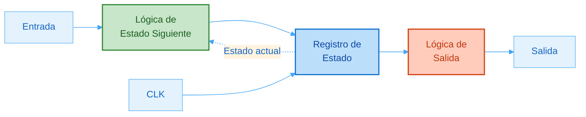
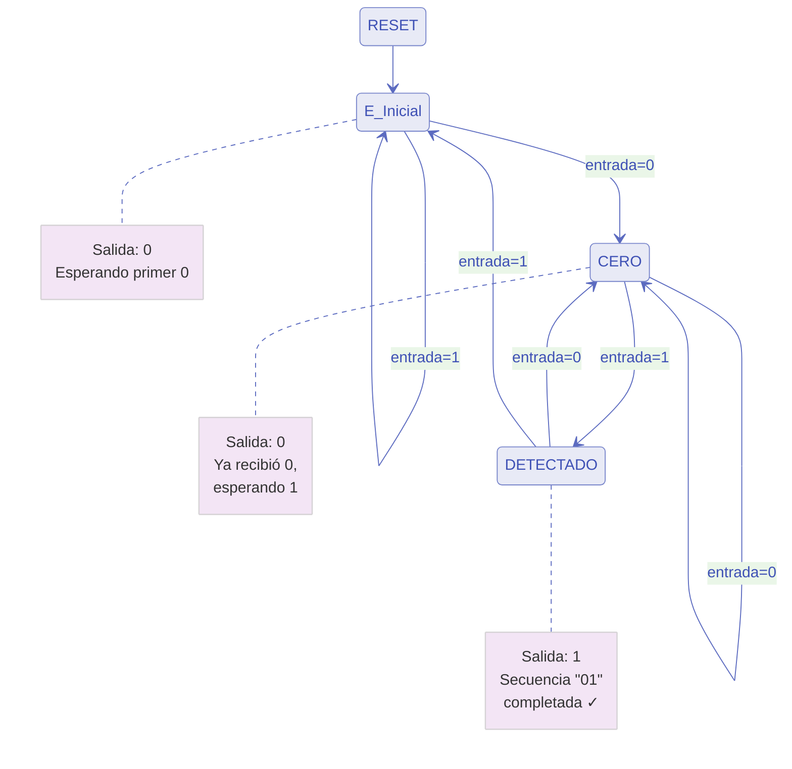
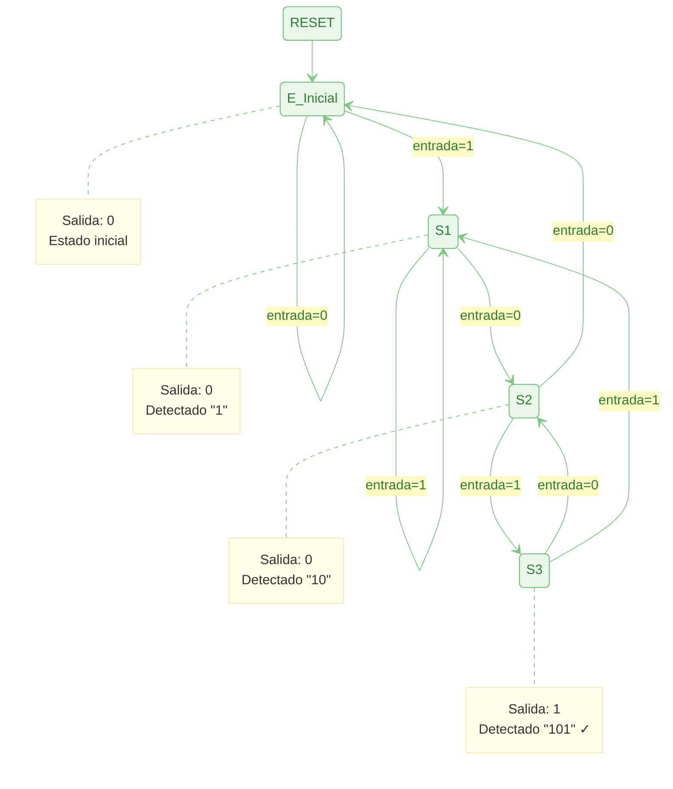
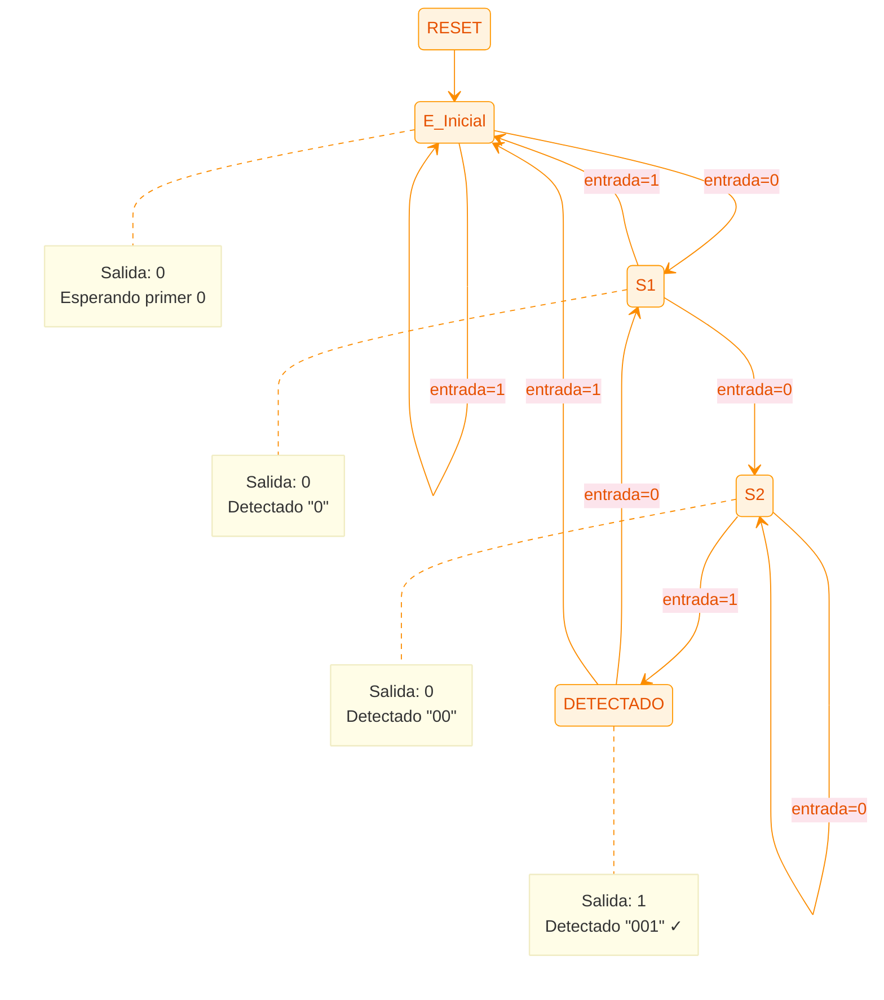
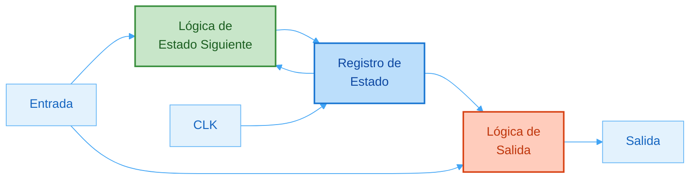
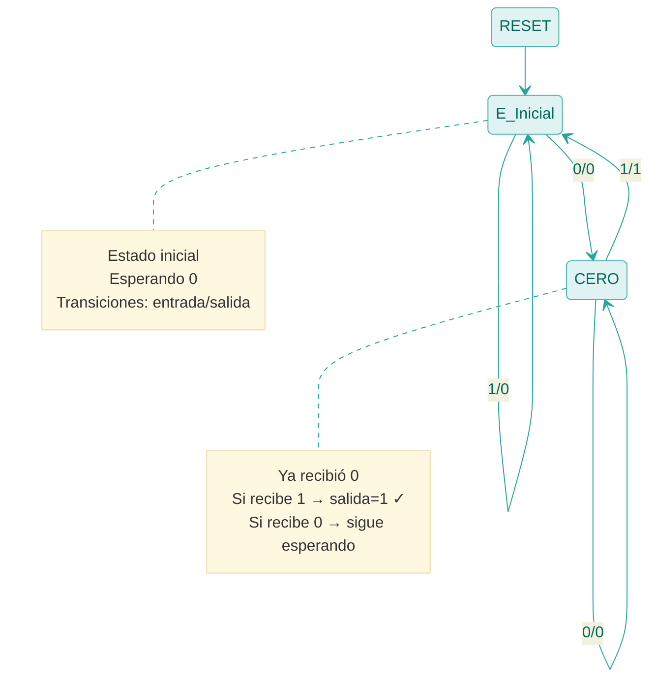
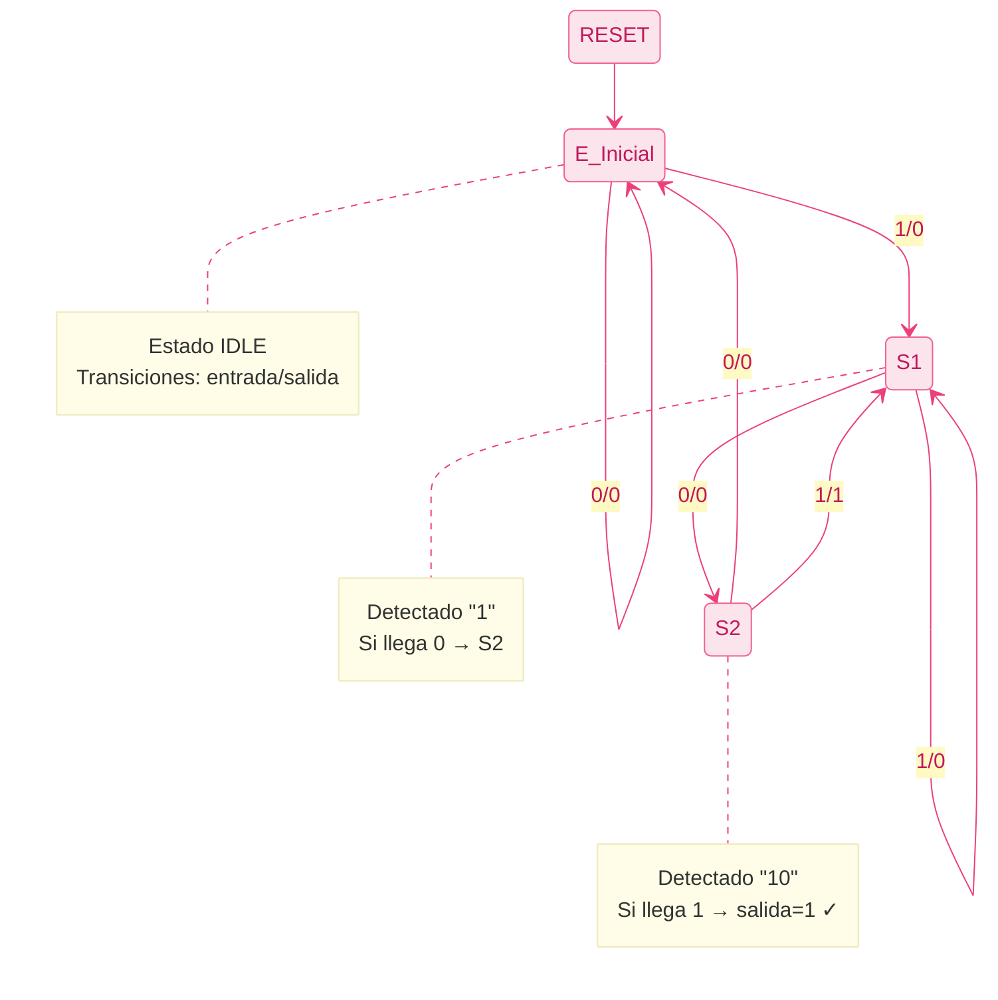
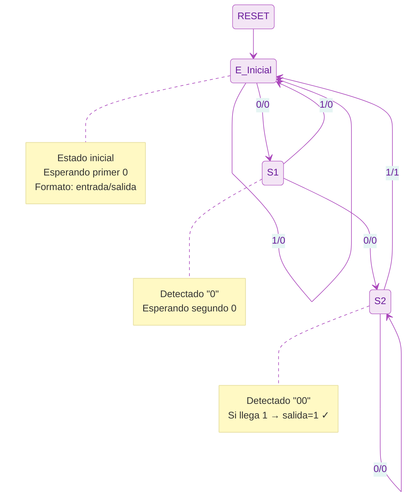

<!--
---
file: Teoria/07_circuitos_secuenciales.md
description: Flip-Flops, Latches, contadores, registros y Máquinas de Estados Finitos (FSM Moore y Mealy)
type: doc/theory
version: 1.0.0
date: 2026-08-26
covers: []
relations: [Teoria/README.md]
keywords: [fsm, moore, mealy, flip-flop, latch, secuenciales, vhdl]
---
-->

# Circuitos Secuenciales

A diferencia de los circuitos combinacionales, donde la salida depende únicamente de las entradas actuales, en los **circuitos secuenciales** la salida depende de las entradas actuales y de la **historia pasada** (estado). Esto implica la necesidad de elementos de **memoria**.

### 7.1 Tipos de memoria: Latch vs. Flip-Flop

La memoria básica en electrónica digital se basa en la realimentación.

*   **Latch (Cerrojo):** Es sensible al **nivel** de la señal de control (habilitación). Mientras la señal de control esté activa, la salida cambia si cambia la entrada (transparencia). Es propenso a *glitches* y difícil de controlar en diseños complejos.
    *   *En VHDL:* Se infiere cuando un proceso no asigna valor a una señal en todas las ramas posibles (ej. falta un `ELSE`). Generalmente es indeseado en diseño síncrono.

*   **Flip-Flop (Biestable):** Es sensible al **flanco** (transición) de la señal de reloj (`CLK`). Solo actualiza su salida en el instante preciso del cambio de 0 a 1 (flanco de subida) o 1 a 0.
    *   *En VHDL:* Se infiere usando `RISING_EDGE(clk)` o `clk'EVENT AND clk='1'`. Es el bloque constructivo fundamental de las FPGAs.

```vhdl
-- Flip-Flop D con Reset Asíncrono (Estándar en FPGAs)
LIBRARY ieee;
USE ieee.std_logic_1164.all;

ENTITY dff_async_rst IS
    PORT (
        clk   : IN  STD_LOGIC;
        reset : IN  STD_LOGIC;
        d     : IN  STD_LOGIC;
        q     : OUT STD_LOGIC
    );
END ENTITY dff_async_rst;

ARCHITECTURE rtl OF dff_async_rst IS
BEGIN
    PROCESS(clk, reset)
    BEGIN
        IF reset = '1' THEN
            q <= '0';
        ELSIF RISING_EDGE(clk) THEN
            q <= d;
        END IF;
    END PROCESS;
END ARCHITECTURE rtl;
```

### 7.2 Tipos de circuitos secuenciales

1.  **Asíncronos:** Los cambios de estado ocurren en cuanto cambian las entradas, sin una señal de reloj global que sincronice todo. Son rápidos pero difíciles de diseñar y propensos a condiciones de carrera.
2.  **Síncronos:** Todos los cambios de estado están sincronizados por una señal de reloj global (`CLK`). El sistema avanza paso a paso. Son más fáciles de diseñar y verificar, y son el estándar en diseño FPGA/ASIC.

### 7.3 Máquinas de Estados Finitos (FSM)

Una FSM es un modelo matemático de computación usado para diseñar lógica secuencial. Se compone de estados, transiciones y salidas.

#### 7.3.1 Modelo de Moore

*   **Definición:** Las salidas dependen **únicamente del estado actual**.
*   **Características:**
    *   La salida es síncrona con el reloj (si se registra el estado) o estable durante el periodo del estado.
    *   Suele requerir más estados que Mealy.
    *   Es más segura frente a *glitches* de entrada.

**Diagrama de bloques:**



**Ejemplo 1: Detector de Secuencia "01" (Moore)**

Ejemplo simple: detectar cuando llega un `0` seguido de un `1`.

En Moore, necesitamos **3 estados** porque la salida solo depende del estado:



**Estados Moore:**
- **E_Inicial**: Estado inicial, esperando el primer `0`. Salida = `0`
  - Si entrada = `1`: permanece en E_Inicial
  - Si entrada = `0`: va a CERO
- **CERO**: Se recibió un `0`, esperando el `1`. Salida = `0`
  - Si entrada = `0`: permanece en CERO (reinicia detección)
  - Si entrada = `1`: va a DETECTADO
- **DETECTADO**: Secuencia `01` completa. **Salida = `1`**
  - Si entrada = `0`: va a CERO (nueva secuencia posible)
  - Si entrada = `1`: va a E_Inicial (resetea)

**Implementación VHDL (Estándar de 2 procesos):**

```vhdl
LIBRARY ieee;
USE ieee.std_logic_1164.all;

ENTITY fsm_moore_01 IS
    PORT (
        clk     : IN  STD_LOGIC;
        reset   : IN  STD_LOGIC;
        entrada : IN  STD_LOGIC;
        salida  : OUT STD_LOGIC
    );
END ENTITY fsm_moore_01;

ARCHITECTURE rtl OF fsm_moore_01 IS
    -- Declaración de tipo enumerado para los estados
    TYPE estado_t IS (E_Inicial, CERO, DETECTADO);
    SIGNAL estado_actual, estado_siguiente : estado_t;
BEGIN
    -- 1. Proceso síncrono: Registro de estado
    PROCESS(clk, reset)
    BEGIN
        IF reset = '1' THEN
            estado_actual <= E_Inicial;
        ELSIF RISING_EDGE(clk) THEN
            estado_actual <= estado_siguiente;
        END IF;
    END PROCESS;

    -- 2. Proceso combinacional: Lógica de estado siguiente y salidas (Moore)
    PROCESS(estado_actual, entrada)
    BEGIN
        -- Valores por defecto para evitar latches
        estado_siguiente <= estado_actual;
        salida <= '0';

        CASE estado_actual IS
            WHEN E_Inicial =>
                salida <= '0';
                IF entrada = '0' THEN
                    estado_siguiente <= CERO;
                ELSE
                    estado_siguiente <= E_Inicial;
                END IF;

            WHEN CERO =>
                salida <= '0';
                IF entrada = '1' THEN
                    estado_siguiente <= DETECTADO;
                ELSE
                    estado_siguiente <= CERO;
                END IF;

            WHEN DETECTADO =>
                salida <= '1'; -- Salida depende exclusivamente del estado
                IF entrada = '0' THEN
                    estado_siguiente <= CERO;
                ELSE
                    estado_siguiente <= E_Inicial;
                END IF;
        END CASE;
    END PROCESS;
END ARCHITECTURE rtl;
```

**Ejemplo 2: Detector de Secuencia "101" (Moore)**

Detecta la secuencia 101 en una entrada serial. La salida se activa un ciclo después de completarse la secuencia.



**Estados en FSM Moore:**
- **E_Inicial**: No se ha detectado nada o reinicio. Salida = `0`
  - `0`: permanece en E_Inicial
  - `1`: va a S1
- **S1**: Se detectó un `1`. Salida = `0`
  - `0`: va a S2
  - `1`: permanece en S1
- **S2**: Se detectó `10`. Salida = `0`
  - `0`: vuelve a E_Inicial
  - `1`: va a S3
- **S3**: Se detectó `101` completo. **Salida = `1`**
  - `0`: va a S2 (puede empezar nueva secuencia "101")
  - `1`: va a S1

**Ejemplo 3: Detector de Secuencia "001" (Moore)**

Detecta la secuencia 001 en una entrada serial. Se necesitan **4 estados**.



**Estados en FSM Moore:**
- **E_Inicial**: Estado inicial. Salida = `0`
  - `0`: va a S1
  - `1`: permanece en E_Inicial
- **S1**: Se detectó primer `0`. Salida = `0`
  - `0`: va a S2
  - `1`: vuelve a E_Inicial
- **S2**: Se detectó `00`. Salida = `0`
  - `0`: permanece en S2
  - `1`: va a DETECTADO
- **DETECTADO**: Secuencia `001` completa. **Salida = `1`**
  - `0`: va a S1 (nueva secuencia posible)
  - `1`: vuelve a E_Inicial

#### 7.3.2 Modelo de Mealy

*   **Definición:** Las salidas dependen del **estado actual Y de las entradas actuales**.
*   **Características:**
    *   La salida puede cambiar en cuanto cambia la entrada (asíncrona respecto al reloj dentro del ciclo).
    *   Suele requerir menos estados.
    *   Puede propagar ruido de las entradas a las salidas.

**Diagrama de bloques:**



**Ejemplo 1: Detector de Secuencia "01" (Mealy)**

En Mealy, solo necesitamos **2 estados** porque la salida depende del estado Y la entrada:



**Estados Mealy (formato `entrada/salida`):**
- **E_Inicial**: Estado inicial
  - `1/0`: permanece en E_Inicial, salida = `0`
  - `0/0`: va a CERO, salida = `0`
- **CERO**: Se recibió un `0`
  - `0/0`: permanece en CERO, salida = `0`
  - **`1/1`**: va a E_Inicial, **salida = `1`** (secuencia detectada en este ciclo)

**Implementación VHDL (Estándar de 2 procesos):**

```vhdl
LIBRARY ieee;
USE ieee.std_logic_1164.all;

ENTITY fsm_mealy_01 IS
    PORT (
        clk     : IN  STD_LOGIC;
        reset   : IN  STD_LOGIC;
        entrada : IN  STD_LOGIC;
        salida  : OUT STD_LOGIC
    );
END ENTITY fsm_mealy_01;

ARCHITECTURE rtl OF fsm_mealy_01 IS
    -- Declaración de tipo enumerado para los estados
    TYPE estado_t IS (E_Inicial, CERO);
    SIGNAL estado_actual, estado_siguiente : estado_t;
BEGIN
    -- 1. Proceso síncrono: Registro de estado
    PROCESS(clk, reset)
    BEGIN
        IF reset = '1' THEN
            estado_actual <= E_Inicial;
        ELSIF RISING_EDGE(clk) THEN
            estado_actual <= estado_siguiente;
        END IF;
    END PROCESS;

    -- 2. Proceso combinacional: Lógica de estado siguiente y salida Mealy (depende de entrada)
    PROCESS(estado_actual, entrada)
    BEGIN
        -- Valores por defecto
        estado_siguiente <= estado_actual;
        salida <= '0';

        CASE estado_actual IS
            WHEN E_Inicial =>
                IF entrada = '0' THEN
                    estado_siguiente <= CERO;
                    salida <= '0';
                ELSE
                    estado_siguiente <= E_Inicial;
                    salida <= '0';
                END IF;

            WHEN CERO =>
                IF entrada = '1' THEN
                    estado_siguiente <= E_Inicial;
                    salida <= '1'; -- Secuencia 01 detectada en el ciclo actual
                ELSE
                    estado_siguiente <= CERO;
                    salida <= '0';
                END IF;
        END CASE;
    END PROCESS;
END ARCHITECTURE rtl;
```

**Comparación para este ejemplo:**
- Moore: 3 estados, salida estable durante todo el ciclo
- Mealy: 2 estados, salida se activa inmediatamente con la entrada

**Ejemplo 2: Detector de Secuencia "101" (Mealy)**

La misma funcionalidad, pero con menos estados. La salida se activa **en el mismo ciclo** que llega el último bit.



**Estados en FSM Mealy (formato `entrada/salida`):**
- **E_Inicial**: Estado inicial
  - `0/0`: permanece en E_Inicial
  - `1/0`: va a S1
- **S1**: Detectado `1`
  - `0/0`: va a S2
  - `1/0`: permanece en S1
- **S2**: Detectado `10`
  - `0/0`: vuelve a E_Inicial
  - **`1/1`**: vuelve a S1 y **activa salida** (secuencia detectada)

**Ejemplo 3: Detector de Secuencia "001" (Mealy)**

Detecta la secuencia 001. Con Mealy solo necesitamos **3 estados** (vs 4 en Moore).



**Estados en FSM Mealy (formato `entrada/salida`):**
- **E_Inicial**: Estado inicial
  - `0/0`: va a S1, salida = `0`
  - `1/0`: permanece en E_Inicial, salida = `0`
- **S1**: Se detectó primer `0`
  - `0/0`: va a S2, salida = `0`
  - `1/0`: vuelve a E_Inicial, salida = `0`
- **S2**: Se detectó `00`
  - `0/0`: permanece en S2, salida = `0`
  - **`1/1`**: vuelve a E_Inicial, **salida = `1`** (secuencia detectada)

**Comparación para este ejemplo:**
- Moore: 4 estados, salida registrada
- Mealy: 3 estados, salida inmediata

#### 7.3.3 Resumen: Comparación Moore vs. Mealy

| Aspecto | Moore | Mealy |
|---------|-------|-------|
| **Salida depende de** | Solo estado actual | Estado actual + Entradas |
| **Número de estados** | Generalmente más | Generalmente menos |
| **Sincronización de salida** | Con el reloj (registrada) | Puede ser asíncrona |
| **Inmunidad al ruido** | Mayor (salida estable) | Menor (entrada afecta salida) |
| **Velocidad de respuesta** | Un ciclo de retardo | Más rápida (mismo ciclo) |
| **Uso típico** | Control, decodificación | Protocolos, detección de patrones |
---

*[⬆ Volver al Índice](README.md)*


---
