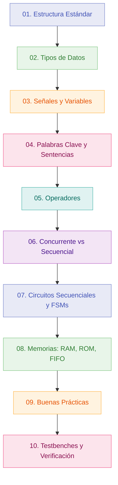

<!--
---
file: Teoria/README.md
description: Indice general y guia de navegacion modular de la teoria de VHDL
type: doc/manual
version: 1.0.0
date: 2026-08-26
covers: []
relations: [AGENTS.md, README.md]
keywords: [indice, guia-navegacion, teoria, vhdl]
---
-->

# Índice General de Teoría VHDL

Bienvenido a la documentación modular de teoría de VHDL. Cada sección ha sido estructurada como un documento atómico para facilitar la consulta rápida y la lectura guiada.

---

## Módulos y Secciones

### [1. Estructura estándar del código](01_estructura_codigo.md)

  - [1.1 Librerías y paquetes](01_estructura_codigo.md#11-librerías-y-paquetes)
  - [1.2 Entidad (ENTITY)](01_estructura_codigo.md#12-entidad-entity)
  - [1.3 Arquitectura (ARCHITECTURE)](01_estructura_codigo.md#13-arquitectura-architecture)
  - [1.4 Genéricos (GENERIC)](01_estructura_codigo.md#14-genéricos-generic)

### [2. Tipos de datos](02_tipos_de_datos.md)

  - [2.1 Tipos escalares básicos](02_tipos_de_datos.md#21-tipos-escalares-básicos)
  - [2.2 Tipos vectoriales](02_tipos_de_datos.md#22-tipos-vectoriales)
  - [2.3 Tipos enumerados](02_tipos_de_datos.md#23-tipos-enumerados)
  - [2.4 Arreglos y registros](02_tipos_de_datos.md#24-arreglos-y-registros)

### [3. Señales, Variables y Constantes](03_senales_variables_constantes.md)

  - [El modelo de ejecución de VHDL: delta-cycles](03_senales_variables_constantes.md#el-modelo-de-ejecución-de-vhdl-delta-cycles)
  - [Comparativa](03_senales_variables_constantes.md#comparativa)
  - [Señal](03_senales_variables_constantes.md#señal)
  - [Variable](03_senales_variables_constantes.md#variable)
  - [Constante](03_senales_variables_constantes.md#constante)
  - [Atributos de señal](03_senales_variables_constantes.md#atributos-de-señal)
  - [Errores típicos con señales y variables](03_senales_variables_constantes.md#errores-típicos-con-señales-y-variables)

### [4. Palabras clave principales](04_palabras_clave_principales.md)

  - [4.1 `PROCESS`](04_palabras_clave_principales.md#41-`process`)
  - [4.2 `IF / ELSIF / ELSE`](04_palabras_clave_principales.md#42-`if-elsif-else`)
  - [4.3 `CASE`](04_palabras_clave_principales.md#43-`case`)
  - [4.4 `FOR ... LOOP`](04_palabras_clave_principales.md#44-`for-loop`)
  - [4.5 `WHILE ... LOOP`](04_palabras_clave_principales.md#45-`while-loop`)
  - [4.6 `GENERATE`](04_palabras_clave_principales.md#46-`generate`)
  - [4.7 `COMPONENT` y `PORT MAP`](04_palabras_clave_principales.md#47-`component`-y-`port-map`)
  - [4.8 `GENERIC` / `GENERIC MAP`](04_palabras_clave_principales.md#48-`generic`-`generic-map`)
  - [4.9 `FUNCTION`](04_palabras_clave_principales.md#49-`function`)
  - [4.10 `PROCEDURE`](04_palabras_clave_principales.md#410-`procedure`)
  - [4.11 `PACKAGE`](04_palabras_clave_principales.md#411-`package`)
  - [4.12 `WAIT`](04_palabras_clave_principales.md#412-`wait`)
  - [4.13 `ASSERT`](04_palabras_clave_principales.md#413-`assert`)

### [5. Operadores](05_operadores.md)

  - [5.1 Lógicos](05_operadores.md#51-lógicos)
  - [5.2 Relacionales](05_operadores.md#52-relacionales)
  - [5.3 Aritméticos](05_operadores.md#53-aritméticos)
  - [5.4 Concatenación y desplazamiento](05_operadores.md#54-concatenación-y-desplazamiento)
  - [5.5 Precedencia de operadores](05_operadores.md#55-precedencia-de-operadores)

### [6. Lógica concurrente vs. secuencial](06_logica_concurrente_vs_secuencial.md)

  - [6.1 Sentencias concurrentes](06_logica_concurrente_vs_secuencial.md#61-sentencias-concurrentes)
  - [6.2 Sentencias secuenciales](06_logica_concurrente_vs_secuencial.md#62-sentencias-secuenciales)
  - [6.3 Comunicación entre procesos](06_logica_concurrente_vs_secuencial.md#63-comunicación-entre-procesos)
  - [6.4 Resumen: guía de elección](06_logica_concurrente_vs_secuencial.md#64-resumen-guía-de-elección)

### [7. Circuitos Secuenciales](07_circuitos_secuenciales.md)

  - [7.1 Tipos de memoria: Latch vs. Flip-Flop](07_circuitos_secuenciales.md#71-tipos-de-memoria-latch-vs-flip-flop)
  - [7.2 Tipos de circuitos secuenciales](07_circuitos_secuenciales.md#72-tipos-de-circuitos-secuenciales)
  - [7.3 Máquinas de Estados Finitos (FSM)](07_circuitos_secuenciales.md#73-máquinas-de-estados-finitos-fsm)

### [8. Memorias y su manejo en VHDL](08_memorias_y_su_manejo.md)

  - [8.1 Conceptos base](08_memorias_y_su_manejo.md#81-conceptos-base)
  - [8.2 Memorias en FPGA: distribuida vs. BRAM](08_memorias_y_su_manejo.md#82-memorias-en-fpga-distribuida-vs-bram)
  - [8.3 Modelado con arreglos (arrays) y direccionamiento](08_memorias_y_su_manejo.md#83-modelado-con-arreglos-arrays-y-direccionamiento)
  - [8.4 ROM sintetizable](08_memorias_y_su_manejo.md#84-rom-sintetizable)
  - [8.5 RAM single-port (1 puerto)](08_memorias_y_su_manejo.md#85-ram-single-port-1-puerto)
  - [8.6 RAM dual-port (2 puertos)](08_memorias_y_su_manejo.md#86-ram-dual-port-2-puertos)
  - [8.7 Shift registers (registros de desplazamiento)](08_memorias_y_su_manejo.md#87-shift-registers-registros-de-desplazamiento)
  - [8.8 FIFO circular (buffer)](08_memorias_y_su_manejo.md#88-fifo-circular-buffer)
  - [8.9 Inicialización y carga desde archivo (síntesis vs simulación)](08_memorias_y_su_manejo.md#89-inicialización-y-carga-desde-archivo-síntesis-vs-simulación)
  - [8.10 Errores típicos y depuración](08_memorias_y_su_manejo.md#810-errores-típicos-y-depuración)
  - [8.11 Checklist rápida](08_memorias_y_su_manejo.md#811-checklist-rápida)

### [9. Buenas prácticas de diseño y estilo en VHDL](09_buenas_practicas_y_estilo.md)

  - [9.1 Mentalidad hardware vs. software](09_buenas_practicas_y_estilo.md#91-mentalidad-hardware-vs-software)
  - [9.2 Estilo sintetizable: combinacional vs secuencial](09_buenas_practicas_y_estilo.md#92-estilo-sintetizable-combinacional-vs-secuencial)
  - [9.3 Tipos, rangos y conversiones seguras](09_buenas_practicas_y_estilo.md#93-tipos-rangos-y-conversiones-seguras)
  - [9.4 Modularidad y reutilización (DRY)](09_buenas_practicas_y_estilo.md#94-modularidad-y-reutilización-dry)
  - [9.5 Interfaces y handshakes (valid/ready, req/ack)](09_buenas_practicas_y_estilo.md#95-interfaces-y-handshakes-validready-reqack)
  - [9.6 Cruce de dominios de reloj (CDC) básico](09_buenas_practicas_y_estilo.md#96-cruce-de-dominios-de-reloj-cdc-básico)

### [10. Verificación práctica: testbenches y depuración](10_verificacion_testbenches_depuracion.md)

  - [10.1 Estructura canónica de un testbench](10_verificacion_testbenches_depuracion.md#101-estructura-canónica-de-un-testbench)
  - [10.2 Generación de reloj y reset](10_verificacion_testbenches_depuracion.md#102-generación-de-reloj-y-reset)
  - [10.3 Testbench autocheck: ASSERT + scoreboard simple](10_verificacion_testbenches_depuracion.md#103-testbench-autocheck-assert-+-scoreboard-simple)
  - [10.4 Estímulos y archivos (TextIO) — solo simulación](10_verificacion_testbenches_depuracion.md#104-estímulos-y-archivos-textio-solo-simulación)
  - [10.5 Checklist de depuración](10_verificacion_testbenches_depuracion.md#105-checklist-de-depuración)
  - [10.6 Organización de tests (runner y suites)](10_verificacion_testbenches_depuracion.md#106-organización-de-tests-runner-y-suites)
  - [10.7 Scoreboard (cola de esperados)](10_verificacion_testbenches_depuracion.md#107-scoreboard-cola-de-esperados)
  - [10.8 Cobertura funcional y logging](10_verificacion_testbenches_depuracion.md#108-cobertura-funcional-y-logging)

---

## Mapa de Aprendizaje Recomendado

